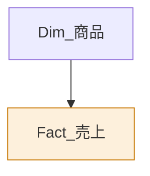

# コンテンツ執筆ガイド

このサイトのレッスン・ラボ・クイズを追加／編集するための手引きです。

---

## 全体の構造

```
docs/content/
├── curriculum.json    レベル・レッスン・ラボの定義（サイトの骨格）
├── lessons/L001.md    レッスン本文
├── labs/LAB01.md      ハンズオン手順
├── quizzes/L001.json  設問
├── quizzes/index.json クイズの一覧（自動生成対象）
└── glossary.json      用語集
```

`curriculum.json` が正です。ここに載っていないレッスンはサイトに表示されません。

---

## レッスンを追加する

### 1. curriculum.json に定義を足す

```json
{
  "id": "L108",
  "level": "L1",
  "title": "データフローで変換を共有する",
  "minutes": 30,
  "type": "concept",
  "objectives": ["データフローの用途を説明できる", "..."],
  "keywords": ["データフロー", "Power Query オンライン"],
  "quiz": "L108",
  "lab": null
}
```

| フィールド | 説明 |
|---|---|
| `id` | `L` + レベル番号 + 連番。ファイル名と一致させる |
| `level` | `L0`〜`L5` |
| `minutes` | 想定所要時間。ロードマップの進捗計算に使われる |
| `type` | `concept` / `hands-on` / `exam` |
| `objectives` | 学習目標。レッスン冒頭に自動表示される |
| `quiz` | クイズのID。なければ `null` |
| `lab` | 関連ラボのID。なければ `null` |

配列内の順序が、そのままロードマップの表示順・前後移動の順序になります。

### 2. 本文を書く

`docs/content/lessons/L108.md` を作ります。**H1（`#`）は書かないでください。**
タイトルは `curriculum.json` から自動で表示されます。本文は本題から始めます。

---

## Markdown 記法

標準的な GitHub Flavored Markdown に加えて、独自の記法が2つあります。

### コールアウト

```markdown
> [!NOTE]
> 覚えておくべき要点。

> [!TIP]
> 実務で効くコツ。

> [!WARN]
> 注意すべき仕様。

> [!TRAP]
> 初学者がつまずくポイント。

> [!EXAM]
> PL-300 で問われる内容。
```

`EXAM` は試験対策として特に重要な箇所に使います。多用すると効果が薄れるので、1レッスンに1〜3個までを目安にしてください。

### 図（Mermaid）

コードフェンスの言語に `mermaid`、その後ろにキャプションを書きます。

````markdown

````

図には「図1：スタースキーマの構造」のように自動で番号が振られます。

**図を書くときの約束**

- 日本語ラベルは必ず `A["テキスト"]` のようにダブルクォートで囲む
- 改行は `<br/>`
- 1つの図に入れる要素は7個まで。それ以上は図を分ける
- 強調したいノードだけ `style` で色を付ける（下の色を使うと配色が揃います）

| 用途 | 色 |
|---|---|
| ファクト・中心概念 | `fill:#fdf0dc,stroke:#c77700` |
| 正しい・推奨 | `fill:#e0f5ee,stroke:#14926b` |
| 誤り・アンチパターン | `fill:#fce8ea,stroke:#d33a4b` |
| 情報・入力 | `fill:#e7efff,stroke:#2f6fed` |

### コードハイライト

`dax`、`m`（または `powerquery`）を指定すると、専用のハイライトが効きます。

````markdown
```dax
売上合計 = SUM( Fact_売上[SalesAmount] )
```
````

### サンプルデータへのリンク

```markdown
[sales.csv](data/sales.csv)
```

### レッスン・ラボへのリンク

```markdown
[L201 スタースキーマ](lesson.html?id=L201)
[LAB03](lab.html?id=LAB03)
```

---

## レッスンの型

読み手が迷わないよう、次の流れを基本にしています。

1. **導入（2〜3文）** — なぜこれを学ぶのか。実務の困りごとから入る
2. **図で全体像** — 文章の前に図を置く
3. **本題** — 見出し（`##`）ごとに1つの概念
4. **比較表** — 「AとBの違い」は必ず表にする
5. **つまずきポイント** — `> [!TRAP]` で先回りする
6. **試験ポイント** — `> [!EXAM]`
7. **まとめ / チェックリスト / 練習問題**

分量の目安は 150〜250行、図は2〜4枚です。

### 書き方の方針

- 断定して書く。「〜かもしれません」を避ける
- 手順は番号付きリスト、比較は表、概念は図
- 「なぜそうするのか」を必ず添える。操作手順だけでは応用が利かない
- 数字（上限値・回数など）は変わりうるため、「執筆時点」と添えるか公式ページへのリンクを置く

---

## クイズを追加する

`docs/content/quizzes/L108.json`：

```json
{
  "id": "L108",
  "lesson": "L108",
  "title": "データフロー",
  "questions": [
    {
      "id": "L108-q1",
      "type": "single",
      "stem": "データフローの主な利点はどれですか。",
      "choices": ["変換ロジックを複数のモデルで再利用できる", "...", "...", "..."],
      "answer": 0,
      "explain": "解説文。**Markdown が使えます。**",
      "area": "データの準備",
      "ref": "L108",
      "difficulty": 2
    }
  ]
}
```

| フィールド | 説明 |
|---|---|
| `type` | `single`（単一選択）または `multi`（複数選択） |
| `answer` | `single` は数値、`multi` は数値の配列 |
| `area` | 領域別スコアの集計単位。下の4つから選ぶ |
| `ref` | 解説から飛ぶレッスンID |
| `difficulty` | 1〜4。結果画面に星で表示される |
| `code` | 任意。設問に添えるコード。`codeLang` で `dax` / `m` を指定 |

`area` に使う値：`データの準備` / `データのモデル化` / `視覚化と分析` / `資産の管理とセキュリティ`

### index.json を更新する

クイズ一覧ページとトップの問題数表示は `index.json` を参照します。
ファイルを追加したら、次のコマンドで作り直してください。

```bash
python3 - <<'EOF'
import json, io, os
OUT = "docs/content/quizzes"
idx, total = {}, 0
for fn in sorted(os.listdir(OUT)):
    if not fn.endswith(".json") or fn == "index.json":
        continue
    d = json.load(io.open(os.path.join(OUT, fn), encoding="utf-8"))
    idx[d["id"]] = {"title": d["title"], "count": len(d["questions"]), "lesson": d.get("lesson")}
    total += len(d["questions"])
io.open(os.path.join(OUT, "index.json"), "w", encoding="utf-8").write(
    json.dumps({"totalQuestions": total, "quizzes": idx}, ensure_ascii=False, indent=2))
print("total:", total)
EOF
```

### 良い設問の条件

- **実務のシナリオで問う。** 「CALCULATEとは何か」ではなく「この状況でどう書くか」
- 誤答の選択肢も、もっともらしくする。明らかな間違いが3つ並ぶ設問は練習にならない
- 解説には「なぜ正解か」だけでなく「なぜ他が誤りか」を書く
- 1レッスンあたり4問を基本とし、難易度1〜4を混ぜる

---

## ハンズオンラボを追加する

1. `curriculum.json` の `labs` 配列に定義を追加
2. `docs/content/labs/LAB07.md` に手順を書く
3. 必要なデータを `docs/data/` に置く（`scripts/generate_sample_data.py` に生成処理を足すのが望ましい）

ラボの構成：

1. 所要時間とゴール
2. 準備（ダウンロードするファイル・列の説明）
3. ステップごとの手順（各ステップに所要時間の目安）
4. 完成チェックリスト
5. トラブルシューティング表
6. 発展課題

**すべての手順を、実際に手を動かして検証してから公開してください。** 動かない手順は教材として害になります。

---

## 用語集に追加する

`docs/content/glossary.json` に追記します。

```json
{
  "term": "データフロー",
  "en": "Dataflow",
  "desc": "Power Query オンラインで作成する、再利用可能な変換処理。",
  "lesson": "L108",
  "tags": ["データ準備", "運用"]
}
```

---

## 公開前のチェック

```bash
python3 scripts/validate_content.py
```

- **エラー** があると GitHub Actions のデプロイが止まります
- **警告** は止まりませんが、公開前に解消しておくのが望ましいです

あわせて、ローカルサーバで実際の表示を確認してください。

```bash
cd docs && python3 -m http.server 8000
```

確認する項目：

- [ ] 図がすべて描画される（Mermaidの構文エラーがない）
- [ ] コールアウトが正しい色で表示される
- [ ] リンク切れがない
- [ ] クイズの正解が意図どおり
- [ ] スマートフォン幅（開発者ツールの375px）で崩れない
- [ ] ダークモードで読める
