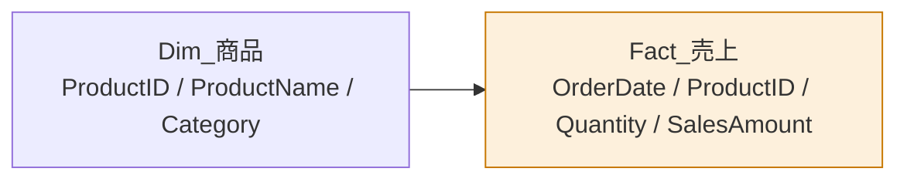

所要30分。Power BI Desktop を起動して、実際に手を動かしながら読んでください。

## このラボのゴール

架空の小売企業「Northstar Retail」の売上データから、次の要素を含むレポートを1枚作ります。

- KPIカード（総売上・販売数量・取引件数）
- カテゴリ別売上の横棒グラフ
- 月次売上推移の折れ線グラフ
- 店舗スライサー

## 準備

[sales.csv](data/sales.csv) をダウンロードしてください。列構成は次のとおりです。

| 列 | 型 | 説明 |
|---|---|---|
| OrderID | テキスト | 注文ID |
| OrderDate | 日付 | 受注日 |
| ShipDate | 日付 | 出荷日 |
| StoreID | テキスト | 店舗ID |
| CustomerID | テキスト | 顧客ID |
| ProductID | テキスト | 商品ID |
| Quantity | 整数 | 数量 |
| UnitPrice | 整数 | 販売単価 |
| Discount | 10進数 | 値引率 |
| SalesAmount | 整数 | 売上金額 |

> [!NOTE]
> このラボでは、まだ商品名やカテゴリの情報がありません。カテゴリ別の集計は、後半で products.csv を追加して行います。

## ステップ1：データを読み込む（5分）

1. **ホーム → データを取得 → テキスト/CSV** で `sales.csv` を選択
2. プレビュー画面右上の「ファイル発生源」が `65001: Unicode (UTF-8)` になっていることを確認
3. **「データの変換」** をクリック（読み込みではありません）
4. Power Query エディタで、各列の型を確認・修正する

| 列 | 設定する型 |
|---|---|
| OrderDate, ShipDate | 日付 |
| Quantity, UnitPrice, SalesAmount | 整数 |
| Discount | 10進数 |
| その他 | テキスト |

5. クエリ名を `Fact_売上` に変更（右ペインのプロパティ）
6. **ホーム → 閉じて適用**

続けて `products.csv` も同じ手順で読み込み、クエリ名を `Dim_商品` にします。

## ステップ2：リレーションシップを確認（3分）

1. 左端の **モデルビュー** を開く
2. `Dim_商品[ProductID]` から `Fact_売上[ProductID]` へ線が引かれているか確認
   - 自動で作られていなければ、`Dim_商品[ProductID]` を `Fact_売上[ProductID]` へドラッグ
3. 線をダブルクリックし、次を確認

| 項目 | 値 |
|---|---|
| 基数 | 1対多（1:*） |
| クロスフィルターの方向 | 単一 |
| リレーションシップをアクティブにする | オン |



## ステップ3：メジャーを3本作る（5分）

**モデリング → 新しいメジャー** で、次の3つを作成します。

```dax
総売上 = SUM( Fact_売上[SalesAmount] )
```

```dax
販売数量 = SUM( Fact_売上[Quantity] )
```

```dax
取引件数 = COUNTROWS( Fact_売上 )
```

作成後、それぞれを選択して **メジャーツール → 書式** を設定します。

| メジャー | 書式 | 小数点 | 桁区切り |
|---|---|---|---|
| 総売上 | 10進数 | 0 | オン |
| 販売数量 | 10進数 | 0 | オン |
| 取引件数 | 10進数 | 0 | オン |

## ステップ4：KPIカードを配置（5分）

1. レポートビューで、キャンバスの**余白**をクリック
2. 視覚化ペインから **カード** を選択
3. `総売上` をフィールドにドラッグ
4. 書式ペイン（筆アイコン）で調整
   - **吹き出しの値 → フォントサイズ** を 32 に
   - **カテゴリラベル** をオンにする
5. カードをキャンバス上部左に配置し、幅を調整
6. 同じ手順で `販売数量` と `取引件数` のカードを作り、横一列に並べる

> [!TIP]
> 3つのカードを選択して **書式（リボン）→ 配置 → 上揃え**、続いて **横方向に均等配置** を実行すると、きれいに揃います。

## ステップ5：カテゴリ別の横棒グラフ（5分）

1. 余白をクリック → **集合横棒グラフ**
2. Y軸に `Dim_商品[Category]`、X軸に `総売上`
3. グラフ右上の「…」→ **軸の並べ替え → 総売上 → 降順**
4. 書式ペイン → **データラベル** をオン

## ステップ6：月次推移の折れ線グラフ（5分）

1. 余白をクリック → **折れ線グラフ**
2. X軸に `Fact_売上[OrderDate]`、Y軸に `総売上`
3. X軸のフィールドの下矢印 → **日付の階層** が選ばれていることを確認
4. グラフ右上のドリルダウンボタンで「年 → 四半期 → 月」と掘り下げられることを確認

> [!TRAP]
> X軸に日付を入れたとき、`OrderDate` そのままだと日単位になり線がギザギザします。フィールドの下矢印から「日付の階層」を選ぶと、年→四半期→月→日で見られるようになります。

## ステップ7：スライサーを追加（2分）

1. 余白をクリック → **スライサー**
2. フィールドに `Fact_売上[StoreID]` をドラッグ
3. スライサー右上の「…」→ **ドロップダウン** に変更（縦のスペースを節約）

## ステップ8：仕上げと保存

1. **挿入 → テキストボックス** でタイトル「Northstar Retail 売上ダッシュボード」を追加
2. **表示 → グリッド線を表示 / グリッドにスナップ** をオンにして、位置を揃える
3. **ファイル → 名前を付けて保存** → `LAB01_売上ダッシュボード.pbix`

## 確認クイズ

- [ ] スライサーで `S001` を選ぶと、3つのカードすべてが変わりますか
- [ ] 横棒グラフの「家電」をクリックすると、折れ線が家電だけの推移になりますか
- [ ] 折れ線をドリルダウンして月別表示にできますか

3つとも「はい」なら完了です。

## 次のステップ

このラボのモデルには、まだ日付テーブルも顧客・店舗ディメンションもありません。
[LAB03](lab.html?id=LAB03) で、本格的なスタースキーマに作り直します。

先に理論を押さえたい場合は [L201 スタースキーマ](lesson.html?id=L201) へ進んでください。
