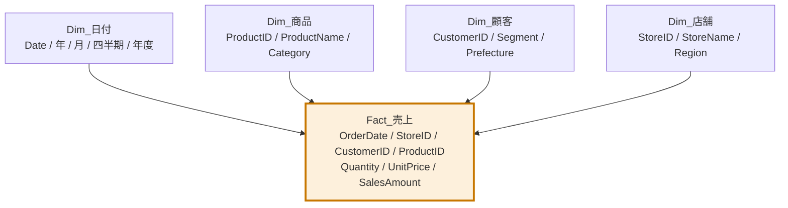

所要45分。[L201](lesson.html?id=L201)〜[L203](lesson.html?id=L203)の内容を実際のデータで実装します。ここが Power BI 習得の分水嶺です。

## このラボのゴール

4つのCSVから、日付テーブルを含む完全なスタースキーマを構築します。



## 準備

次の4ファイルをダウンロードしてください。

- [sales.csv](data/sales.csv)
- [products.csv](data/products.csv)
- [customers.csv](data/customers.csv)
- [stores.csv](data/stores.csv)

## ステップ1：4つのテーブルを読み込む（8分）

各ファイルを **データを取得 → テキスト/CSV → データの変換** で読み込み、次の名前に変更します。

| ファイル | クエリ名 |
|---|---|
| sales.csv | `Fact_売上` |
| products.csv | `Dim_商品` |
| customers.csv | `Dim_顧客` |
| stores.csv | `Dim_店舗` |

各テーブルでデータ型を確認してください。特に日付列（`OrderDate` `ShipDate` `SignupDate` `OpenDate`）が日付型になっているか確認します。

> [!TRAP]
> `stores.csv` の `Prefecture` 列には、オンライン店舗のために `—`（全角ダッシュ）が入っています。これはテキスト型なので問題ありませんが、地図ビジュアルを使うときは除外が必要です。

## ステップ2：不要な列を削除（3分）

モデルを軽くするため、この分析で使わない列を削除します。

| テーブル | 削除する列 |
|---|---|
| Fact_売上 | （今回はすべて使用） |
| Dim_店舗 | `Manager`（RLSを試すなら `ManagerEmail` は残す） |
| Dim_顧客 | （今回はすべて使用） |

> [!TIP]
> 「後で使うかもしれない」で残すとモデルが太ります。必要になったときに追加するほうが常に安上がりです。

## ステップ3：日付テーブルを作る（10分）

**閉じて適用** した後、**モデリング → 新しいテーブル** で次を入力します。

```dax
Dim_日付 =
VAR MinDate = MIN( Fact_売上[OrderDate] )
VAR MaxDate = MAX( Fact_売上[OrderDate] )
RETURN
ADDCOLUMNS(
    CALENDAR( DATE( YEAR(MinDate), 1, 1 ), DATE( YEAR(MaxDate), 12, 31 ) ),
    "年",         YEAR( [Date] ),
    "月番号",      MONTH( [Date] ),
    "月",         FORMAT( [Date], "M月" ),
    "年月",       FORMAT( [Date], "YYYY/MM" ),
    "四半期",      "Q" & ROUNDUP( MONTH( [Date] ) / 3, 0 ),
    "年度",       IF( MONTH( [Date] ) >= 4, YEAR( [Date] ), YEAR( [Date] ) - 1 ),
    "年度月番号",   IF( MONTH( [Date] ) >= 4, MONTH( [Date] ) - 3, MONTH( [Date] ) + 9 ),
    "曜日番号",     WEEKDAY( [Date], 2 ),
    "曜日",        FORMAT( [Date], "aaa" ),
    "平日区分",     IF( WEEKDAY( [Date], 2 ) >= 6, "週末", "平日" )
)
```

### 日付テーブルとしてマーク

1. データペインで `Dim_日付` を選択
2. **テーブルツール → 日付テーブルとしてマーク**
3. 日付列に `Date` を指定 → OK

### 自動の日付/時刻をオフにする

**ファイル → オプションと設定 → オプション → 現在のファイル → データの読み込み** で「自動の日付/時刻」のチェックを外します。

> [!WARN]
> この設定を外すと、既にビジュアルで使っていた「日付の階層」が消えます。LAB01のレポートを開いている場合は、`Dim_日付[年]` などに置き換えてください。

## ステップ4：リレーションシップを作る（8分）

モデルビューで、次の4本を作成します（自動検出されている場合は確認のみ）。

| 1側（ディメンション） | 多側（ファクト） | 基数 | 方向 |
|---|---|---|---|
| Dim_日付[Date] | Fact_売上[OrderDate] | 1対多 | 単一 |
| Dim_商品[ProductID] | Fact_売上[ProductID] | 1対多 | 単一 |
| Dim_顧客[CustomerID] | Fact_売上[CustomerID] | 1対多 | 単一 |
| Dim_店舗[StoreID] | Fact_売上[StoreID] | 1対多 | 単一 |

各リレーションシップの線をダブルクリックして、基数と方向を必ず目視確認してください。

### 出荷日の非アクティブなリレーションシップ（発展）

`Dim_日付[Date]` から `Fact_売上[ShipDate]` へも線を引きます。これは自動的に**非アクティブ（点線）**になります。

後で次のメジャーを作ると、出荷日ベースの売上が出せます。

```dax
出荷ベース売上 =
CALCULATE( [総売上], USERELATIONSHIP( Dim_日付[Date], Fact_売上[ShipDate] ) )
```

## ステップ5：モデルを磨く（8分）

### 並べ替え列の設定

| 列 | 並べ替えの基準 |
|---|---|
| Dim_日付[月] | Dim_日付[月番号] |
| Dim_日付[曜日] | Dim_日付[曜日番号] |

**列を選択 → 列ツール → 列で並べ替え** から設定します。

### キー列を非表示に

レポート作成時に使わない列を、右クリック → **レポートビューでは非表示** にします。

- `Fact_売上[ProductID]` `[CustomerID]` `[StoreID]` `[OrderID]`
- `Dim_日付[月番号]` `[曜日番号]` `[年度月番号]`

### 階層を作る

1. `Dim_商品[Category]` を右クリック → **階層の作成** → 名前を `商品階層` に
2. `SubCategory` と `ProductName` をこの階層へドラッグ

同様に `Dim_店舗` で `Region → Prefecture → StoreName` の `地域階層` を作ります。

### データカテゴリの設定

`Dim_店舗[Prefecture]` を選択 → **列ツール → データカテゴリ → 都道府県**

### 書式の設定

`Fact_売上[SalesAmount]` と `[UnitPrice]` に、桁区切り・小数点0桁を設定します。

## ステップ6：動作確認（8分）

新しいレポートページを作り、次を配置してみてください。

1. **マトリックス**：行に `Dim_店舗[Region]`、列に `Dim_日付[年]`、値に `総売上`
2. **横棒グラフ**：Y軸に `Dim_商品[Category]`、X軸に `総売上`
3. **スライサー**：`Dim_日付[年月]`
4. **スライサー**：`Dim_顧客[Segment]`

`総売上` メジャーがなければ、次を作成します。

```dax
総売上 = SUM( Fact_売上[SalesAmount] )
```

## 完成チェックリスト

- [ ] モデルビューの図が「星」の形になっている
- [ ] リレーションシップはすべて 1対多・単一方向
- [ ] `Dim_日付` が日付テーブルとしてマークされている
- [ ] 自動の日付/時刻がオフになっている
- [ ] 月と曜日が正しい順序で並ぶ
- [ ] キー列が非表示になっている
- [ ] 顧客セグメントのスライサーで、地域別の集計も連動して変わる

## 発展課題

### 課題1：売上ゼロの商品を見つける

商品テーブルには32商品あります。次のメジャーで、フィルター条件によっては売上が BLANK になる商品があることを確認してください。

```dax
販売実績 = IF( ISBLANK( [総売上] ), "実績なし", "あり" )
```

テーブルビジュアルに `Dim_商品[ProductName]` と `販売実績` を置き、「実績なし」が表示されることを確認します。**フラットテーブルではこの表示ができません** — これがディメンションを分ける理由です。

### 課題2：フィルターの伝播を確かめる

顧客セグメントのスライサーで「プラチナ」を選んだとき、`Dim_商品` のテーブルビジュアルは絞り込まれるでしょうか。予想してから試してください。

答え：絞り込まれません。フィルターは 顧客 → 売上 と流れますが、売上 → 商品 へは（単一方向のため）逆流しないからです。ただし `総売上` メジャーの値は変わります。

## 次のステップ

このモデルを使って、[LAB04](lab.html?id=LAB04) でDAXメジャーを10本実装します。`.pbix` を `LAB03_スタースキーマ.pbix` として保存しておいてください。
