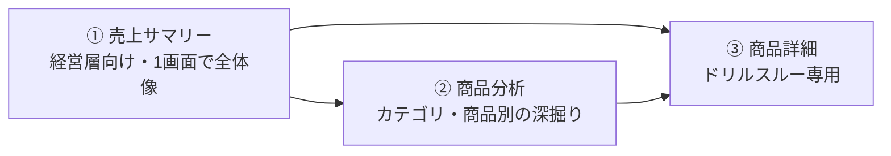
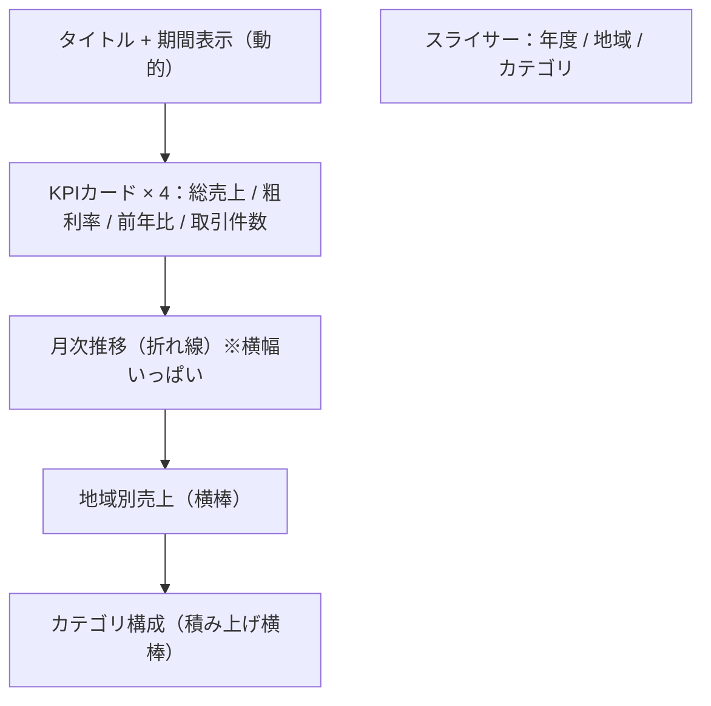

所要60分。[LAB04](lab.html?id=LAB04) のモデルとメジャーを使って、実際に配布できる品質のダッシュボードを作ります。

## このラボのゴール

3ページ構成のレポートを作り、モバイルレイアウトまで仕上げます。



## 準備

`LAB04_DAXメジャー.pbix` を開いてください。

## ステップ1：テーマを設定する（8分）

**表示 → テーマ → テーマのカスタマイズ**

| 設定 | 値 |
|---|---|
| データ色1 | `#2F6FED` |
| データ色2 | `#14926B` |
| データ色3 | `#C77700` |
| データ色4 | `#D3457A` |
| データ色5 | `#7C4DFF` |
| データ色6 | `#0E8FA8` |
| フォントファミリ | Segoe UI（または游ゴシック） |

**テキスト → 全般 → フォントサイズ** を 11pt に、**カード → 吹き出しの値** を 28pt にします。

> [!TIP]
> テーマは「テーマのエクスポート」でJSONとして保存できます。組織で共有すれば、誰が作っても同じ見た目になります。ビジュアルを作る**前**に設定するのが鉄則です。

## ステップ2：ページ①「売上サマリー」（20分）

### レイアウト設計



### 動的タイトルを作る

まず次のメジャーを作成します。

```dax
レポートタイトル =
VAR 期間 =
    FORMAT( MIN( Dim_日付[Date] ), "yyyy年M月" ) & " 〜 " &
    FORMAT( MAX( Dim_日付[Date] ), "yyyy年M月" )
VAR 地域 =
    IF(
        ISFILTERED( Dim_店舗[Region] ),
        CONCATENATEX( VALUES( Dim_店舗[Region] ), Dim_店舗[Region], ", " ),
        "全社"
    )
RETURN
    地域 & " 売上サマリー（" & 期間 & "）"
```

**カード**ビジュアルにこのメジャーを入れ、ページ最上部に配置します。フォントサイズは20pt程度、カテゴリラベルはオフにします。

### KPIカードを4つ

余白をクリック → **カード** で以下を作成し、横一列に配置します。

| カード | メジャー |
|---|---|
| 1 | 総売上 |
| 2 | 粗利率 |
| 3 | 前年比増減率 |
| 4 | 取引件数（なければ `COUNTROWS( Fact_売上 )` で作成） |

4つを選択して **書式 → 配置 → 上揃え**、続いて **横方向に均等配置**。

### 月次推移の折れ線

- X軸：`Dim_日付[年月]`
- Y軸：`総売上`
- 2本目の線：`売上_7日移動平均`（LAB04の発展課題）を追加してもよい
- **分析ペイン → 平均線** を追加

### 地域別売上（横棒）

- Y軸：`Dim_店舗[Region]`
- X軸：`総売上`
- 「…」→ 軸の並べ替え → 総売上 → 降順
- 書式 → データラベル：オン

### カテゴリ構成（積み上げ横棒）

- Y軸：`Dim_日付[年]`
- X軸：`総売上`
- 凡例：`Dim_商品[Category]`

### スライサー

右側または上部に3つ配置します。

| スライサー | フィールド | スタイル |
|---|---|---|
| 年度 | `Dim_日付[年度]` | タイル |
| 地域 | `Dim_店舗[Region]` | ドロップダウン |
| カテゴリ | `Dim_商品[Category]` | ドロップダウン |

> [!TIP]
> スライサーの位置は**全ページで統一**してください。ページを移動するたびに探すことになると、使ってもらえなくなります。

### 相互作用の調整

KPIカードを選択 → **書式（リボン）→ 相互作用の編集**。棒グラフからカードへの影響を「フィルター」に設定します（既定で強調表示になっている場合があります）。

## ステップ3：ページ②「商品分析」（12分）

新しいページを追加し、名前を「商品分析」にします。

### 配置するビジュアル

1. **マトリックス**
   - 行：`商品階層`（Category → SubCategory → ProductName）
   - 値：`総売上`、`粗利率`、`前年比増減率`、`商品ランク`
   - 書式 → 行見出し → **段階的レイアウト** をオン
   - `前年比増減率` に条件付き書式（フィールド基準：`前年比_色`）

2. **散布図**
   - X軸：`総売上`
   - Y軸：`粗利率`
   - 凡例：`Dim_商品[Category]`
   - 詳細：`Dim_商品[ProductName]`
   - **分析ペイン → 平均線** をX・Y両方に追加すると、4象限として読めます

3. **ツリーマップ**
   - グループ：`Dim_商品[SubCategory]`
   - 値：`総売上`

> [!TIP]
> 散布図に平均線を2本引くと「売上が高く粗利率も高い（主力）」「売上は高いが粗利率が低い（見直し候補）」など、4象限で商品を分類できます。会議でそのまま使える形になります。

## ステップ4：ページ③「商品詳細」（ドリルスルー）（10分）

新しいページを追加し、名前を「商品詳細」にします。

1. 視覚化ペインの **ページ情報の下 → ドリルスルー** に `Dim_商品[ProductName]` をドラッグ
2. 「すべてのフィルターを保持」をオンにする
3. 自動生成された戻るボタンはそのまま残す
4. 動的タイトル用のメジャーを作成

```dax
商品詳細タイトル =
SELECTEDVALUE( Dim_商品[ProductName], "商品を選択してください" )
```

5. 配置するビジュアル
   - カード：`商品詳細タイトル`（タイトル用）
   - カード：`総売上`、`粗利率`、`商品ランク`
   - 折れ線：`Dim_日付[年月]` × `総売上`
   - 横棒：`Dim_店舗[StoreName]` × `総売上`
   - 横棒：`Dim_顧客[Segment]` × `総売上`

動作確認：ページ②のマトリックスで商品名を右クリック → **ドリルスルー → 商品詳細** を選択します。

## ステップ5：ツールチップページ（5分）

1. 新しいページを追加、名前を「ツールチップ_月次」
2. **書式 → ページ情報 → ツールチップとして使用** をオン
3. **書式 → キャンバスの設定 → 種類 → ツールチップ**
4. 小さな折れ線グラフを1つ配置（X軸：`Dim_日付[年月]`、Y軸：`総売上`）
5. ページ①の地域別横棒グラフを選択 → **書式 → ツールチップ → 種類「レポートページ」→ ツールチップ_月次**

地域の棒にホバーすると、その地域の月次推移が小さく表示されます。

## ステップ6：ページナビゲーション（3分）

1. ページ①で **挿入 → ボタン → ナビゲーター → ページ ナビゲーター**
2. 生成されたナビゲーターを上部に配置
3. **書式 → ページ → 表示 → 非表示のページを表示しない** をオン
4. ドリルスルーページとツールチップページを右クリック → **ページを非表示にする**

## ステップ7：モバイルレイアウト（12分）

**表示 → モバイル レイアウト**

ページ①で、右のペインから次の順に縦1列でドラッグします。

1. 動的タイトル（カード）
2. KPIカード：総売上
3. KPIカード：前年比増減率
4. 月次推移の折れ線
5. 地域別売上の横棒
6. スライサー：年度

> [!TIP]
> すべてのビジュアルを載せる必要はありません。**スマホで見たいものを3〜5個**に絞ります。散布図やマトリックスはスマホでは読めないので、モバイルレイアウトから外します。

ページ②も同様に、マトリックスの代わりに横棒グラフを配置します。

> [!WARN]
> モバイルレイアウトは**ページごと**の設定です。設定していないページは、スマホでPC用レイアウトが縮小表示され、文字が読めません。

## ステップ8：アクセシビリティの仕上げ（5分）

1. 各ビジュアルを選択 → **書式 → 全般 → 代替テキスト** に説明を入力
2. **表示 → 選択 → タブ順序** で、視覚的な並びと一致するよう並べ替え
3. 装飾用の図形やタイトル背景は、タブ順序から除外（非表示に設定）
4. 色だけで良否を示している箇所に、アイコンまたは記号を追加

## 完成チェックリスト

- [ ] テーマで色が統一されている
- [ ] KPIカードの端が揃っている
- [ ] タイトルが動的に変わる
- [ ] スライサーの位置が全ページで一貫している
- [ ] ドリルスルーが動作する
- [ ] ツールチップページが表示される
- [ ] ページナビゲーターで移動できる
- [ ] モバイルレイアウトを全ページ設定した
- [ ] 代替テキストを設定した
- [ ] パフォーマンス アナライザーでページ表示が5秒以内

保存名：`LAB05_ダッシュボード.pbix`

## 発展課題

**表示切り替えボタン**を実装してください。

1. マトリックスと横棒グラフを同じ位置に重ねて配置
2. **表示 → 選択** で片方を非表示にし、ブックマーク①を保存（「データ」のチェックは外す）
3. 逆の状態でブックマーク②を保存
4. ボタンを2つ配置し、それぞれにブックマークを割り当て
