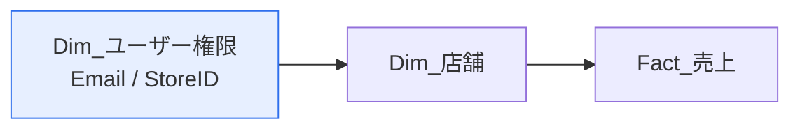
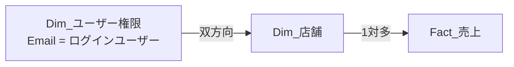
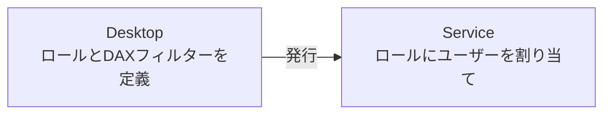

所要45分。行レベルセキュリティ（RLS）を実装し、アプリとして安全に配布するまでを体験します。

## このラボのゴール

「各店舗の店長は自分の店舗のデータだけが見える」レポートを作り、Power BI Service に発行して動作を検証します。



## 準備

- `LAB05_ダッシュボード.pbix`（または LAB03/LAB04 の成果物）
- [security_users.csv](data/security_users.csv)
- Power BI Service にサインインできる組織アカウント（Pro以上）

> [!NOTE]
> 組織アカウントがない場合も、ステップ1〜4（Desktop側）まではすべて実施できます。「ロールとして表示」でRLSの動作を確認できます。ステップ5以降はService側の操作です。

## security_users.csv の構造

| 列 | 説明 |
|---|---|
| Email | ユーザーのメールアドレス（UPN） |
| StoreID | そのユーザーが閲覧できる店舗ID |

同じメールアドレスが複数行あります。これは「1人が複数店舗を担当する」ケースを表しています。

## ステップ1：権限テーブルを読み込む（5分）

1. **データを取得 → テキスト/CSV** で `security_users.csv` を選択
2. **データの変換** → クエリ名を `Dim_ユーザー権限` に変更
3. 両列をテキスト型に設定
4. `Email` 列を選択 → **変換 → 書式 → 小文字**（大文字小文字の揺れを吸収）
5. **ホーム → 閉じて適用**

## ステップ2：リレーションシップを作る（5分）

モデルビューで、`Dim_ユーザー権限[StoreID]` から `Dim_店舗[StoreID]` へ線を引きます。

| 項目 | 設定 |
|---|---|
| 基数 | 多対1（`Dim_ユーザー権限` が多側、`Dim_店舗` が1側） |
| クロスフィルターの方向 | **両方** |

> [!WARN]
> ここは双方向にする必要があります。`Dim_ユーザー権限` でフィルターされた結果を `Dim_店舗` に流し、さらに `Fact_売上` へ伝播させるためです。[L204](lesson.html?id=L204) で「双方向は避ける」と学びましたが、**RLSのブリッジは正当な例外**の1つです。



## ステップ3：ロールを作成する（8分）

1. **モデリング → ロールの管理 → 作成**
2. ロール名を `店舗担当者` に変更
3. `Dim_ユーザー権限` テーブルを選択
4. DAX式に次を入力

```dax
[Email] = LOWER( USERPRINCIPALNAME() )
```

5. 保存

> [!EXAM]
> `USERNAME()` ではなく `USERPRINCIPALNAME()` を使う点が重要です。`USERNAME()` は Desktop では `DOMAIN\user` を返すため、テストと本番で挙動が変わります。`LOWER()` で囲んでいるのは、ステップ1で Email を小文字化したことに合わせるためです。

## ステップ4：Desktop でテストする（8分）

1. **モデリング → 表示 → ロールとして表示**
2. `店舗担当者` にチェック
3. 「他のユーザー」にチェックを入れ、`tanaka@northstar-retail.example.com` と入力
4. **OK**

画面上部に黄色いバナーが表示され、そのユーザーの視点でレポートが表示されます。

### 確認すること

| ユーザー | 期待される表示 |
|---|---|
| tanaka@northstar-retail.example.com | 新宿本店（S001）のみ |
| suzuki@northstar-retail.example.com | 横浜店（S003）のみ |
| area-kanto@northstar-retail.example.com | 関東4店舗（S001〜S004） |
| exec@northstar-retail.example.com | 全14店舗 |

`area-kanto` と `exec` で複数店舗が表示されるのは、`security_users.csv` に複数行あるためです。**1人が複数の行を持てる**のが動的RLSの利点です。

5. バナーの「ロールの表示を停止」で通常表示に戻します

> [!TRAP]
> 「ロールとして表示」で何も表示されない場合、次を確認してください。
> - `Dim_ユーザー権限 → Dim_店舗` のクロスフィルター方向が「両方」になっているか
> - Email の大文字小文字が一致しているか
> - 入力したメールアドレスが `security_users.csv` に存在するか

## ステップ5：発行する（5分）

1. **ホーム → 発行**
2. 発行先のワークスペースを選択（共有ワークスペース。個人用ワークスペースでは共有できません）
3. 発行完了後、「Power BI で開く」をクリック

## ステップ6：Service でロールにユーザーを割り当てる（8分）

1. ワークスペースを開く
2. セマンティックモデルの「**…**」→ **セキュリティ**
3. 左側に `店舗担当者` ロールが表示される
4. 右側の入力欄に、ユーザーまたは**セキュリティグループ**を追加 → **追加** → **保存**



> [!EXAM]
> **ロールの定義は Desktop、ユーザーの割り当ては Service**。この分担は頻出です。Desktop でユーザーを割り当てることはできません。

### Service でのテスト

1. セキュリティ画面でロール名の「**…**」→ **ロールとしてテスト**
2. 特定のユーザーになりすまして表示を確認できます

## ステップ7：アプリとして配布する（6分）

1. ワークスペース右上の **アプリの作成**
2. **セットアップ**：アプリ名 `Northstar 売上ダッシュボード`、説明、テーマ色を設定
3. **コンテンツ**：作成したレポートを追加、表示順を調整
4. **対象ユーザー**：
   - 対象ユーザー名を `全社` に
   - アクセス権を付与するグループ/ユーザーを指定
   - **「ビルド権限を許可する」はオフ**（閲覧のみにする場合）
5. **アプリの発行**

## ステップ8：権限の最終確認（5分）

配布先のユーザーには、次の権限になっている必要があります。

| 対象 | ロール | 理由 |
|---|---|---|
| 閲覧者 | **ビューアー**（またはアプリの閲覧者） | RLSが適用されるのはビューアーのみ |
| レポート作成者 | 共同作成者 | 編集はできるがアプリ発行はできない |
| 配布責任者 | メンバー | アプリの発行・更新ができる |

> [!WARN]
> **閲覧者に共同作成者以上の権限を与えると、RLSが効かず全データが見えてしまいます。** RLSを実装したら、必ず権限設定も併せて確認してください。

## 完成チェックリスト

- [ ] `Dim_ユーザー権限` を読み込み、Emailを小文字化した
- [ ] `Dim_ユーザー権限 → Dim_店舗` を双方向リレーションシップにした
- [ ] `店舗担当者` ロールに `[Email] = LOWER( USERPRINCIPALNAME() )` を設定した
- [ ] Desktop の「ロールとして表示」で4パターンすべて期待どおりに動いた
- [ ] 共有ワークスペースに発行した
- [ ] Service でロールにユーザー/グループを割り当てた
- [ ] 「ロールとしてテスト」で検証した
- [ ] アプリとして発行した
- [ ] 閲覧者にビューアー権限を付与した

## 発展課題：階層型RLS

「エリアマネージャは配下の全店舗を見られる」を実装してみてください。

1. `Dim_店舗` に上位組織を表す列（例：`ParentStoreID`）を追加する
2. `PATH( StoreID, ParentStoreID )` で階層パスの計算列を作る
3. ロールのフィルター式を `PATHCONTAINS` で書き換える

```dax
PATHCONTAINS(
    Dim_店舗[店舗パス],
    LOOKUPVALUE( Dim_ユーザー権限[StoreID], Dim_ユーザー権限[Email], LOWER( USERPRINCIPALNAME() ) )
)
```

詳しくは [L206](lesson.html?id=L206) を参照してください。

## お疲れさまでした

これで6つのハンズオンラボはすべて完了です。データの取得から、整形・モデリング・DAX・可視化・配布・セキュリティまでを一通り実装したことになります。

次は [模擬試験](exam.html) で、知識の定着を確認してください。
