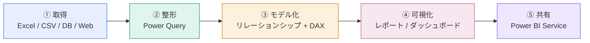
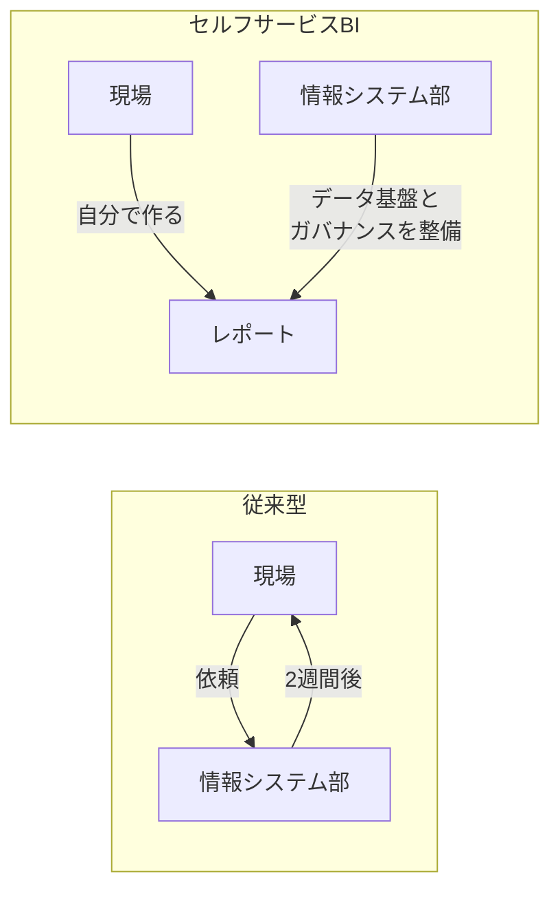

Excelで毎月同じ集計をしていて、「またこの作業か」と思ったことはありませんか。Power BI は、その繰り返しを一度作れば終わりにするための道具です。

## Power BI は「データを意思決定に変える」パイプライン

Power BI がやっていることは、突き詰めると4つの工程だけです。この流れは全レッスンを通じて何度も出てくるので、まずこの1枚を頭に入れてください。

この5工程が、そのまま本サイトのレベル構成に対応しています。

| 工程 | 学ぶレベル | 使う道具 |
|---|---|---|
| ① 取得・② 整形 | Lv.1 | Power Query（M言語） |
| ③ モデル化 | Lv.2 / Lv.3 | リレーションシップ・DAX |
| ④ 可視化 | Lv.4 | レポートビュー・ビジュアル |
| ⑤ 共有・運用 | Lv.5 | Power BI Service |

> [!NOTE]
> Power BI の学習でつまずく人の大半は、②③を飛ばして④から入ります。グラフは作れるのに数字が合わない、という状態です。遠回りに見えても、Lv.1から順に進むのが最短です。

## Excelと何が違うのか

「Excelでもできる」ことは事実です。違うのは**繰り返しの扱い方**です。

具体的な違いを整理すると次のとおりです。

| 観点 | Excel | Power BI |
|---|---|---|
| 得意なこと | 手作業での計算・自由な表づくり | 決まった集計の繰り返し・大量データ |
| データ量 | 100万行が上限（実用は数万行） | 数千万行でも軽快（列指向で圧縮） |
| 手順の再現 | 手順が人の頭の中にある | 手順がクエリとして保存される |
| 更新 | 毎回作り直す | 更新ボタン／スケジュール自動更新 |
| 共有 | ファイルを配る（版が乱立する） | URLを共有（常に最新が1つ） |
| 権限 | ファイル単位 | 行レベルまで制御できる（RLS） |

> [!TIP]
> 「Excelの置き換え」ではなく「Excelの隣に置く道具」と考えると判断しやすくなります。**一度きりの分析はExcel、毎月繰り返す分析はPower BI** が基本方針です。

## 「セルフサービスBI」という言葉の意味

かつてレポート作成は情報システム部門への依頼事項でした。依頼して2週間待ち、出てきた数字を見て「やっぱりこの切り口でも見たい」と再依頼する——このサイクルが分析のスピードを殺していました。

セルフサービスBIは、現場が自分でデータを触れるようにする考え方です。ただし野放しにすると「数字が人によって違う」状態を生むため、**Lv.5で学ぶガバナンス**とセットで初めて機能します。

## Power BIでできることの具体例

- 売上ダッシュボード：昨対比・予算達成率・店舗ランキングを1画面で
- 在庫の異常検知：閾値を割った商品だけ自動でハイライト
- 営業の行動分析：訪問件数と受注率の関係を散布図で
- Webアクセス解析：どの地域からいつ見られているかを地図で
- 経営会議用の月次レポート：毎月1日に自動更新され、スマホからも見られる

> [!EXAM]
> PL-300では「Power BIとは何か」を直接問う問題は出ません。ただし**どの工程でどのツールを使うか**（例：データのクレンジングはPower Query、集計ロジックはDAX）を問う問題は頻出です。この4工程の対応関係は必ず覚えてください。

## 理解度チェック（自分に説明してみる）

次の3つを、図を見ずに人に説明できますか。

1. Power BIの4工程を順番に言えますか
2. Excelを使い続けるべき場面を1つ挙げられますか
3. セルフサービスBIが抱えるリスクは何ですか

言葉に詰まったら、上に戻ってもう一度図を眺めてください。図が思い出せれば、説明は後からついてきます。
