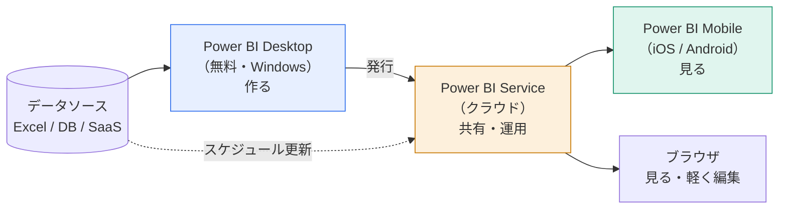
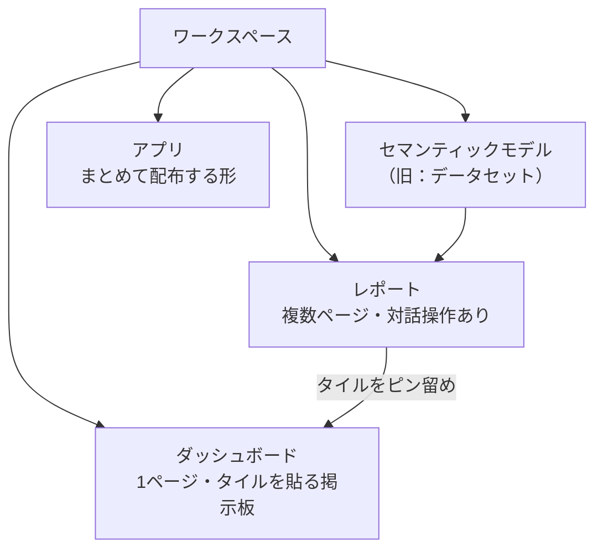
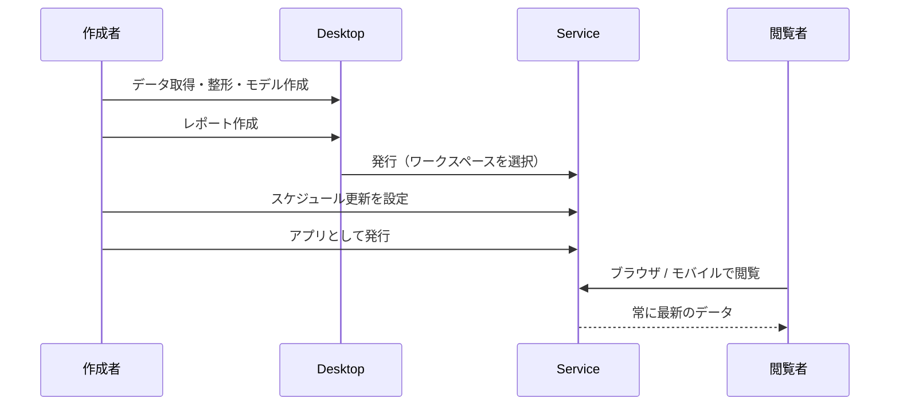

Power BI は1つの製品ではありません。役割の違う3つが連携して動きます。ここを混同すると、あとで「発行ってどこに？」「ダッシュボードとレポートの違いは？」で必ず迷います。

## 3つの製品の役割分担

| 製品 | 主な用途 | できること | できないこと |
|---|---|---|---|
| **Desktop** | 制作 | データ取得・整形・モデリング・DAX・レポート作成 | 他人への共有 |
| **Service** | 共有・運用 | 発行・アプリ配布・スケジュール更新・RLS適用・権限管理 | Power Queryの本格的な編集（一部制限あり） |
| **Mobile** | 閲覧 | レポート閲覧・アラート受信・注釈付き共有 | 作成・編集 |

> [!TRAP]
> 「Power BI Desktop で共有する」ことはできません。共有は必ず Service を経由します。`.pbix` ファイルを直接メールで送るのは、Excelファイルを配るのと同じ問題（版の乱立）を招きます。

## 用語の整理：レポートとダッシュボードは別物

日本語では両方「ダッシュボード」と呼ばれがちですが、Power BI では明確に区別されます。

- **セマンティックモデル**：データ本体 + リレーションシップ + メジャー。レポートの中身の「エンジン」
- **レポート**：複数ページ、フィルターやドリルダウンなど対話操作ができる
- **ダッシュボード**：Serviceだけの機能。複数レポートからタイルをピン留めした1ページの掲示板
- **アプリ**：レポートやダッシュボードをまとめ、閲覧者向けに配布する形

> [!EXAM]
> 「データセット」は現在 **セマンティックモデル (semantic model)** に名称変更されています。試験でも新旧どちらの表記も見かけます。同じものだと理解しておいてください。

## ライセンスの考え方

| ライセンス | 費用感 | できること |
|---|---|---|
| Desktop | 無料 | 作成のみ。1人で完結するなら費用ゼロ |
| Free（Serviceのみ） | 無料 | 個人用ワークスペースでの利用のみ。他人と共有不可 |
| Pro | ユーザー単位の月額 | 作成・共有・アプリ配布。もっとも一般的 |
| Premium Per User (PPU) | Proより高い | Proの機能 + 大容量モデル・高頻度更新など |
| Fabric / Premium 容量 | 容量単位 | Free ユーザーにも配布可能。大規模組織向け |

> [!NOTE]
> 「作った本人はPro、見るだけの人もPro」が原則です。閲覧者を含めた全員分のライセンスが必要になる点は、導入計画でよく見落とされます（容量ライセンスを買った場合を除く）。

## 作成から共有までの流れ

> [!EXAM]
> 「レポートを社内の100人に配布したい。最も適切な方法は？」という設問では、個別共有ではなく **アプリとして発行** が正解になります。管理と権限の観点で最も適切だからです。詳しくは Lv.5 で扱います。

## まとめ

- 作るのは Desktop、共有は Service、見るのは Mobile／ブラウザ
- レポート（対話できる複数ページ）とダッシュボード（Serviceの1ページ掲示板）は別物
- データ本体はセマンティックモデル。1つのモデルを複数レポートで使い回せる
