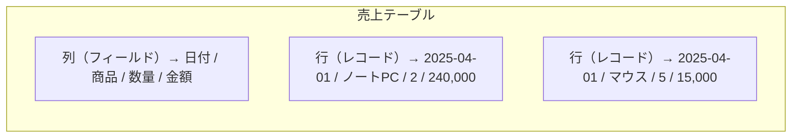

これから何度も出てくる言葉を、ここで一度そろえておきます。用語が曖昧なままだと、Lv.2以降の説明が急に難しく感じられます。

## テーブル・列・行

Power BI が扱うデータは、すべて**テーブル（表）**の形をしています。

- **列（column / フィールド）**：属性。「何を持っているか」
- **行（row / レコード）**：1件の事実。「いつ何が起きたか」

Power BI は**列指向**でデータを保持します。行ごとではなく列ごとにまとめて圧縮するため、同じ値が繰り返される列（都道府県、カテゴリなど）は劇的に小さくなります。この性質は Lv.2 のモデル最適化で効いてきます。

## ファクトとディメンション

分析用のテーブルは、性質によって2種類に分かれます。**この区別がPower BI学習の最重要ポイント**です。

| | ファクトテーブル | ディメンションテーブル |
|---|---|---|
| 内容 | 起きた出来事の記録 | 出来事を説明する属性 |
| 例 | 売上明細、アクセスログ、入出庫 | 商品、顧客、店舗、日付 |
| 行数 | 多い（数万〜数千万行） | 少ない（数十〜数万行） |
| 増え方 | 時間とともに増え続ける | ほとんど増えない |
| 使い方 | 集計する（合計・平均） | 切り口にする（〜別に見る） |
| 目印 | 数値の列が多い | 文字列の列が多い |

見分け方はシンプルです。**「〜別の売上」と言ったとき、「〜」に入るものがディメンション、「売上」がファクト**です。

> [!TIP]
> 迷ったら「このテーブルは足し算したくなるか？」と自問してください。足したくなるならファクト、切り口として使いたいならディメンションです。

## 粒度（グレイン）

**粒度とは「ファクトテーブルの1行が何を表しているか」**です。

| 粒度 | 1行の意味 | 行数の目安 |
|---|---|---|
| 明細レベル | 注文1件の中の商品1つ | 非常に多い |
| 注文レベル | 注文1件 | 多い |
| 日次×商品 | ある日のある商品の合計 | 中 |
| 月次×カテゴリ | ある月のあるカテゴリの合計 | 少ない |

> [!TRAP]
> 粒度を後から細かくすることはできません。月次に集約したデータから「日別に見たい」と言われても、元データを取り直すしかありません。**迷ったら細かい粒度で取り込む**のが原則です（性能が問題になったら後から粗くできます）。

## 計算列とメジャー

Power BI で「計算」を作る方法は2つあり、この違いが初学者最大の壁です。

| | 計算列 | メジャー |
|---|---|---|
| 計算されるタイミング | データ更新時に1回 | 表示のたび（クリックのたび） |
| 保存 | 各行に値が保存される | 保存されない |
| メモリ | 消費する | ほぼ消費しない |
| 使いどころ | 行ごとの属性を作る（例：単価×数量、価格帯の区分） | 集計値（合計・平均・比率） |
| 例 | `売上金額 = [数量] * [単価]` | `総売上 = SUM([売上金額])` |

原則は **「集計はメジャー、行ごとの属性は計算列」**。迷ったらメジャーを試してください。

> [!EXAM]
> 「スライサーの選択肢にしたい」→ 計算列（値が保存されている必要がある）。「合計や比率を出したい」→ メジャー。この判断は頻出です。

## そのほか押さえる用語

| 用語 | 意味 |
|---|---|
| **リレーションシップ** | テーブル同士のつながり。Lv.2で詳しく扱う |
| **スタースキーマ** | ファクト1つを中心にディメンションが放射状に並ぶ設計 |
| **DAX** | メジャーや計算列を書く式言語（Lv.3） |
| **M言語** | Power Query の変換手順を記述する言語（Lv.1） |
| **VertiPaq** | Power BI 内部の列指向データベースエンジン |
| **カーディナリティ** | 列に含まれる値の種類の数。多いほど圧縮が効かない |
| **整然データ (tidy data)** | 1列1変数・1行1観測・1テーブル1種類 という整った形 |

## 理解度チェック

次のテーブルはファクトかディメンションか、判断してください。

1. 全国の店舗一覧（店舗コード、店舗名、都道府県、開店日）
2. POSレジの取引ログ（取引ID、日時、商品コード、点数、金額）
3. 社員マスタ（社員番号、氏名、所属、入社日）
4. 日次の在庫残高（日付、倉庫、商品、残数）

答え：1=ディメンション、2=ファクト、3=ディメンション、4=ファクト（日付ごとに増え続けるため）
