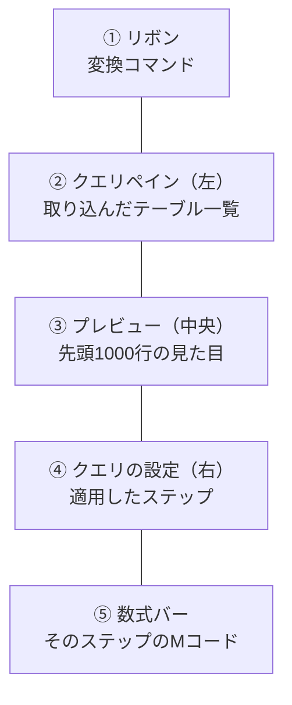

Power Query は「データ整形の記録係」です。あなたがマウスでした操作をすべて手順として記録し、次回以降は同じ手順を自動で再実行します。

## エディタの5つの領域



もっとも重要なのは **④ 適用したステップ** です。ここに操作の履歴が上から順に積み上がります。

## 「適用したステップ」が本体


- ステップ名をクリックすると、**その時点のデータ**がプレビューに表示される
- 途中のステップを削除・並べ替えできる
- 歯車アイコンがあるステップは、設定をやり直せる

> [!TIP]
> うまくいかないときは、ステップを上から順にクリックして「どこで壊れたか」を特定してください。デバッグの基本動作です。

> [!TRAP]
> ステップの順序には意味があります。「列の削除」を先にしてから、その列を参照する「フィルター」を置くとエラーになります。並べ替えるときは依存関係に注意してください。

## 最初にやるべき3つの操作

新しくデータを読み込んだら、まずこの3つを確認します。

### 1. ヘッダーの昇格

1行目が見出しなのにデータ行として扱われている場合：**変換 → 1行目をヘッダーとして使用**

### 2. データ型の設定

各列の左上のアイコンが型を表します。

| アイコン | 型 | 用途 |
|---|---|---|
| 123 | 整数 | 個数・ID |
| 1.2 | 10進数 | 金額・率 |
| ABC | テキスト | 名称・コード |
| カレンダー | 日付 | 日付 |
| ABC123 | any（型未設定） | **これは危険信号** |

> [!WARN]
> `any` 型が残っていると、Service での更新時に予期しない型変換が起きます。すべての列に明示的な型を設定してください。

### 3. 不要な列の削除

使わない列は**この段階で消します**。読み込むデータ量が減り、モデルが軽くなります。

> [!TIP]
> 「列の削除」より **「他の列の削除」**（使う列を選んで右クリック）を使うほうが安全です。元データに新しい列が増えても、クエリが壊れません。

## 列プロファイル — データの健康診断

**表示タブ**で3つのチェックボックスをオンにしてください。

| 機能 | 分かること |
|---|---|
| 列の品質 | 有効・エラー・空 の割合 |
| 列の分布 | 個別の値の数、一意の値の数 |
| 列のプロファイル | 最小・最大・平均・分布のヒストグラム |

さらに画面下部のステータスバーで **「上位1000行に基づく列プロファイル」→「データセット全体に基づく列プロファイル」** に切り替えられます。

> [!TIP]
> 分析を始める前に列プロファイルを眺める習慣をつけてください。「顧客IDに空白が3%ある」「日付が1900年になっている行がある」といった地雷を、レポートを作る前に見つけられます。

## UI操作はすべてMコードになる

数式バーを見てください。列を1つ削除しただけで、こんなコードが生成されています。

```m
= Table.RemoveColumns(変更された型,{"備考"})
```

**ホーム → 詳細エディタ** を開くと、全ステップが1つのコードとして見えます。

```m
let
    ソース = Csv.Document(File.Contents("C:\data\sales.csv"),
                          [Delimiter=",", Encoding=65001]),
    昇格されたヘッダー数 = Table.PromoteHeaders(ソース),
    変更された型 = Table.TransformColumnTypes(昇格されたヘッダー数,
                     {{"OrderDate", type date}, {"Quantity", Int64.Type}}),
    削除された列 = Table.RemoveColumns(変更された型,{"備考"})
in
    削除された列
```

各ステップが変数になり、前のステップの結果を受け取って次に渡していく——これがMの構造です（詳しくは L107）。

> [!EXAM]
> 「Power Query で行った変換は元データを書き換えるか？」→ **書き換えません**。変換はPower BI内部でのみ行われ、ソースファイルは無傷です。この確認は出題されます。

## クエリの整理

クエリが増えてきたら整理します。

- **グループ化**：クエリを右クリック → 「新しいグループへ移動」
- **読み込みの無効化**：中間クエリを右クリック → 「読み込みを有効にする」のチェックを外す（モデルに不要なテーブルを持ち込まない）
- **参照**：既存クエリを元に別のクエリを作る（`複製` は独立コピー、`参照` は元を参照）

> [!TRAP]
> `複製` と `参照` は別物です。参照は元クエリの変更が伝播します。複製は独立します。マージ用の中間テーブルを作るときは参照、実験用には複製、と使い分けます。
