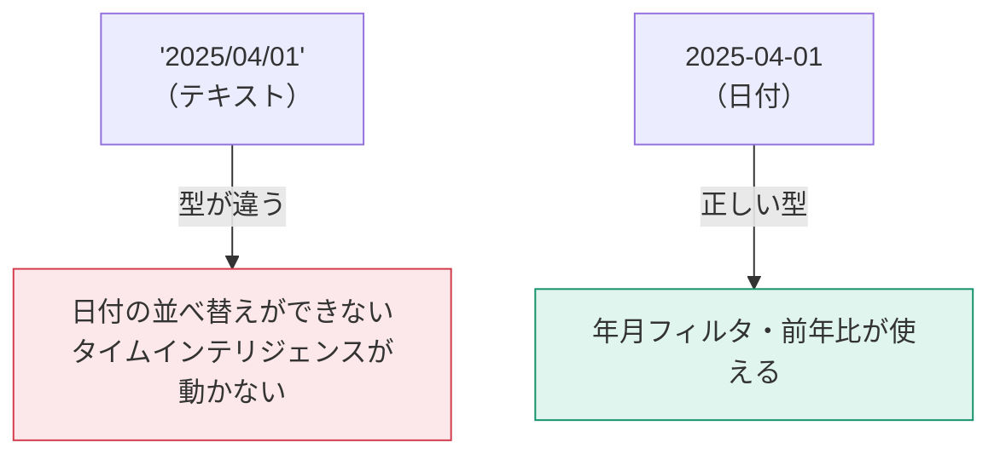
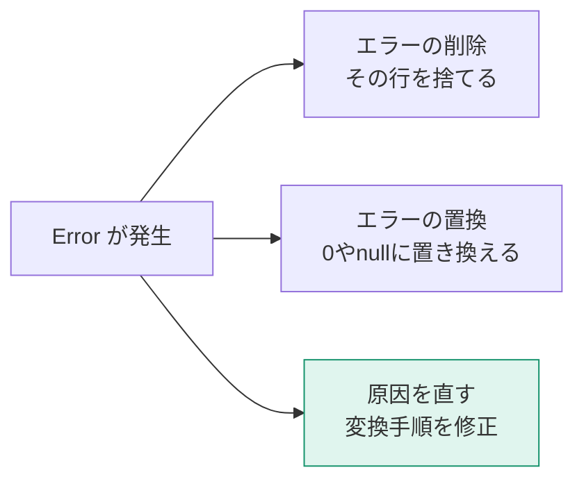

現実のデータは汚れています。全角スペース、表記ゆれ、「‐」と「-」の混在、日付に見える文字列。この回では、それらを機械的に片づける手順を身につけます。

## データ型はすべての土台



型の設定方法は3つあります。

1. 列見出し左のアイコンをクリック → 型を選ぶ
2. **変換 → データ型**
3. **変換 → ロケールを使用**（重要）

### ロケールを使用

`01/04/2025` という文字列は、日本なら「1月4日」、ヨーロッパなら「4月1日」です。Power BI は既定でシステムのロケールを使うため、意図しない解釈が起きます。

**変換 → データ型 → ロケールを使用 → 日付 / 日本語(日本)** と明示的に指定すれば、環境に依存しなくなります。

> [!EXAM]
> 「別の国のPCで開いたら日付がずれる」という設問の正解は、ほぼ **「ロケールを使用」で型変換する** です。

## エラーの正体と3つの対処

型変換に失敗したセルは `Error` になります。



| 対処 | 操作 | 使いどころ |
|---|---|---|
| 行を削除 | ホーム → 行の削除 → エラーの削除 | 明らかなゴミ行 |
| 値を置換 | 変換 → 値の置換 → エラーの置換 | 欠測を0として扱ってよい場合 |
| 原因を直す | 変換手順の修正 | **まずこれを検討する** |

> [!WARN]
> 「エラーの削除」を安易に使うと、**本来集計されるべきデータが黙って消えます**。削除する前に、必ずエラー行を確認してください（列見出しの品質バーの「エラー」をクリックすると、エラー行だけ抽出できます）。

## null と空文字は違う

| 値 | 意味 | 集計での扱い |
|---|---|---|
| `null` | 値が存在しない | SUM等では無視される |
| `""`（空文字） | 長さ0の文字列 | 「値がある」扱い |
| `0` | ゼロという値 | 集計に含まれる |

「売上がnull」と「売上が0」は意味が違います。前者は「データがない」、後者は「売れなかった」。集計結果が変わるので、意図を持って使い分けてください。

**変換 → 値の置換** で `null` ↔ `0` を相互に変換できます。

## 文字列のクレンジング定番セット

日本語データでは、以下をワンセットで適用しておくと事故が激減します。

| 操作 | メニュー | 効果 |
|---|---|---|
| トリミング | 変換 → 書式 → トリミング | 前後の空白を除去 |
| クリーン | 変換 → 書式 → クリーン | 印字されない制御文字を除去 |
| 大文字/小文字 | 変換 → 書式 → 小文字 | 表記ゆれを統一 |
| 値の置換 | 変換 → 値の置換 | 全角スペースなど個別対応 |

> [!TRAP]
> **標準の「トリミング」は半角スペースしか除去しません。** 全角スペース（U+3000）は残ります。日本語データでは、トリミングの前に「値の置換」で全角スペースを半角に変換するか、次のカスタム列を使ってください。

```m
= Table.TransformColumns(前のステップ,
    {{"顧客名", each Text.Trim(Text.Replace(_, "　", " ")), type text}})
```

## 重複の扱い

| 操作 | 場所 | 注意 |
|---|---|---|
| 重複の削除 | ホーム → 行の削除 → 重複の削除 | **選択中の列**が基準になる |
| 重複の保持 | ホーム → 行の保持 → 重複の保持 | 重複行の調査に便利 |

> [!TRAP]
> 列を選ばずに「重複の削除」を実行すると、**全列が一致する行**だけが削除されます。「顧客IDの重複を消したい」なら、顧客ID列を選んでから実行します。ただしその場合、どの行が残るかは元の並び順に依存するため、事前に並べ替えておく必要があります。

## 条件列で分類を作る

**列の追加 → 条件列** で、if-then-else をGUIで書けます。

例：売上金額を「高額 / 中額 / 少額」に分類する

| 条件 | 出力 |
|---|---|
| SalesAmount >= 100000 | 高額 |
| SalesAmount >= 10000 | 中額 |
| それ以外 | 少額 |

生成されるMコードはこうなります。

```m
= Table.AddColumn(前のステップ, "金額区分", each
    if [SalesAmount] >= 100000 then "高額"
    else if [SalesAmount] >= 10000 then "中額"
    else "少額", type text)
```

> [!TIP]
> 分類のような「行ごとの属性」は、DAXの計算列ではなく Power Query の条件列で作るほうが良い場面が多いです。データ更新時に一度だけ計算され、モデル側の負荷になりません。

## クレンジングのチェックリスト

作業が終わったら、以下を確認してください。

- [ ] すべての列に明示的なデータ型が設定されている（`any` が残っていない）
- [ ] 列の品質でエラー0%、または残したエラーの理由を説明できる
- [ ] 日付列がカレンダーアイコンになっている
- [ ] 文字列列のトリミング・全角スペース処理が済んでいる
- [ ] 使わない列を削除済み
- [ ] キー列（顧客ID等）に null がない
