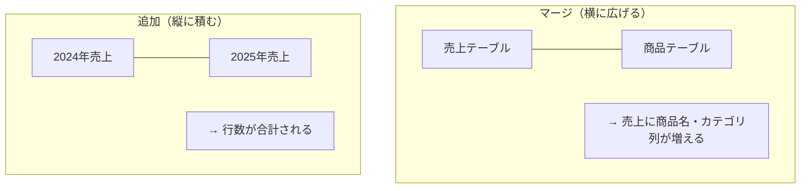
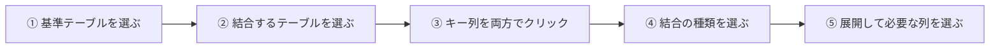
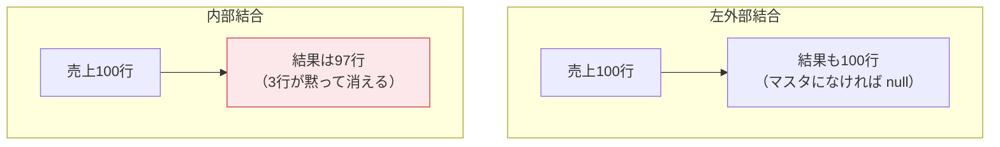
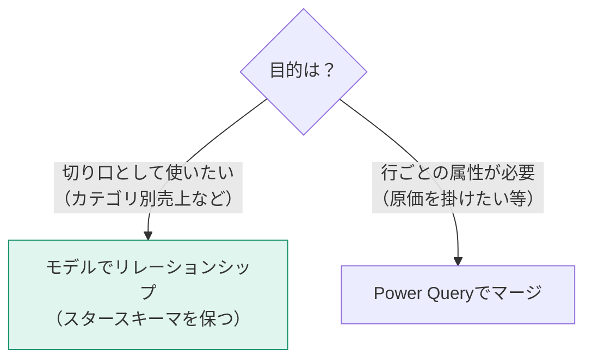

テーブルを組み合わせる方法は2つだけです。**横に広げる（マージ）**か、**縦に積む（追加）**か。この違いを図でしっかり分けておきます。

## マージと追加



| | マージ | 追加 |
|---|---|---|
| SQLでいうと | JOIN | UNION |
| 増えるもの | 列 | 行 |
| 必要な条件 | 突き合わせるキー列 | 同じ列構成 |
| メニュー | ホーム → クエリのマージ | ホーム → クエリの追加 |

## 追加（Append）

同じ形のテーブルを縦に積みます。

1. **ホーム → クエリの追加 → クエリを新規追加として**
2. 積みたいテーブルを2つ以上選択

> [!TRAP]
> **列名が完全一致していないと、別の列として扱われます。** 「売上金額」と「売上額」が混在すると、片方が null だらけの列が2本できます。追加の前に列名を揃えてください。

> [!TIP]
> 3つ以上を積むときは「3つ以上のテーブル」オプションを使います。ただし、そもそも同じ形のファイルが複数あるならフォルダ接続（L101）のほうが保守が楽です。

## マージ（Merge）

キー列で突き合わせて、別テーブルの列を持ってきます。



手順4で選ぶ**結合の種類**が最重要です。

| 種類 | 残る行 | 使いどころ |
|---|---|---|
| **左外部** | 左の全行 + 一致した右の情報 | **もっとも一般的**。売上に商品名を付ける |
| 右外部 | 右の全行 + 一致した左の情報 | 左右を入れ替えた左外部と同じ |
| 完全外部 | 両方の全行 | 差分の調査 |
| 内部 | 一致した行のみ | 一致するものだけ欲しいとき |
| 左反 | 左にあって右にない行 | **マスタ未登録の検出** |
| 右反 | 右にあって左にない行 | 使われていないマスタの検出 |



> [!WARN]
> 内部結合は**行が黙って消えます**。「合計が合わない」原因の常連です。売上にマスタ情報を付けるだけなら、必ず**左外部結合**を使ってください。

> [!TIP]
> **左反結合はデータ品質チェックの必殺技です。** 売上テーブルを左、商品マスタを右にして左反結合すると、「マスタに存在しない商品コードで売られた行」だけが抽出されます。原因不明の数字ズレは、大抵ここに答えがあります。

## 展開のときの注意

マージ直後、新しい列にはテーブルのアイコンが入っています。列見出しの展開ボタン（⇔）を押して、必要な列だけを選びます。

チェックボックス下部の **「元の列名をプレフィックスとして使用します」** は、通常オフにします。オンだと `商品.商品名` のような長い列名になります。

> [!TRAP]
> **展開で行数が増えることがあります。** 右テーブルのキーが一意でない場合（同じ商品コードが2行ある等）、左の1行が右の該当行数だけ複製されます。マージの前後で行数を確認する習慣をつけてください。マージ画面の下部に「〜個中〜個の行が一致しました」という表示が出るので、必ず読んでください。

## Power Query でマージすべきか、モデルでリレーションを張るべきか

これは実務でよく迷うポイントです。



| 判断 | 選択 |
|---|---|
| 商品カテゴリ別に売上を見たい | **リレーションシップ**（マージしない） |
| 売上行ごとに原価を掛けて粗利を出したい | マージして原価列を持ってくる |
| ディメンションの属性を増やしたい | ディメンション側でマージ |

> [!EXAM]
> 原則は **「マージしすぎない」**。すべてをマージして1つの巨大なフラットテーブルにするのは、Lv.2で学ぶスタースキーマの正反対のアンチパターンです。この判断は出題されます。

## 実践：3テーブルの構成例

```m
// 売上に商品マスタから「標準原価」だけを持ってくる例
let
    ソース = 売上,
    マージ = Table.NestedJoin(ソース, {"ProductID"}, 商品, {"ProductID"},
                              "商品情報", JoinKind.LeftOuter),
    展開 = Table.ExpandTableColumn(マージ, "商品情報", {"StandardCost"}, {"標準原価"}),
    粗利 = Table.AddColumn(展開, "原価合計",
             each [Quantity] * [標準原価], type number)
in
    粗利
```
