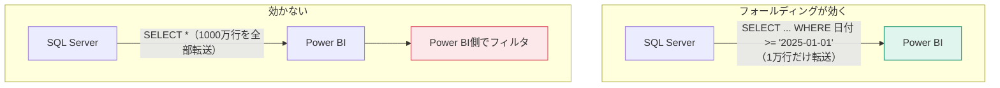

ここからは Power Query を「使える」から「設計できる」に引き上げます。パラメータ・カスタム関数・クエリフォールディングの3つです。

## パラメータ — クエリを可変にする

ファイルパスやサーバ名をクエリに直書きすると、環境が変わるたびに全ステップを直すことになります。

**ホーム → パラメーターの管理 → 新しいパラメーター**

| 設定項目 | 例 |
|---|---|
| 名前 | `DataFolder` |
| 種類 | テキスト |
| 推奨値 | 値の一覧 |
| 現在の値 | `C:\data\` |

作ったパラメータは、ソースステップの設定で選べるようになります。

```m
let
    ソース = Csv.Document(File.Contents(DataFolder & "sales.csv"))
in
    ソース
```

> [!TIP]
> 開発環境と本番環境でデータソースを切り替える定番手法です。Lv.5 のデプロイメントパイプラインでは、この**パラメータをデータソース規則で自動切り替え**します。

用途の例：

- 取り込む期間（開始日・終了日）
- 環境（開発 / 本番）のサーバ名
- 取り込む対象部門のコード

## カスタム関数 — 同じ処理を再利用する

同じ変換を複数のクエリに繰り返し書いているなら、関数にまとめます。

### 作り方1：GUIから

1. 変換のひな型となるクエリを1つ完成させる
2. そのクエリを右クリック → **関数の作成**
3. パラメータを指定

### 作り方2：詳細エディタで直接書く

```m
// 全角スペースを半角にして前後を除去する関数
let
    Clean = (input as nullable text) as nullable text =>
        if input = null then null
        else Text.Trim(Text.Replace(input, "　", " "))
in
    Clean
```

呼び出し側：

```m
= Table.TransformColumns(前のステップ, {{"顧客名", Clean, type text}})
```

> [!TIP]
> フォルダ接続（L101）で「結合」を押すと、Power BI が自動でこのカスタム関数を作ります。中身を読んでみると、関数の書き方が自然と身につきます。

## クエリ フォールディング — 性能の鍵

**フォールディングとは、Power Query の変換手順をデータソース側（SQLなど）に押し戻して実行させる仕組み**です。



同じ結果でも、転送量が1000倍違うことがあります。

### 確認方法

ステップを右クリック → **「ネイティブクエリの表示」**

- 選べる → そのステップまでフォールディングされている
- グレーアウト → そこでフォールディングが止まっている

### フォールディングしやすい操作 / しにくい操作

| 効きやすい | 効きにくい・止まる |
|---|---|
| 行のフィルター | カスタム関数の適用 |
| 列の削除・並べ替え | `Table.Buffer` |
| グループ化 | 一部の日付関数・テキスト関数 |
| マージ（同一ソース同士） | インデックス列の追加 |
| 型変更（多くの場合） | 異なるデータソース間のマージ |

> [!EXAM]
> 「更新に時間がかかる。改善方法は？」という設問では、**フォールディングが効く順序に変換を並べ替える**（フィルターや列削除を先頭に持ってくる）が正解になります。

> [!TIP]
> 実務の鉄則は **「絞り込みは可能な限り最初に」**。行のフィルターと列の削除を先頭に置くだけで、更新時間が劇的に変わることがあります。

## 増分更新の考え方

大きなファクトテーブルを毎回まるごと読み直すのは無駄です。**増分更新**は「古い期間は保持し、直近だけ再取得する」仕組みです。


設定の前提条件：

1. `RangeStart` と `RangeEnd` という名前の**日付/時刻型パラメータ**を作る（名前は固定・大文字小文字も一致させる）
2. ファクトテーブルの日付列をこの2つでフィルターする
3. テーブルを右クリック → **増分更新** で保持期間と更新期間を設定
4. Service に発行して初回更新

> [!WARN]
> 増分更新はフォールディングが効くデータソースでなければ意味がありません。CSVやExcelでは基本的に使えません。

> [!EXAM]
> `RangeStart` / `RangeEnd` という**パラメータ名が固定**であることは、そのまま出題されます。
