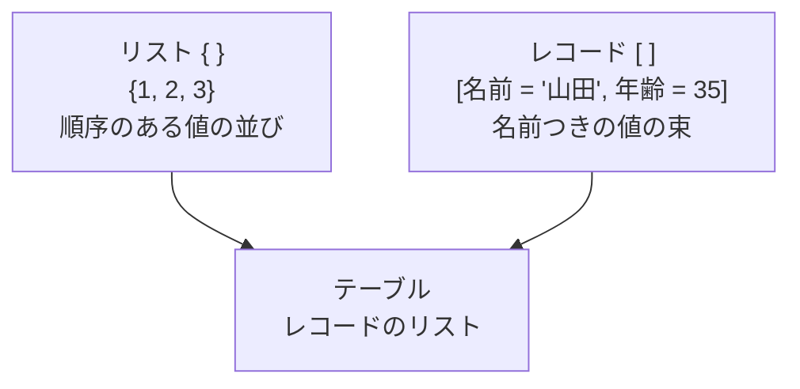

UI操作だけでも大半は足りますが、Mコードが読めると「エラーの原因が分かる」「他人のクエリを引き継げる」ようになります。読めるレベルを目指します。

## let ... in の構造

Mコードの基本形はこれだけです。

```m
let
    変数1 = 式,
    変数2 = 変数1 を使った式,
    変数3 = 変数2 を使った式
in
    変数3
```

- `let` の中で変数を順に定義する
- `in` の後に「最終的に返すもの」を書く
- **変数名 = 「適用したステップ」の名前**


つまり、右ペインの「適用したステップ」は、`let` の中の変数がそのまま並んでいるだけです。

## 実際のコードを読む

```m
let
    ソース = Csv.Document(
                 File.Contents("C:\data\sales.csv"),
                 [Delimiter = ",", Columns = 8, Encoding = 65001]),
    ヘッダー昇格 = Table.PromoteHeaders(ソース, [PromoteAllScalars = true]),
    型変換 = Table.TransformColumnTypes(ヘッダー昇格, {
                 {"OrderDate", type date},
                 {"Quantity", Int64.Type},
                 {"UnitPrice", type number}
             }),
    絞り込み = Table.SelectRows(型変換, each [Quantity] > 0),
    列削除 = Table.RemoveColumns(絞り込み, {"備考"})
in
    列削除
```

読み方のコツ：

- 各関数の**第1引数が「前のステップ」**になっている（データが左から右へ流れる）
- `[...]` はレコード（オプション設定の束）
- `{...}` はリスト（値の並び）
- `each` は「各行に対して」の意味

## 重要な3つのデータ構造



| 記号 | 名前 | 例 | アクセス方法 |
|---|---|---|---|
| `{ }` | リスト | `{1, 2, 3}` | `リスト{0}` （0始まり） |
| `[ ]` | レコード | `[名前="山田"]` | `レコード[名前]` |
| — | テーブル | 表 | `テーブル{0}[列名]` |

## each と _ の意味

`each` は「引数を1つ取る無名関数」の省略記法です。`_` がその引数を指します。

```m
// この2つは同じ意味
each [Quantity] > 0
(_) => _[Quantity] > 0
```

行ごとの処理では `[列名]` と書くと、`_[列名]` の省略として解釈されます。

## 大文字小文字の区別

> [!WARN]
> **M言語は大文字と小文字を厳密に区別します。** `Table.SelectRows` を `table.selectrows` と書くとエラーです。DAXは区別しないため、両方を書いていると混乱します。「MはうるさくてDAXは寛容」と覚えてください。

## よく使う関数の対応表

| やりたいこと | M関数 |
|---|---|
| 行を絞り込む | `Table.SelectRows` |
| 列を削除 | `Table.RemoveColumns` |
| 列を残す | `Table.SelectColumns` |
| 列を追加 | `Table.AddColumn` |
| 列名を変更 | `Table.RenameColumns` |
| 型を変える | `Table.TransformColumnTypes` |
| グループ化 | `Table.Group` |
| 結合 | `Table.NestedJoin` + `Table.ExpandTableColumn` |
| 縦に積む | `Table.Combine` |
| 重複削除 | `Table.Distinct` |
| ピボット解除 | `Table.UnpivotOtherColumns` |
| 文字の置換 | `Text.Replace` |
| 前後の空白除去 | `Text.Trim` |
| 日付から年 | `Date.Year` |

## エラーハンドリング

```m
// 変換に失敗したら null を返す
= try Number.FromText([コード]) otherwise null
```

`try ... otherwise` は、エラーが起きたときの代替値を指定します。列全体に適用するなら：

```m
= Table.TransformColumns(前のステップ,
    {{"コード", each try Number.FromText(_) otherwise null, type number}})
```

> [!TIP]
> `try` を安易に使うと、本当は直すべき問題を隠してしまいます。まず列プロファイルでエラーの実態を確認し、それでも許容できると判断したときだけ使ってください。

## コメントの書き方

```m
// 1行コメント

/* 複数行
   コメント */
```

> [!TIP]
> 詳細エディタに直接書いたコードは、他人（3か月後の自分を含む）には解読が難しくなります。ステップ名を日本語で意味の分かるものにリネームしておくだけでも、可読性は大きく変わります。

## 練習：このコードは何をしているか

```m
let
    ソース = Excel.Workbook(File.Contents("売上.xlsx"), null, true),
    シート = ソース{[Item = "Sheet1", Kind = "Sheet"]}[Data],
    ヘッダー = Table.PromoteHeaders(シート),
    フィルター = Table.SelectRows(ヘッダー, each [売上] <> null and [売上] > 0),
    グループ = Table.Group(フィルター, {"店舗"}, {{"売上合計", each List.Sum([売上]), type number}})
in
    グループ
```

答え：Excelファイルの Sheet1 を読み、1行目をヘッダーにし、売上が null でなく0より大きい行に絞り、店舗ごとに売上を合計している。
