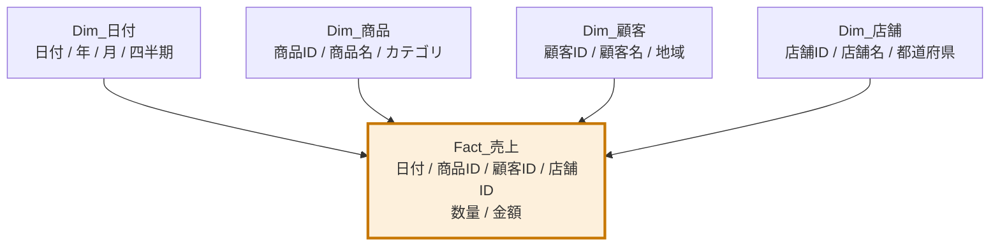
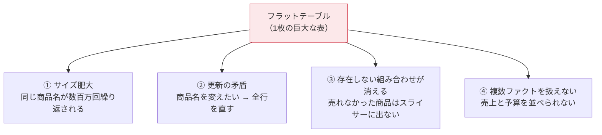
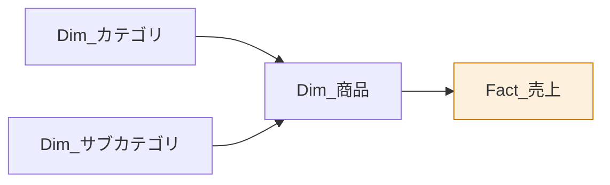
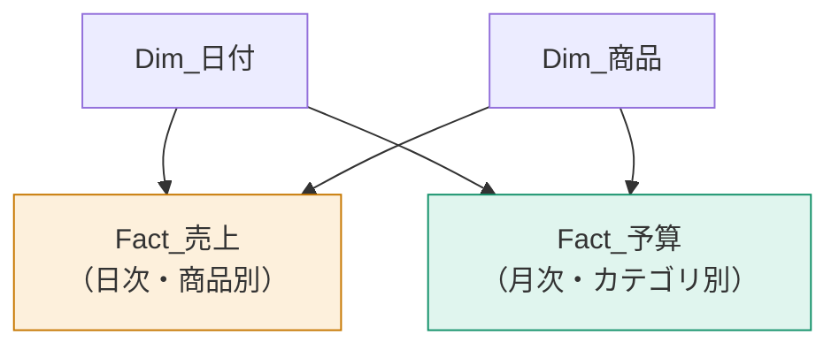

このレッスンが本サイト全体でもっとも重要です。**Power BIで起きる問題の8割はモデル設計に原因があり、その解決策はほぼ常に「スタースキーマにする」**です。

## スタースキーマとは

中央にファクトテーブルを1つ置き、その周りにディメンションテーブルを放射状に配置する設計です。図にすると星形に見えるので、この名前がついています。

ルールは3つだけです。

1. ファクトは**数値と外部キーだけ**を持つ
2. ディメンションは**説明的な属性**を持つ
3. リレーションシップは**ディメンションからファクトへ、1対多**

## なぜフラットテーブルではダメなのか

Excelから来た人は、すべての情報を1枚の表に詰め込みたくなります。

| 日付 | 商品名 | カテゴリ | 顧客名 | 地域 | 店舗名 | 都道府県 | 数量 | 金額 |
|---|---|---|---|---|---|---|---|---|

一見シンプルですが、4つの問題が起きます。

### 問題③が特に深刻

フラットテーブルでは、**「今月1個も売れなかった商品」がスライサーの選択肢に出てきません**。データがないからです。ディメンションを分けておけば、商品マスタには全商品が載っているので、「売上ゼロ」を正しく表示できます。

> [!TRAP]
> 「売上ゼロの店舗が一覧に出てこない」——これはほぼ100%、ディメンションを分けていないことが原因です。

## 分解の手順

フラットな1枚表をスタースキーマに直す手順を、実際のデータで見ます。

Power Query での実際の操作：

1. 元クエリを右クリック → **参照** で `Dim_商品` を作る
2. `Dim_商品` で「商品ID・商品名・カテゴリ」以外の列を削除
3. **ホーム → 行の削除 → 重複の削除**
4. 同様に `Dim_顧客`、`Dim_店舗` を作る
5. 元クエリ（ファクト）から、キー以外の属性列（商品名・カテゴリなど）を削除
6. モデルビューでリレーションシップを確認

> [!TIP]
> ディメンションを作ったら、必ず**キー列に重複がないこと**を確認してください。列プロファイルで「個別の値」と「一意の値」が同じ数なら、重複はありません。

## スノーフレークスキーマ

ディメンションをさらに正規化して階層化した形をスノーフレーク（雪の結晶）と呼びます。

| | スタースキーマ | スノーフレーク |
|---|---|---|
| テーブル数 | 少ない | 多い |
| リレーションのホップ数 | 1 | 2以上 |
| クエリ性能 | 速い | やや遅い |
| Power BIでの推奨 | **こちら** | 必要な場合のみ |

> [!EXAM]
> **Power BI ではスタースキーマが推奨**です。スノーフレークが不正解というわけではありませんが、「最適なモデルは？」と問われたらスタースキーマを選びます。ディメンションは多少冗長でも非正規化（1テーブルにまとめる）してかまいません。

## 複数ファクトを扱う（コンフォームドディメンション）

売上と予算を並べて比較したい場合、ファクトが2つになります。

**同じディメンションを両方のファクトから参照する**——これをコンフォームドディメンション（共有ディメンション）と呼びます。これにより、1つのスライサーで両方のファクトを同時に絞り込めます。

> [!WARN]
> 粒度が違うファクト（売上=日次×商品、予算=月次×カテゴリ）を組み合わせるときは、**共通の粒度でしか比較できません**。この場合、月×カテゴリの単位でのみ意味のある比較ができます。日別の予算は存在しないので、日別グラフに予算を並べても正しく表示されません。

## モデルの良し悪しを判定するチェックリスト

- [ ] ファクトテーブルは1つ（または明確な理由がある複数）
- [ ] ファクトの列は「キー」と「数値」だけ
- [ ] すべてのリレーションシップが 1対多、方向は単一
- [ ] 日付テーブルが存在し、日付テーブルとしてマークされている
- [ ] ディメンションのキーに重複・null がない
- [ ] 双方向リレーションシップを使っていない（使うなら理由を説明できる）
- [ ] モデルビューの図が「星」に見える

> [!EXAM]
> PL-300のケーススタディでは、モデル図が提示されて「問題点を指摘せよ」という形で出ます。このチェックリストがそのまま答えの型になります。

## 覚えておく言葉

> 「困ったらスタースキーマ。速くしたいならスタースキーマ。DAXが書きにくいならスタースキーマ。」

これは冗談ではなく、実務での経験則です。DAXが異様に複雑になっているとき、原因はDAXではなくモデルにあります。
