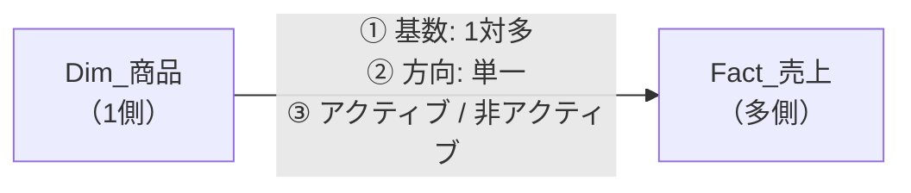
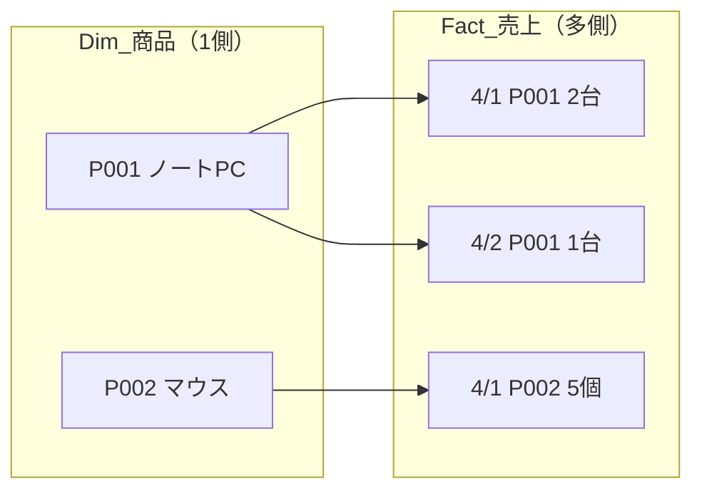
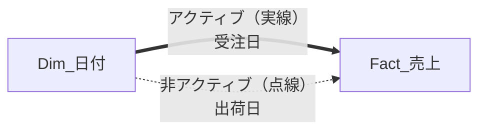
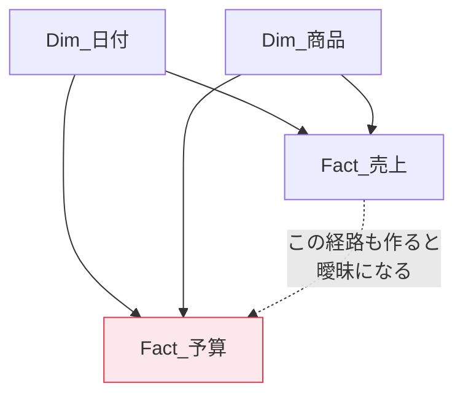
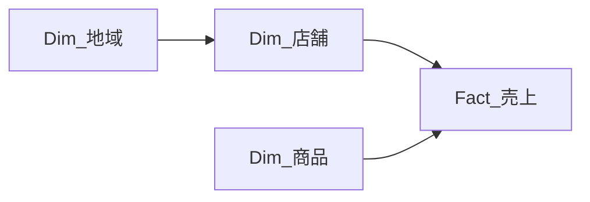

リレーションシップは「フィルターが流れる配管」です。この配管の向きと太さを制御できるようになると、モデルの挙動が予測できるようになります。

## リレーションシップの3要素



| 要素 | 選択肢 | 既定 |
|---|---|---|
| 基数（カーディナリティ） | 1対多 / 多対1 / 1対1 / 多対多 | 1対多 |
| クロスフィルターの方向 | 単一 / 両方 | 単一 |
| アクティブ | オン / オフ | オン |

## 基数（カーディナリティ）



| 基数 | 意味 | 例 |
|---|---|---|
| 1対多（1:*） | 片方でキーが一意、もう片方で重複 | 商品マスタ → 売上明細 |
| 1対1 | 両方で一意 | 社員 → 社員の詳細情報（分ける必要は薄い） |
| 多対多（*:*） | 両方で重複 | 顧客 ↔ 商品（購買履歴を介して） |

> [!TRAP]
> 1対多にしたいのに「多対多」と表示される場合、**1側にしたいテーブルのキーに重複がある**ということです。Power Query に戻って重複を削除してください。エラーではなく警告として黙って多対多で作られてしまうため、モデルビューで基数表示を必ず確認します。

## クロスフィルターの方向 — 最重要概念

**フィルターは「1側」から「多側」へ流れます。逆には流れません。**


これが「カテゴリ別売上」が正しく出る仕組みです。

### 逆方向が必要になるケース

「商品マスタに載っている全商品のうち、実際に売れた商品は何件か」を出したいとき、ファクト側から商品ディメンションへフィルターを流したくなります。この場合の選択肢は2つあります。

1. **双方向リレーションシップにする**（副作用が大きい。L204で扱う）
2. **`CROSSFILTER` 関数でメジャー単位で制御する**（推奨）

```dax
売れた商品数 =
CALCULATE(
    DISTINCTCOUNT( Fact_売上[ProductID] )
)
```

このように、そもそも双方向にしなくても解決できることが多いです。

> [!EXAM]
> 「双方向リレーションシップを設定すべきか」と問われたら、まず **「メジャーで解決できないか」** を考えるのが正解の方向です。

## アクティブ／非アクティブ

2つのテーブル間には、**アクティブなリレーションシップを1本しか持てません**。

例：売上テーブルに「受注日」と「出荷日」の2つの日付列がある場合。



非アクティブなリレーションシップは、DAXの `USERELATIONSHIP` で一時的に有効化できます。

```dax
出荷日ベースの売上 =
CALCULATE(
    [売上合計],
    USERELATIONSHIP( Dim_日付[Date], Fact_売上[ShipDate] )
)
```

これで、同じ日付スライサーを使いながら「受注ベース」「出荷ベース」の両方を1つのグラフに並べられます。

> [!EXAM]
> `USERELATIONSHIP` は `CALCULATE` の中でしか使えません。単独では使えない点も含めて出題されます。

## 曖昧なパス（Ambiguity）

複数の経路でテーブルがつながると、Power BI は「どの経路でフィルターを流すべきか」判断できません。



Power BI は循環参照を検出すると、リレーションシップの作成を拒否するか、一部を非アクティブにします。**スタースキーマを守っていれば、この問題はまず起きません。**

## リレーションシップの作り方

1. **モデルビュー**を開く
2. 一方のテーブルのキー列を、もう一方のキー列へドラッグ
3. 線をダブルクリックして基数と方向を確認

自動検出（ホーム → リレーションシップの管理 → 自動検出）もありますが、**列名が同じというだけで意図しない関係が作られる**ことがあります。作られた関係は必ず目視で確認してください。

> [!WARN]
> `1対1` と `両方向` の組み合わせや、テキスト列同士のリレーションシップは性能を落とします。リレーションシップのキーは**整数の代理キー**が理想です。

## フィルターの伝播を追う練習

次のモデルで「地域スライサーで『関東』を選んだとき、商品テーブルはどうなるか」を考えてください。



答え：**商品テーブルは絞られません**。フィルターは 地域 → 店舗 → 売上 と流れますが、売上から商品へは（単一方向のため）逆流しないからです。この挙動が、L302のフィルターコンテキストの土台になります。
