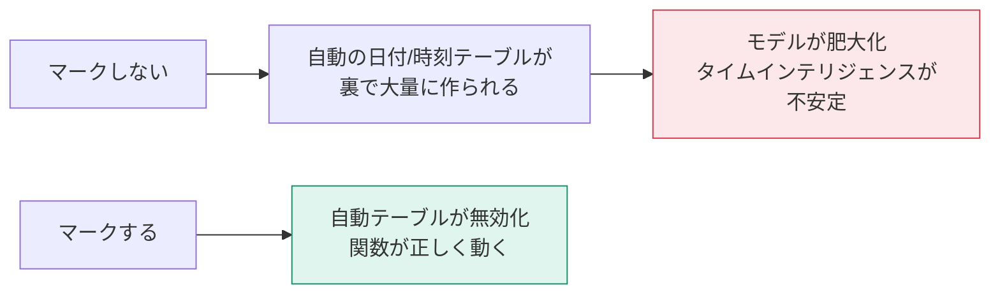

「前年同月比を出したい」「年度累計を見たい」——これらはすべて、**専用の日付テーブルがないと正しく動きません**。

## なぜ日付テーブルが必要なのか

売上テーブルの日付列だけでは、次の問題が起きます。


日付テーブルは「連続した日付の目盛り」です。売上の有無に関わらず、すべての日が存在することが本質的に重要です。

## 日付テーブルの3つの条件

1. **連続した日付**が、抜けなく1行ずつ入っている
2. 期間がファクトの最小日〜最大日を**完全にカバー**している
3. 日付列に**重複がなく、時刻を含まない**

## 作り方1：DAXで生成（推奨）

**モデリング → 新しいテーブル**

```dax
Dim_日付 =
VAR MinDate = MIN( Fact_売上[OrderDate] )
VAR MaxDate = MAX( Fact_売上[OrderDate] )
RETURN
ADDCOLUMNS(
    CALENDAR( DATE( YEAR(MinDate), 1, 1 ), DATE( YEAR(MaxDate), 12, 31 ) ),
    "年",        YEAR( [Date] ),
    "月番号",     MONTH( [Date] ),
    "月",        FORMAT( [Date], "M月" ),
    "年月",      FORMAT( [Date], "YYYY/MM" ),
    "四半期",     "Q" & ROUNDUP( MONTH( [Date] ) / 3, 0 ),
    "年度",      IF( MONTH( [Date] ) >= 4, YEAR( [Date] ), YEAR( [Date] ) - 1 ),
    "年度月番号",  IF( MONTH( [Date] ) >= 4, MONTH( [Date] ) - 3, MONTH( [Date] ) + 9 ),
    "曜日番号",    WEEKDAY( [Date], 2 ),
    "曜日",       FORMAT( [Date], "aaa" ),
    "平日区分",    IF( WEEKDAY( [Date], 2 ) >= 6, "週末", "平日" )
)
```

> [!TIP]
> `CALENDAR` の範囲を **1月1日〜12月31日** にしているのがポイントです。年の途中で切れていると、`TOTALYTD` などのタイムインテリジェンス関数が正しく動きません。

`CALENDARAUTO()` を使えばモデル内の全日付列から自動で範囲を決めてくれますが、意図しない列（例：商品の登録日）まで拾うことがあるため、明示指定のほうが安全です。

## 作り方2：Power Queryで生成

```m
let
    開始日 = #date(2022, 1, 1),
    終了日 = #date(2026, 12, 31),
    日数 = Duration.Days(終了日 - 開始日) + 1,
    日付リスト = List.Dates(開始日, 日数, #duration(1,0,0,0)),
    テーブル = Table.FromList(日付リスト, Splitter.SplitByNothing(), {"Date"}),
    型 = Table.TransformColumnTypes(テーブル, {{"Date", type date}}),
    年 = Table.AddColumn(型, "年", each Date.Year([Date]), Int64.Type),
    月番号 = Table.AddColumn(年, "月番号", each Date.Month([Date]), Int64.Type),
    月 = Table.AddColumn(月番号, "月", each Text.From(Date.Month([Date])) & "月", type text),
    四半期 = Table.AddColumn(月, "四半期", each "Q" & Text.From(Date.QuarterOfYear([Date])), type text)
in
    四半期
```

どちらでも構いません。**DirectQuery を使う場合や、複数モデルで共有したい場合は Power Query 版**が有利です。

## 「日付テーブルとしてマークする」を必ず実行

作っただけでは不十分です。

1. テーブルを選択
2. **テーブルツール → 日付テーブルとしてマーク**
3. 日付列を指定



> [!EXAM]
> 「日付テーブルとしてマークする」の効果は頻出です。**タイムインテリジェンス関数が正しく動作するようになる**ことと、**自動の日付テーブルが不要になる**ことの2点を押さえてください。

## 自動の日付/時刻を切る

Power BI は既定で、日付列ごとに隠しの日付テーブルを自動生成します。これはモデルを無駄に太らせます。

**ファイル → オプションと設定 → オプション → 現在のファイル → データの読み込み → 「自動の日付/時刻」のチェックを外す**

> [!TIP]
> 新規ファイルを作ったら真っ先にこの設定を外す、を習慣にしてください。数十MBのモデルが数MBになることもあります。

## 並べ替え列の設定

「1月, 10月, 11月, 12月, 2月...」という文字列順の並びを直します。

1. `月` 列を選択
2. **列ツール → 列で並べ替え → 月番号**

同様に、`年月`（文字列）は数値の `年月番号` で並べ替えます。

> [!TRAP]
> 並べ替え列は、**並べ替えられる列と1対1の対応**が必要です。「月」に対して「月番号」が複数対応していると（例：4月に4と16が対応）エラーになります。

## 会計年度への対応

日本企業では4月始まりが一般的です。上のDAXコードの `年度` と `年度月番号` がその対応です。

| 暦月 | 月番号 | 年度月番号（4月始まり） |
|---|---|---|
| 4月 | 4 | 1 |
| 3月 | 3 | 12 |

タイムインテリジェンス関数の多くは、年度の終了日を指定できます。

```dax
年度累計売上 = TOTALYTD( [売上合計], Dim_日付[Date], "3/31" )
```

> [!EXAM]
> `TOTALYTD` の第3引数（年度末日）は、日本の会計年度を扱う問題で出てきます。`"3/31"` のように文字列で指定します。

## 完成後の確認

- [ ] `Dim_日付` の行数 = 期間の日数（うるう年を含めて）
- [ ] 日付列に重複・null がない
- [ ] 日付テーブルとしてマーク済み
- [ ] ファクトの日付列と 1対多 でつながっている
- [ ] 「自動の日付/時刻」がオフ
- [ ] 月・曜日に並べ替え列が設定されている
