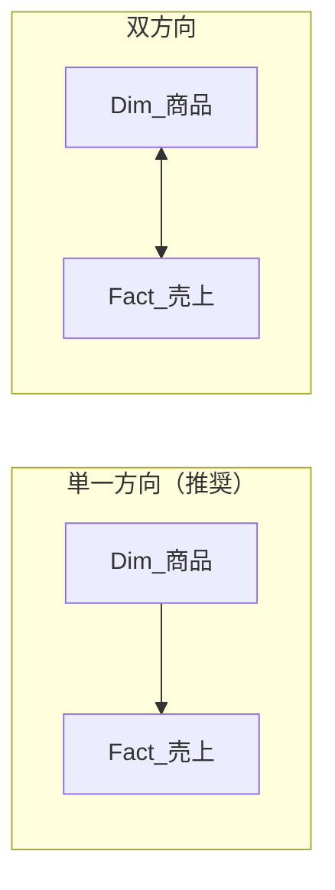
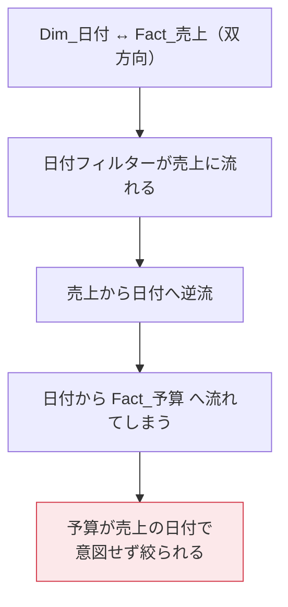
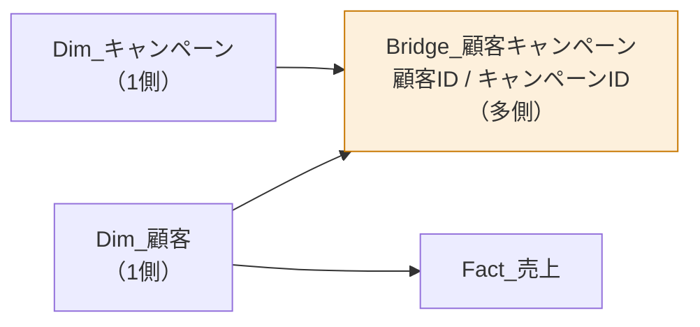
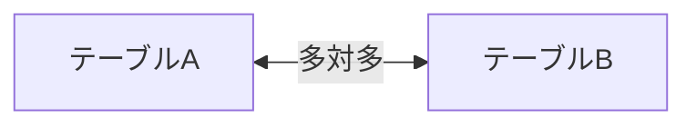

双方向リレーションシップは強力ですが、**モデルを壊す最大の原因**でもあります。この回では、その危険性と正しい代替手段を学びます。

## 双方向にすると何が起きるか



双方向にすると、ファクト側のフィルターがディメンションへ逆流します。一見便利ですが、副作用があります。



つまり、**離れた場所にあるビジュアルの数字が、知らないうちに変わります**。しかもエラーは出ません。静かに間違った数字が表示されます。

> [!WARN]
> 双方向リレーションシップの問題は「エラーにならない」ことです。数字が微妙に違うだけなので、発見が何か月も遅れることがあります。

## 双方向を使ってよい数少ない場面

1. **ブリッジテーブルを介した多対多**（後述）
2. **スライサーの選択肢を実データに絞りたい**とき（かつ副作用がないと確認できたとき）

それ以外は単一方向にしてください。

## 代替手段1：CROSSFILTER

必要なメジャーだけで、一時的に双方向にします。

```dax
売れた商品の種類数 =
CALCULATE(
    DISTINCTCOUNT( Dim_商品[ProductID] ),
    CROSSFILTER( Dim_商品[ProductID], Fact_売上[ProductID], BOTH )
)
```

モデル全体は単一方向のまま、このメジャーの評価中だけ双方向になります。影響範囲が限定できるので、事故が起きません。

## 代替手段2：TREATAS

フィルターを別テーブルへ「移植」します。

```dax
予算_売上の商品で絞る =
CALCULATE(
    [予算合計],
    TREATAS( VALUES( Fact_売上[ProductID] ), Fact_予算[ProductID] )
)
```

## 多対多の関係とブリッジテーブル

顧客とキャンペーンのように、両方が「多」の関係を扱う場合を考えます。

- 1人の顧客が複数のキャンペーンに参加する
- 1つのキャンペーンに複数の顧客が参加する



ブリッジテーブルは、両方の「1側」から参照される「多側」のテーブルです。これにより多対多を2本の1対多に分解できます。

> [!TIP]
> ブリッジテーブルは Power Query で作れます。関係を表す元データから、キー2列だけを取り出して重複を削除すれば完成です。

### ブリッジ経由でフィルターを流す

キャンペーンで絞って売上を見るには、`Dim_キャンペーン → Bridge → Dim_顧客 → Fact_売上` とフィルターを流す必要があります。`Bridge → Dim_顧客` は逆流なので、ここだけ双方向にするか、`CROSSFILTER` を使います。

```dax
キャンペーン別売上 =
CALCULATE(
    [売上合計],
    CROSSFILTER( Dim_顧客[顧客ID], Bridge_顧客キャンペーン[顧客ID], BOTH )
)
```

> [!EXAM]
> 「多対多の関係をモデル化する最適な方法は？」→ **ブリッジ（ファクトレス ファクト）テーブルを使い、両側から1対多でつなぐ**。これが標準的な正解です。

## Power BI の「多対多リレーションシップ」機能

Power BI には、ブリッジなしで直接多対多を張る機能もあります。



使えますが、次の点に注意が必要です。

| 論点 | 内容 |
|---|---|
| 空白行の扱い | 一致しない値が「空白」として集計に現れることがある |
| 性能 | ブリッジ経由より遅くなることがある |
| 可読性 | モデル図から意図が読み取りにくい |

> [!WARN]
> 直接の多対多は「最後の手段」です。まずブリッジテーブルで解決できないか検討してください。

## 診断：あなたのモデルは大丈夫か

モデルビューを開いて、次を確認してください。

- [ ] 双方向の矢印（↔）がいくつあるか。0本が理想
- [ ] 双方向がある場合、その理由を1文で説明できるか
- [ ] 多対多の関係がある場合、ブリッジテーブルを使っているか
- [ ] リレーションシップの線が交差して「網」になっていないか

線が網のように絡み合っているなら、それはスタースキーマではありません。L201に戻って設計をやり直すのが、結局いちばん速い道です。
