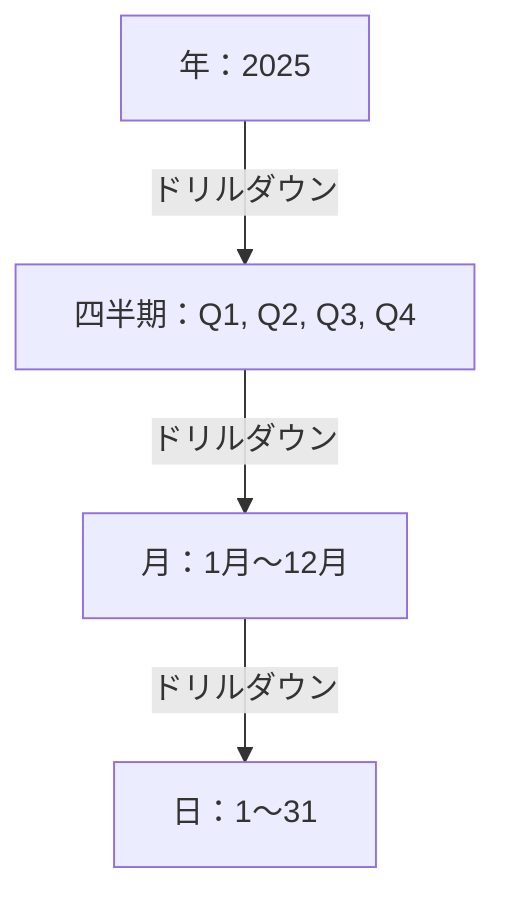
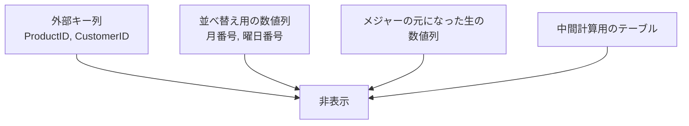

モデルが正しく動くようになったら、次は「使いやすさ」を整えます。ここは地味ですが、レポート作成の速度と品質に直結します。

## 階層（Hierarchy）

ドリルダウンできる階層を作ります。

**作り方**：データペインで最上位にしたい列を右クリック → **階層の作成** → 他の列をドラッグして追加

| 典型的な階層 | 構成 |
|---|---|
| 日付 | 年 → 四半期 → 月 → 日 |
| 商品 | カテゴリ → サブカテゴリ → 商品名 |
| 組織 | 本部 → 部 → 課 → 個人 |
| 地理 | 地方 → 都道府県 → 市区町村 |

グラフに階層を入れると、右上にドリルダウン用のボタンが表示されます。

| ボタン | 動作 |
|---|---|
| 下向き矢印（単一） | 選択した項目だけ1階層下へ |
| 二重下向き矢印 | 全項目を1階層下へ |
| 分岐アイコン | 現在の階層に下位を展開して追加 |
| 上向き矢印 | 1階層上へ |

## 列で並べ替え

文字列の列は、既定では**あいうえお順・アルファベット順**に並びます。これを意図した順序にします。

**列を選択 → 列ツール → 列で並べ替え → 並べ替えの基準となる列**

| 表示したい列 | 並べ替えに使う列 |
|---|---|
| 月（1月, 2月...） | 月番号（1, 2...） |
| 曜日（月, 火...） | 曜日番号（1, 2...） |
| 規模（小, 中, 大） | 規模順（1, 2, 3） |
| 年月（2025/01） | 年月番号（202501） |

> [!TRAP]
> 並べ替え列は **1対1の対応**が必要です。「1月」に対して並べ替え値が `1` と `13` の両方が存在するとエラーになります。年をまたぐ「年月」を並べ替えるなら、並べ替え列も年を含む `202501` 形式にしてください。

## 表示形式（フォーマット）

**列ツール（またはメジャーツール） → 書式**

| データ | 推奨形式 |
|---|---|
| 金額 | 通貨、小数点0桁、桁区切りあり |
| 比率 | パーセンテージ、小数点1桁 |
| 件数 | 整数、桁区切りあり |
| 日付 | `yyyy/MM/dd` |

カスタム形式も指定できます。

| 書式文字列 | 表示例 |
|---|---|
| `#,0` | `1,234` |
| `#,0.0%` | `12.3%` |
| `"¥"#,0` | `¥1,234` |
| `#,0,,"M"` | `12M`（百万単位） |
| `yyyy年M月` | `2025年4月` |

> [!TIP]
> 金額が大きいレポートでは `#,0,,"M"` のような単位付き表示にすると、グラフのラベルが読みやすくなります。

## データカテゴリ

地図系ビジュアルを使うには、列に「これは地名です」と教える必要があります。

**列を選択 → 列ツール → データカテゴリ**

| カテゴリ | 用途 |
|---|---|
| 都道府県 / 国 / 市区町村 | マップビジュアル |
| 緯度 / 経度 | 正確な位置プロット |
| 画像URL | テーブル内に画像を表示 |
| Web URL | クリックできるリンク |
| バーコード | モバイルのバーコードスキャン |

> [!TIP]
> 「東京」が地図上でアメリカに置かれるトラブルは、データカテゴリ未設定が原因です。**都道府県名の列には必ず「都道府県」を設定**し、可能なら「東京都, 日本」のように国名を含む列を別に作ると精度が上がります。

## 列とテーブルの整理

### 非表示にする

キー列（`ProductID` など）はレポート作成時に使いません。右クリック → **レポートビューでは非表示**。

データペインがすっきりすると、レポート作成が明らかに速くなります。

### 説明を書く

列やメジャーを右クリック → **プロパティ → 説明**。ここに書いた文章は、データペインでホバーしたときにツールチップとして表示されます。

> [!TIP]
> 「粗利率 = 粗利 ÷ 売上（税抜）」のように定義を書いておくと、他の人がモデルを使うときの問い合わせが激減します。

## 表示フォルダー

メジャーが増えてきたら、フォルダーで整理します。

**メジャーを選択 → プロパティ → 表示フォルダー** に `売上系` のように入力。`売上系\前年比` のようにバックスラッシュで階層も作れます。

## メジャー専用テーブルを作る

メジャーがファクトテーブルに散らばると探しにくくなります。

1. **ホーム → データの入力** で空のテーブル `_Measures` を作成（列は1つ、値は空でよい）
2. 作ったメジャーをすべてこのテーブルへ移動（メジャーを選択 → **ホームテーブル**を変更）
3. ダミー列を非表示にする

テーブル名を `_` で始めると、データペインの先頭に表示されます。

> [!TIP]
> この整理をしておくと、レポート作成者が「メジャーはここを見ればいい」と分かります。チームで使うモデルでは事実上の標準です。

## 仕上げのチェックリスト

- [ ] キー列と並べ替え列を非表示にした
- [ ] 月・曜日に並べ替え列を設定した
- [ ] 金額・比率に書式を設定した
- [ ] 地名の列にデータカテゴリを設定した
- [ ] よく使う階層を作った
- [ ] メジャーを `_Measures` テーブルにまとめた
- [ ] 主要メジャーに説明を書いた
