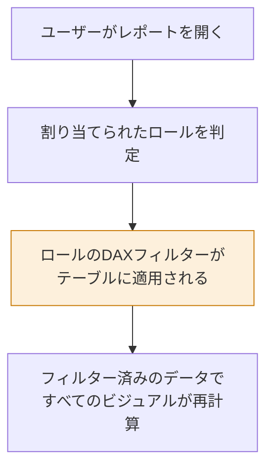
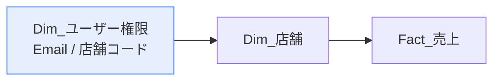
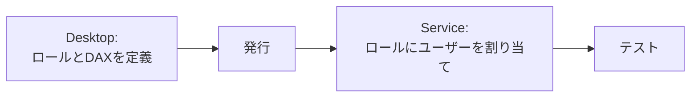

「東京支店の人には東京の数字だけ見せたい」——これを実現するのが行レベルセキュリティ（RLS）です。レポートを分けるのではなく、**1つのレポートで人によって見える行を変える**仕組みです。

## RLSの仕組み



重要なのは、**フィルターがモデルの最下層で効く**ことです。ユーザーはフィルターを外すことも、DAXで回避することもできません。

## 静的RLS — ロールごとに固定条件

**モデリング → ロールの管理 → 作成**

| ロール名 | テーブル | DAX式 |
|---|---|---|
| 東京支店 | Dim_店舗 | `[都道府県] = "東京都"` |
| 関東エリア | Dim_店舗 | `[地方] = "関東"` |
| 家電部門 | Dim_商品 | `[カテゴリ] = "家電"` |

作成後、**表示 → ロールとして表示** で動作を確認できます。

> [!TRAP]
> 静的RLSは**ロールの数だけメンテナンスが必要**です。支店が50あれば50ロール。組織変更のたびに全部直すことになります。支店数が多いなら次の動的RLSにしてください。

## 動的RLS — ログインユーザーで判定

ロールは1つだけ作り、DAXの中でログインユーザーを判定します。

### 準備：ユーザーとデータの対応表

| Email | 店舗コード |
|---|---|
| tanaka@example.com | S001 |
| suzuki@example.com | S002 |
| suzuki@example.com | S003 |

1人が複数行持てるので、複数店舗の担当も表現できます。



### ロールのDAX式

`Dim_ユーザー権限` テーブルに次のフィルターを設定します。

```dax
[Email] = USERPRINCIPALNAME()
```

これだけです。ログインしたユーザーの行だけが残り、そこから店舗 → 売上へとフィルターが伝播します。

> [!WARN]
> `Dim_ユーザー権限 → Dim_店舗` のリレーションシップは、フィルターが流れる向きになっている必要があります。流れない場合は、この関係だけ双方向にするか、モデル構成を見直してください。

### USERNAME と USERPRINCIPALNAME

| 関数 | Desktop での戻り値 | Service での戻り値 |
|---|---|---|
| `USERNAME()` | `DOMAIN\user` | UPN（メールアドレス形式） |
| `USERPRINCIPALNAME()` | UPN | UPN |

> [!EXAM]
> **動的RLSでは `USERPRINCIPALNAME()` を使う**のが正解です。`USERNAME()` は Desktop と Service で戻り値の形式が変わるため、テストと本番で挙動が変わってしまいます。

## 階層型の権限（マネージャは部下の分も見る）

組織階層のように「上位者は配下すべてを見る」場合、`PATH` 関数群を使います。

```dax
// Dim_社員 に計算列として
社員パス = PATH( Dim_社員[社員ID], Dim_社員[上司ID] )
```

ロールのフィルター式：

```dax
PATHCONTAINS(
    Dim_社員[社員パス],
    LOOKUPVALUE( Dim_社員[社員ID], Dim_社員[Email], USERPRINCIPALNAME() )
)
```

これで、自分と自分の配下すべての行が見えるようになります。

## テストの方法

### Desktop で

**モデリング → 表示 → ロールとして表示**。ロールを選び、「他のユーザー」に検証したいメールアドレスを入力すると、その人の視点でレポートが表示されます。

### Service で

ワークスペース → セマンティックモデルの「…」 → **セキュリティ** → ロールにユーザー/グループを割り当て → 「…」 → **ロールとしてテスト**



> [!EXAM]
> **ロールの定義は Desktop、ユーザーの割り当ては Service** です。この分担は頻出します。Desktop でユーザーを割り当てることはできません。

## RLSの注意点

| 注意点 | 内容 |
|---|---|
| ワークスペース管理者 | 管理者・メンバー・共同作成者にはRLSが適用されません。**ビューアーにのみ適用**されます |
| ダッシュボードのタイル | タイルの画像はキャッシュされますが、クリックして開くとRLS適用後のデータが表示されます |
| Excelでの分析 | ライブ接続でも RLS は適用されます |
| 性能 | 複雑なRLS式はクエリを遅くします。できるだけ単純な等価比較にとどめる |

> [!WARN]
> **ワークスペースのビューアー権限を持つユーザーにしかRLSは効きません。** 「テストしたら自分には全部見えた」というのは、自分が管理者だからです。必ず「ロールとしてテスト」で検証してください。

## 実装チェックリスト

- [ ] ロールを作成し、DAXフィルターを設定した
- [ ] `USERPRINCIPALNAME()` を使っている（`USERNAME()` ではない）
- [ ] 権限テーブルからファクトへフィルターが伝播する構成になっている
- [ ] Desktop で「ロールとして表示」を実行し、期待どおり絞られた
- [ ] Service でロールにユーザー/セキュリティグループを割り当てた
- [ ] 閲覧者にはビューアー権限を付与した（管理者権限を渡していない）
