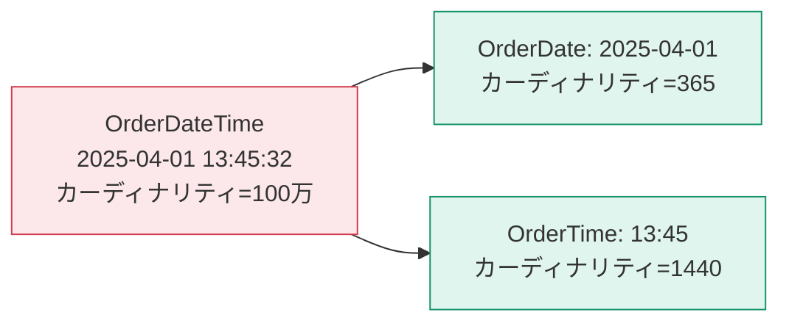

「レポートが遅い」の原因の多くはモデルにあります。なぜPower BIが速いのか、そして何をすると遅くなるのかを理解します。

## VertiPaq — 列指向・インメモリのエンジン

Power BI のインポートモードは、`VertiPaq` という列指向データベースを使います。

分析クエリは「金額列を全部合計する」ような処理なので、列指向が圧倒的に有利です。さらに、同じ列の値は似ているため、高い圧縮率が得られます。

## 圧縮の3つの技術

| 技術 | 内容 | 効果 |
|---|---|---|
| 値エンコード | 数値から最小値を引くなどして桁を減らす | 数値列に有効 |
| ディクショナリエンコード | 値を辞書に登録し、本体は辞書のインデックスで持つ | 文字列列に有効 |
| ランレングスエンコード（RLE） | 同じ値の連続を「値 × 回数」で持つ | 並べ替え済みの列に絶大 |

## カーディナリティが性能を決める

**カーディナリティ = その列に含まれる値の種類の数**です。

| 列 | カーディナリティ | 圧縮 |
|---|---|---|
| 性別 | 2〜3 | 極めてよく効く |
| 都道府県 | 47 | よく効く |
| 商品コード | 数千 | それなり |
| 取引ID | 行数と同じ | **まったく効かない** |
| 日時（秒まで） | 行数に近い | **まったく効かない** |

> [!WARN]
> **もっとも危険なのは「日時」列です。** `2025-04-01 13:45:32` のような秒単位の値は、ほぼ全行が異なる値になります。日付部分と時刻部分を別の列に分けるだけで、モデルサイズが劇的に減ります。

## 軽くするための7つの手

1. **使わない列を削除する**（もっとも効果が大きい）
2. **一意性の高い列（取引ID・GUID・自由記述）を捨てる**
3. **日時を日付と時刻に分割する**（時刻が不要なら時刻ごと捨てる）
4. **小数の桁数を減らす**（不要な精度は捨てる。固定小数点数型を検討）
5. **自動の日付/時刻をオフにする**（L203参照）
6. **計算列よりPower Queryの列、それよりメジャー**を優先する
7. **不要な中間クエリの読み込みを無効化する**

> [!TIP]
> 「後で使うかもしれないから残しておく」は、モデルを太らせる最大の理由です。**必要になったときに追加する**ほうが、常に安上がりです。

## 計測する — DAX Studio と VertiPaq Analyzer

推測ではなく計測しましょう。無料ツール [DAX Studio](https://daxstudio.org/) を使います。

1. Power BI Desktop でファイルを開いたまま、DAX Studio を起動して接続
2. **Advanced → View Metrics**（VertiPaq Analyzer）

見るべき指標：

| 指標 | 意味 | 目安 |
|---|---|---|
| Table Size | テーブルごとのメモリ使用量 | 大きい順に対策 |
| Cardinality | 列ごとの値の種類数 | 行数に近い列は要注意 |
| Col Size | 列ごとのサイズ | 上位数列で全体の大半を占めることが多い |
| % Table | テーブル内での列の占有率 | 突出した列を探す |
| Encoding | エンコード方式 | HASH が多い列は文字列 |

> [!TIP]
> 実務では「サイズ上位5列」を見るだけで、削減の8割が達成できます。パレートの法則がきれいに当てはまる領域です。

## モデルサイズの目安

| モデルサイズ | 状況 |
|---|---|
| 〜100MB | 快適 |
| 100MB〜300MB | 通常のPro環境で問題なし |
| 300MB〜1GB | Pro の上限（1GB）が近い。整理が必要 |
| 1GB超 | Premium / PPU が必要、または設計の見直し |

> [!EXAM]
> Power BI Pro のセマンティックモデル上限は **1GB** です。この数字は問われることがあります。

## DirectQuery を選ぶべき場合

| 条件 | 判断 |
|---|---|
| データ量が数億行を超える | DirectQuery を検討 |
| リアルタイム性が必須（分単位） | DirectQuery |
| 元DBが高速（Synapse, Databricks等） | DirectQuery でも実用的 |
| 上記に当てはまらない | **インポート** |

複合モデル（一部はインポート、一部はDirectQuery）や、集計テーブル（Aggregations）を使えば両者の良いとこ取りもできますが、これは上級テーマです。

## 最適化のチェックリスト

- [ ] 自動の日付/時刻をオフにした
- [ ] 使わない列をすべて削除した
- [ ] 日時列を日付と時刻に分割した（または時刻を捨てた）
- [ ] 一意性の高い列（取引ID等）を必要性を確認して削除した
- [ ] 中間クエリの読み込みを無効化した
- [ ] DAX Studio でサイズ上位5列を確認した
- [ ] スタースキーマになっている（これが最大の性能対策）
