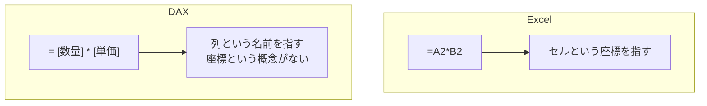
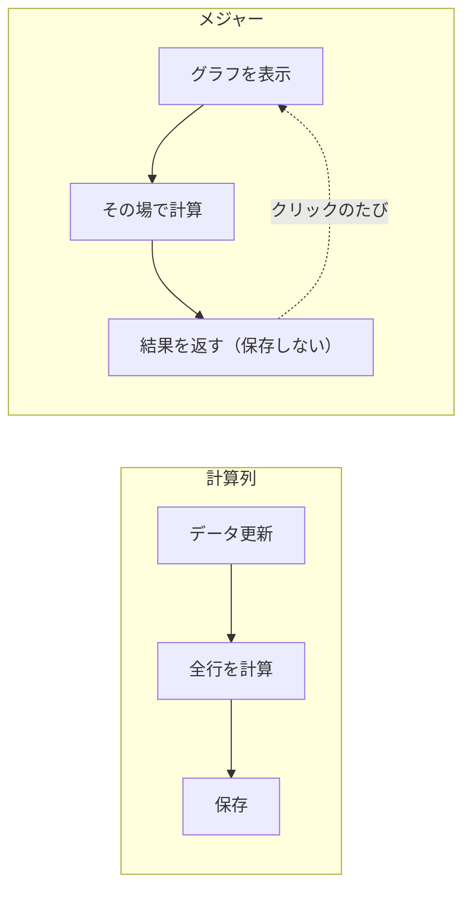
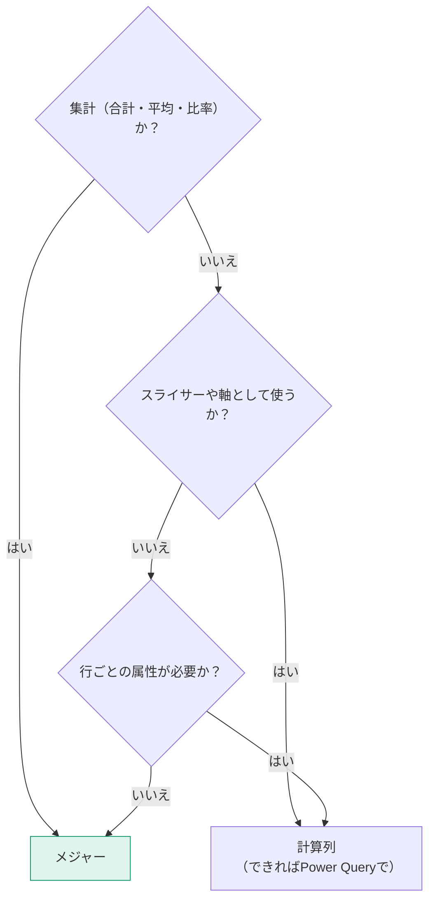

DAX（Data Analysis Expressions）は、Power BI で計算を書くための言語です。Excelの数式に見た目は似ていますが、**動く仕組みが根本的に違います**。

## Excelの数式との決定的な違い



DAXには「A2」のようなセル参照がありません。あるのは**テーブルと列**だけです。この違いが、次の「コンテキスト」という概念を生みます。

## 計算列とメジャー — もう一度、正確に

L004で概要は扱いました。ここでは動作原理まで踏み込みます。

### 計算列

**モデリング → 新しい列**

```dax
売上金額 = Fact_売上[Quantity] * Fact_売上[UnitPrice]
```

- **データ更新時に1回だけ計算**される
- 各行に値が**物理的に保存**される
- メモリを消費する
- 行コンテキスト（今どの行を見ているか）が自動的に存在する

### メジャー

**モデリング → 新しいメジャー**

```dax
売上合計 = SUM( Fact_売上[売上金額] )
```

- **表示のたびに計算**される
- 値は保存されない
- メモリをほぼ消費しない
- フィルターコンテキスト（今どんな絞り込みが効いているか）の中で評価される



## どちらを使うか — 判断フローチャート



> [!EXAM]
> 「メジャーではなく計算列を使うべき場面は？」→ **スライサーの選択肢にしたい／グラフの軸にしたい／リレーションシップのキーにしたい**とき。この3つが典型的な正解です。

> [!TIP]
> 計算列で作れるものの大半は、Power Query でも作れます。**Power Query > 計算列** の優先順位です。Power Query のほうが更新時に1回計算されるだけで、モデルの評価に負荷をかけません。

## 基本の集計関数

```dax
売上合計   = SUM( Fact_売上[売上金額] )
数量合計   = SUM( Fact_売上[Quantity] )
平均単価   = AVERAGE( Fact_売上[UnitPrice] )
取引件数   = COUNTROWS( Fact_売上 )
商品数     = DISTINCTCOUNT( Fact_売上[ProductID] )
最大売上   = MAX( Fact_売上[売上金額] )
```

| 関数 | 用途 | 注意 |
|---|---|---|
| `SUM` | 合計 | 引数は列1つだけ |
| `AVERAGE` | 平均 | null は無視される（0として扱われない） |
| `COUNT` | 空でない値の数 | 数値列のみ |
| `COUNTA` | 空でない値の数 | 型を問わない |
| `COUNTROWS` | 行数 | **引数はテーブル**。もっとも汎用的 |
| `DISTINCTCOUNT` | 一意な値の数 | 重い場合がある |
| `MIN` / `MAX` | 最小・最大 | 日付にも使える |

> [!TRAP]
> `COUNT( テーブル[列] )` と `COUNTROWS( テーブル )` は違います。前者は**その列が空でない行数**、後者は**全行数**です。null が含まれる列では結果が食い違います。件数を数えたいなら `COUNTROWS` が安全です。

## DIVIDE — 割り算は必ずこれ

```dax
粗利率 = DIVIDE( [粗利], [売上合計] )
```

`/` 演算子ではなく `DIVIDE` を使ってください。

| 式 | 分母が0のとき |
|---|---|
| `[粗利] / [売上合計]` | エラー（`Infinity` や `NaN`） |
| `DIVIDE( [粗利], [売上合計] )` | 空白（BLANK） |
| `DIVIDE( [粗利], [売上合計], 0 )` | 0 |

> [!EXAM]
> `DIVIDE` の第3引数（代替値）は出題されます。省略時は BLANK が返ります。

## メジャーの書き方の作法

```dax
粗利率 =
VAR 売上 = [売上合計]
VAR 原価 = [原価合計]
VAR 粗利 = 売上 - 原価
RETURN
    DIVIDE( 粗利, 売上 )
```

守ると読みやすくなる作法：

1. `=` の後で改行する
2. 関数の引数が複数行になるときはインデントを揃える
3. テーブル名は `'テーブル名'[列名]`、メジャーは `[メジャー名]` と書き分ける
4. 複雑な式は `VAR` で分解する（L306）

> [!TIP]
> **列参照には必ずテーブル名を付け、メジャー参照にはテーブル名を付けない。** これはDAXコミュニティの標準規約です。慣れると、コードを見ただけで「これは列」「これはメジャー」と即座に区別できます。

## 最初に作るべきメジャー7本

どんなモデルでも、まずこの7本を作れば分析が始められます。

```dax
売上合計   = SUM( Fact_売上[売上金額] )
原価合計   = SUMX( Fact_売上, Fact_売上[Quantity] * RELATED( Dim_商品[StandardCost] ) )
粗利       = [売上合計] - [原価合計]
粗利率     = DIVIDE( [粗利], [売上合計] )
取引件数   = COUNTROWS( Fact_売上 )
客単価     = DIVIDE( [売上合計], [取引件数] )
販売数量   = SUM( Fact_売上[Quantity] )
```

`SUMX` と `RELATED` はL304で扱いますが、まずは「行ごとに計算してから合計する関数」だと理解しておいてください。

## 練習

次のメジャーの誤りを指摘してください。

```dax
平均販売単価 = AVERAGE( Fact_売上[売上金額] ) / AVERAGE( Fact_売上[Quantity] )
```

答え：2つの問題があります。(1) `/` ではなく `DIVIDE` を使うべき。(2) そもそも「平均の割り算」は正しい平均単価になりません。正しくは `DIVIDE( SUM(売上金額), SUM(Quantity) )` です。**平均の平均は平均ではない**——集計の順序が結果を変える典型例です。
