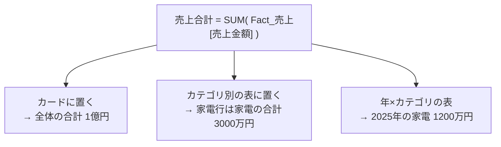
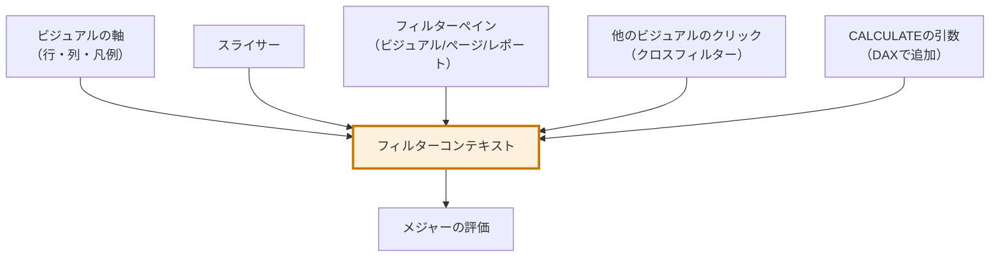
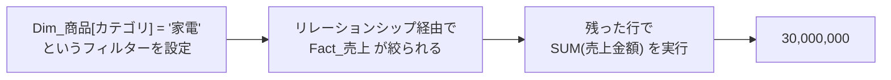
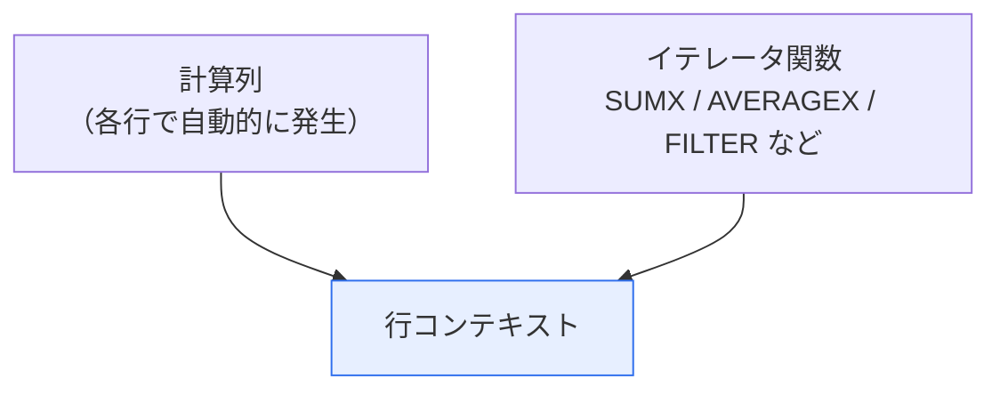
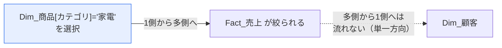
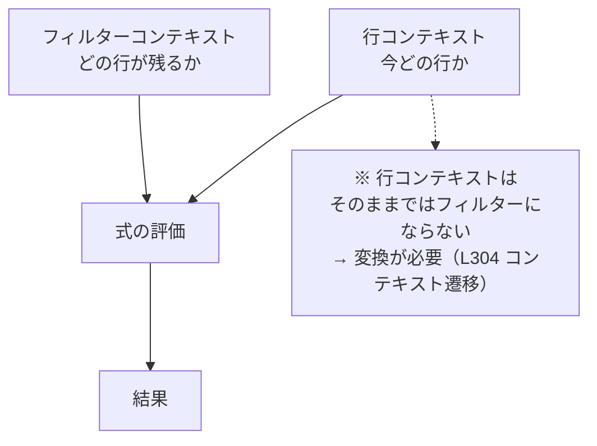

このレッスンがDAX学習の分水嶺です。ここを乗り越えれば、DAXは「暗記」から「理解」に変わります。

## そもそもコンテキストとは

DAXの式は、必ず**何らかの文脈（コンテキスト）の中で**評価されます。同じ `SUM( Fact_売上[売上金額] )` でも、置く場所によって違う答えを返します。



式は1つ、答えは複数。この「答えを変えているもの」がコンテキストです。

## フィルターコンテキスト

**フィルターコンテキストとは、「今、どの行が計算対象として残っているか」を決める絞り込みの集合**です。



### 具体例で追う

次の表があるとします。

| カテゴリ | 売上合計 |
|---|---|
| 家電 | 30,000,000 |
| 衣料 | 18,000,000 |
| 食品 | 52,000,000 |
| **合計** | **100,000,000** |

「家電」の行を計算するとき、Power BI は内部でこうしています。



合計行では、`カテゴリ = '家電'` のフィルターが**存在しない**ので、全行が対象になります。

> [!NOTE]
> 「合計行が各行の足し算にならない」という現象は、ここに理由があります。合計行は「各行の合計」ではなく、**「フィルターなしで式を再評価した結果」**です。`DISTINCTCOUNT` を使うと顕著に現れます。

## 行コンテキスト

**行コンテキストとは、「今、テーブルの何行目を見ているか」を示すもの**です。

行コンテキストが発生するのは2か所だけです。



計算列では、次のように書けます。

```dax
売上金額 = Fact_売上[Quantity] * Fact_売上[UnitPrice]
```

`[Quantity]` と書いたとき「どの行の Quantity か」が決まっているのは、行コンテキストがあるからです。

## 2つのコンテキストの決定的な違い

| | フィルターコンテキスト | 行コンテキスト |
|---|---|---|
| 何を決めるか | どの行が**残る**か | 今どの行を**見ている**か |
| 集計するか | する（複数行→1つの値） | しない（1行ずつ処理） |
| 発生源 | ビジュアル・スライサー・CALCULATE | 計算列・イテレータ |
| メジャーで既定で存在するか | する | **しない** |

> [!TRAP]
> **メジャーの中には、既定では行コンテキストがありません。** だから、メジャーの中でいきなり `Fact_売上[Quantity] * Fact_売上[UnitPrice]` と書くとエラーになります。「1行ずつ処理する」には `SUMX` のようなイテレータが必要です（L304）。

## フィルターの伝播

フィルターコンテキストは、リレーションシップに沿って伝播します。



L202で学んだリレーションシップの向きが、そのままフィルターの流れる向きになります。**モデル設計とDAXは切り離せない**理由がこれです。

## よくある誤解を正す

### 誤解1：「メジャーはテーブル全体を計算している」

いいえ。**そのセルのフィルターコンテキストで絞られた後の行**を計算しています。

### 誤解2：「合計行は各行の足し算」

いいえ。**合計行のフィルターコンテキストで、式を最初から評価し直しています**。

### 誤解3：「計算列とメジャーは書き方が同じ」

いいえ。計算列には行コンテキストがあり、メジャーにはありません。同じ式が片方で動いて片方でエラーになるのは、これが理由です。

## 練習：この表の「合計」はいくつになるか

`商品数 = DISTINCTCOUNT( Fact_売上[ProductID] )` というメジャーがあります。

| カテゴリ | 商品数 |
|---|---|
| 家電 | 15 |
| 衣料 | 22 |
| 食品 | 30 |
| 合計 | **?** |

答え：**67とは限りません**。合計行では「カテゴリのフィルターなし」で `DISTINCTCOUNT` が再評価されるため、複数カテゴリに登場する商品があれば67より小さくなります。逆に、重複がなければ67になります。

この挙動を「バグでは？」と感じたなら、まだフィルターコンテキストが腹落ちしていません。もう一度、上の図に戻ってください。ここが分かれば、DAXの世界の見え方が変わります。

## この回のまとめ



次の L303 では、このフィルターコンテキストを**自分で操作する**方法——`CALCULATE` を学びます。
