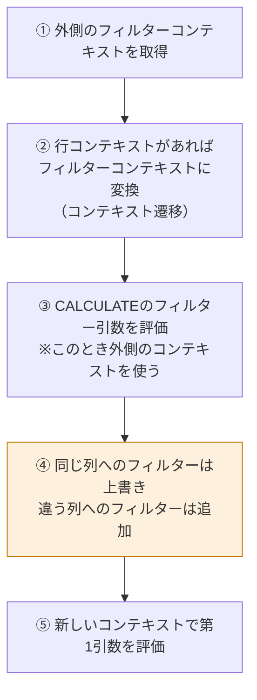
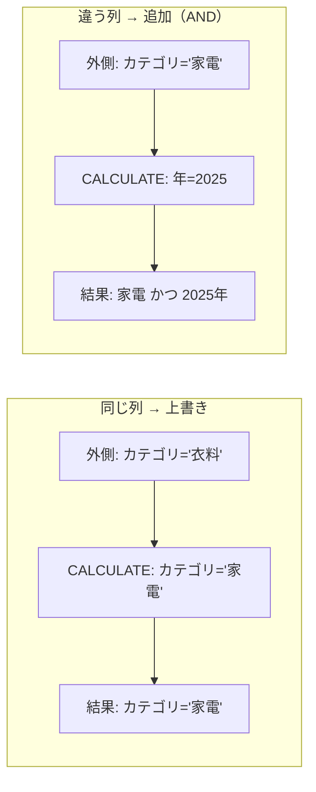
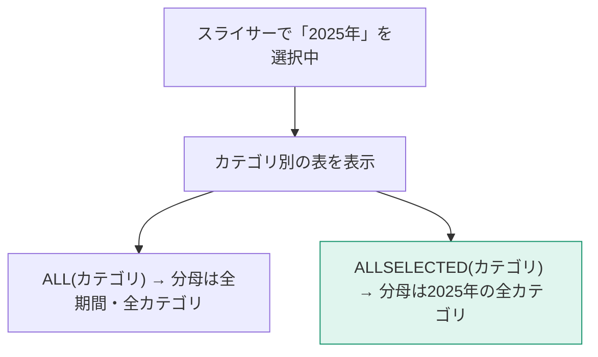
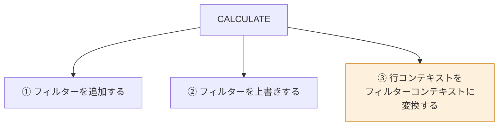

`CALCULATE` は DAX でただ一つ、**フィルターコンテキストを変更できる関数**です。DAXの表現力のほぼすべてがここに集約されています。

## 構文

```dax
CALCULATE( <式>, <フィルター1>, <フィルター2>, ... )
```

- 第1引数：評価したい式（通常はメジャー）
- 第2引数以降：適用するフィルター（省略可・複数可）

## 最も単純な例

```dax
家電の売上 =
CALCULATE(
    [売上合計],
    Dim_商品[カテゴリ] = "家電"
)
```

このメジャーは、**どんなビジュアルに置いても常に家電の売上**を返します。カテゴリ別の表に置くと、こうなります。

| カテゴリ | 売上合計 | 家電の売上 |
|---|---|---|
| 家電 | 30,000,000 | 30,000,000 |
| 衣料 | 18,000,000 | **30,000,000** |
| 食品 | 52,000,000 | **30,000,000** |

衣料の行でも家電の売上が出ています。**CALCULATEのフィルターが、ビジュアルのフィルターを上書きした**からです。

## CALCULATE の評価順序

ここが最重要です。多くの人が「上から順に評価される」と誤解しています。実際は違います。



### 上書きと追加の使い分け



| 外側のフィルター | CALCULATEのフィルター | 結果 |
|---|---|---|
| カテゴリ = 衣料 | カテゴリ = 家電 | 家電（上書き） |
| カテゴリ = 家電 | 年 = 2025 | 家電 かつ 2025（追加） |

> [!EXAM]
> 「同じ列 = 上書き、違う列 = 追加（AND条件）」は、そのまま出題されます。

## ALL — フィルターを取り除く

`ALL` は、指定した範囲のフィルターを**すべて解除**します。

```dax
全体売上 = CALCULATE( [売上合計], ALL( Dim_商品 ) )
```

これで「商品テーブルのフィルターを無視した売上」が得られます。構成比の計算に必須です。

```dax
カテゴリ構成比 =
DIVIDE(
    [売上合計],
    CALCULATE( [売上合計], ALL( Dim_商品[カテゴリ] ) )
)
```

| カテゴリ | 売上合計 | 分母（ALL適用） | 構成比 |
|---|---|---|---|
| 家電 | 30,000,000 | 100,000,000 | 30% |
| 衣料 | 18,000,000 | 100,000,000 | 18% |
| 食品 | 52,000,000 | 100,000,000 | 52% |

### ALL の仲間

| 関数 | 効果 |
|---|---|
| `ALL( テーブル )` | そのテーブルの全フィルターを解除 |
| `ALL( テーブル[列] )` | その列のフィルターだけ解除 |
| `ALLEXCEPT( テーブル, 列1, 列2 )` | **指定した列以外**のフィルターを解除 |
| `ALLSELECTED()` | **ユーザーがスライサーで選んだ範囲**まで戻す |
| `ALLNOBLANKROW()` | ALL + リレーションシップの空白行を除く |
| `REMOVEFILTERS()` | ALL と同じ（意図が明確な新しい書き方） |

> [!TIP]
> `ALL` は「フィルター解除」と「テーブルを返す」の2つの顔を持ちます。`CALCULATE` の中では前者、`SUMX` などの引数では後者として働きます。

### ALL と ALLSELECTED の違い



> [!EXAM]
> 「スライサーの選択を尊重したうえで構成比を出したい」→ **`ALLSELECTED`**。「常に全体に対する比率が欲しい」→ **`ALL`**。この使い分けは頻出です。

## KEEPFILTERS — 上書きせずに追加する

`CALCULATE` の既定は上書きですが、`KEEPFILTERS` を使うと「既存のフィルターと AND を取る」動作になります。

```dax
高額商品の売上 =
CALCULATE(
    [売上合計],
    KEEPFILTERS( Dim_商品[価格帯] = "高額" )
)
```

価格帯スライサーで「中額」が選ばれているとき：

| 書き方 | 結果 |
|---|---|
| `Dim_商品[価格帯] = "高額"` | 高額（スライサーを無視） |
| `KEEPFILTERS( Dim_商品[価格帯] = "高額" )` | 高額 AND 中額 = 空 |

> [!TIP]
> `KEEPFILTERS` は「スライサーの選択を尊重したい」ときに使います。ユーザーの操作を勝手に上書きしないための安全装置です。

## FILTER — 複雑な条件を書く

単純な `列 = 値` では表現できない条件は `FILTER` を使います。

```dax
大口取引の売上 =
CALCULATE(
    [売上合計],
    FILTER( Fact_売上, Fact_売上[売上金額] > 100000 )
)
```

`FILTER` はテーブルを1行ずつ評価して、条件に合う行だけのテーブルを返します。

> [!WARN]
> `FILTER( Fact_売上, ... )` のようにファクトテーブル全体をイテレートするのは**重い**です。可能なら、次のように対象を絞ってください。

```dax
// 悪い例：全ファクトをイテレート
CALCULATE( [売上合計], FILTER( Fact_売上, Fact_売上[UnitPrice] > 10000 ) )

// 良い例：ディメンションの一意な値だけをイテレート
CALCULATE( [売上合計], FILTER( VALUES( Dim_商品[価格帯] ), ... ) )

// もっと良い例：単純な条件ならFILTERを使わない
CALCULATE( [売上合計], Fact_売上[UnitPrice] > 10000 )
```

実は3番目の書き方は、内部的に `FILTER( ALL( Fact_売上[UnitPrice] ), ... )` に変換されます。列だけをイテレートするので高速です。

## CALCULATE の暗黙の呼び出し

**メジャーを別のメジャーから参照すると、自動的に `CALCULATE` で包まれます。**

```dax
// この2つは同じ意味
売上2倍 = [売上合計] * 2
売上2倍 = CALCULATE( [売上合計] ) * 2
```

これが L304 で扱う「コンテキスト遷移」の鍵になります。今は「メジャー参照には見えない CALCULATE が付いている」とだけ覚えてください。

## まとめ：CALCULATE の3つの顔



③は次のレッスンで扱います。ここまでで「①と②を図で説明できる」なら、DAXの半分は理解できています。
