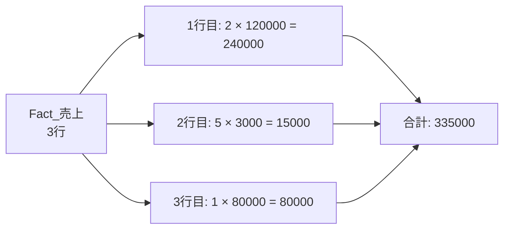
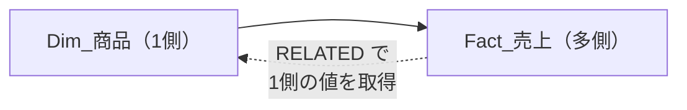
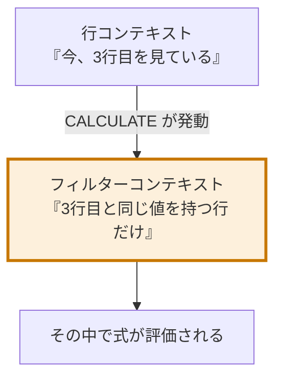
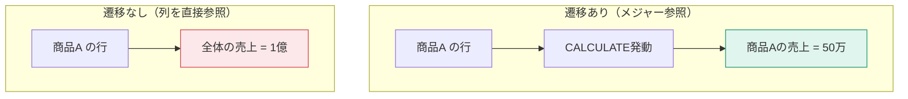

`SUMX` のような「X が付く関数」と、DAX最大の難関「コンテキスト遷移」を扱います。ここを越えれば、DAXで書けないものはほぼなくなります。

## イテレータ関数とは

**イテレータは、テーブルを1行ずつ処理してから集計する関数**です。名前の末尾に `X` が付きます。

```dax
SUMX( <テーブル>, <行ごとの式> )
```



```dax
売上合計 = SUMX( Fact_売上, Fact_売上[Quantity] * Fact_売上[UnitPrice] )
```

**イテレータは行コンテキストを作ります。** だから `Fact_売上[Quantity]` と書いて「今の行の数量」を取得できます。

## SUM と SUMX の使い分け

| 状況 | 使う関数 |
|---|---|
| 既に存在する列を合計する | `SUM( 列 )` |
| 行ごとに計算してから合計する | `SUMX( テーブル, 式 )` |

```dax
// 列が既にある場合
売上合計 = SUM( Fact_売上[売上金額] )

// 列がない（数量×単価をその場で計算）
売上合計 = SUMX( Fact_売上, Fact_売上[Quantity] * Fact_売上[UnitPrice] )
```

> [!TIP]
> 計算列 `売上金額` を作って `SUM` するか、`SUMX` でその場計算するか。**メモリを節約したいなら SUMX、クエリ速度を優先するなら計算列 + SUM** です。多くの場合、SUMX でも十分高速です。

## 主なイテレータ

| 関数 | 用途 |
|---|---|
| `SUMX` | 行ごとに計算して合計 |
| `AVERAGEX` | 行ごとに計算して平均 |
| `MAXX` / `MINX` | 行ごとに計算して最大・最小 |
| `COUNTX` | 行ごとに評価して空でない数を数える |
| `RANKX` | ランキング |
| `CONCATENATEX` | 行ごとの値を文字列連結 |
| `FILTER` | 行ごとに条件判定してテーブルを返す |
| `ADDCOLUMNS` | 行ごとに列を追加 |

## RELATED — 1側の列を取ってくる

行コンテキストがあるとき、リレーションシップの**1側**の列を参照できます。

```dax
原価合計 =
SUMX(
    Fact_売上,
    Fact_売上[Quantity] * RELATED( Dim_商品[StandardCost] )
)
```



逆方向（1側から多側の複数行を取る）は `RELATEDTABLE` です。

```dax
// 商品ごとの取引件数（計算列として）
取引件数 = COUNTROWS( RELATEDTABLE( Fact_売上 ) )
```

> [!EXAM]
> `RELATED` は多側から1側へ（単一の値を取得）、`RELATEDTABLE` は1側から多側へ（テーブルを取得）。方向を逆にするとエラーになります。頻出です。

## コンテキスト遷移 — DAX最大の難関

**コンテキスト遷移とは、行コンテキストがフィルターコンテキストに変換される現象**です。`CALCULATE` が引き起こします。



### なぜ必要なのか

次のメジャーを考えます。「1商品あたりの平均売上」を出したい。

```dax
商品あたり平均売上 =
AVERAGEX(
    Dim_商品,
    [売上合計]
)
```

`AVERAGEX` は `Dim_商品` を1行ずつ見ます。各行で `[売上合計]` を評価しますが——**メジャー参照には暗黙の `CALCULATE` が付いている**（L303）ので、コンテキスト遷移が起きます。

結果として、「今見ている商品に絞った売上合計」が計算されます。これがなければ、全商品の売上合計が毎回返ってきて、平均が意味をなしません。



### 明示的にコンテキスト遷移を起こす

メジャーではなく式を書きたい場合は、自分で `CALCULATE` を付けます。

```dax
商品あたり平均売上 =
AVERAGEX(
    Dim_商品,
    CALCULATE( SUM( Fact_売上[売上金額] ) )
)
```

`CALCULATE` にフィルター引数がなくても、**コンテキスト遷移だけを目的に**使えます。この用法は非常によく出てきます。

## 計算列でのコンテキスト遷移

計算列にも行コンテキストがあります。だから同じことが起きます。

```dax
// Dim_商品 の計算列
この商品の売上 = CALCULATE( SUM( Fact_売上[売上金額] ) )
```

`CALCULATE` があるので、その商品の行だけに絞られた売上が返ります。`CALCULATE` を外すと全商品の合計になります。

> [!TRAP]
> **計算列で `SUM()` を書いても、全行の合計にしかなりません。** 「その行に対応する集計」が欲しいなら `CALCULATE` で包むか、`RELATEDTABLE` を使ってください。初学者が必ず一度は踏む罠です。

## EARLIER は忘れてよい

古い教材には `EARLIER` 関数が出てきます。これは「外側の行コンテキストを参照する」ための関数ですが、**現在は `VAR` を使うのが標準**です。

```dax
// 古い書き方
累計 = CALCULATE( SUM( ... ), FILTER( ALL(表), 表[日付] <= EARLIER( 表[日付] ) ) )

// 現代的な書き方
累計 =
VAR 現在日付 = 表[日付]
RETURN
    CALCULATE( SUM( ... ), FILTER( ALL( 表 ), 表[日付] <= 現在日付 ) )
```

読みやすさが段違いです。`EARLIER` は「読めればよい」レベルで構いません。

## 練習：この式は何を返すか

`Dim_商品` の計算列として：

```dax
売上シェア =
VAR この商品の売上 = CALCULATE( SUM( Fact_売上[売上金額] ) )
VAR 全体売上 = CALCULATE( SUM( Fact_売上[売上金額] ), ALL( Dim_商品 ) )
RETURN
    DIVIDE( この商品の売上, 全体売上 )
```

答え：各商品の売上が全体売上に占める割合。1行目の `CALCULATE` はコンテキスト遷移でその商品に絞り、2行目は `ALL` で商品フィルターを解除して全体を取っています。**この2行の対比が、DAXの本質そのもの**です。
