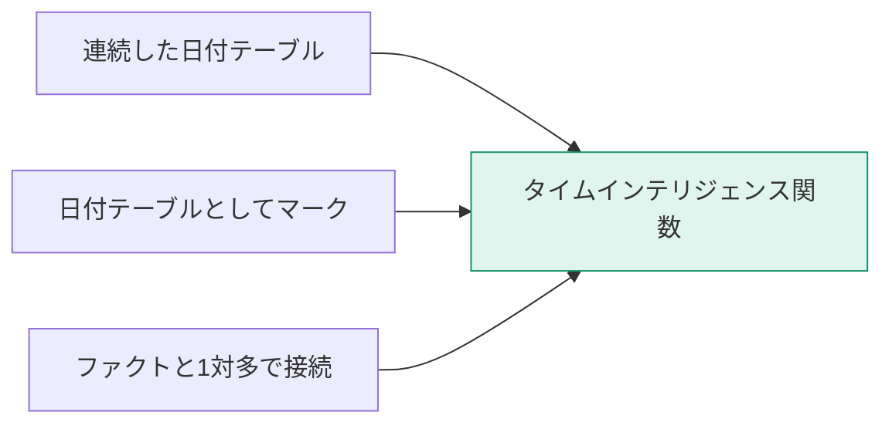
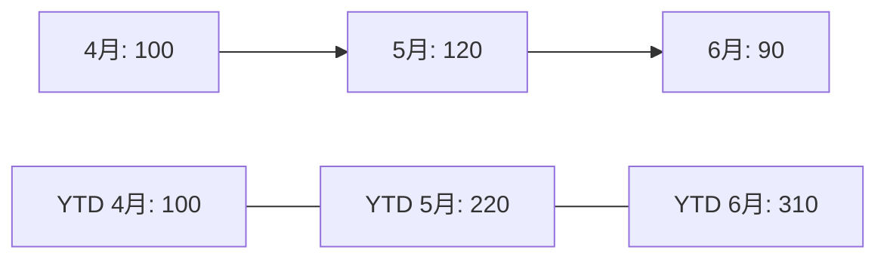
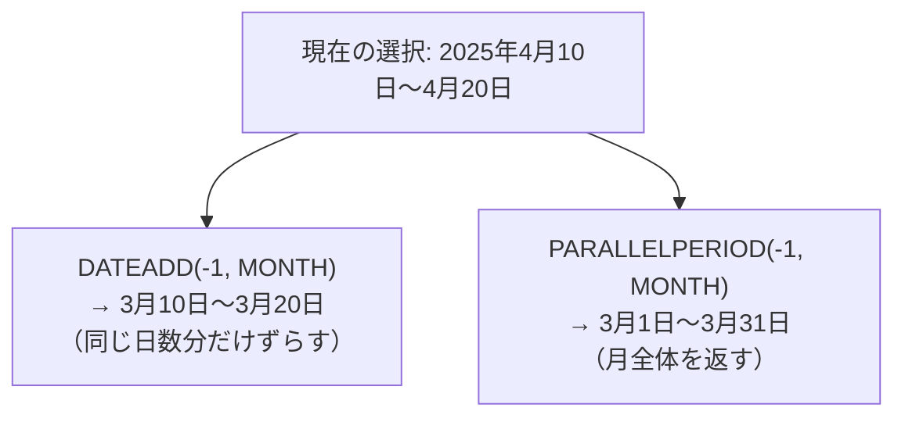

「前年同月比」「年度累計」「移動平均」——経営レポートで必ず求められる指標を、DAXの標準関数で実装します。

## 前提：日付テーブルが必須

タイムインテリジェンス関数は、**L203で作った日付テーブルが「日付テーブルとしてマーク」されていること**を前提に動きます。これがないと、正しい結果が返らないか、そもそもエラーになります。



## 累計（YTD / QTD / MTD）

```dax
売上YTD = TOTALYTD( [売上合計], Dim_日付[Date] )
売上QTD = TOTALQTD( [売上合計], Dim_日付[Date] )
売上MTD = TOTALMTD( [売上合計], Dim_日付[Date] )
```

会計年度が4月始まりの場合は、第3引数で年度末を指定します。

```dax
売上YTD_年度 = TOTALYTD( [売上合計], Dim_日付[Date], "3/31" )
```



`DATESYTD` を使った同等の書き方も覚えておくと応用が利きます。

```dax
売上YTD = CALCULATE( [売上合計], DATESYTD( Dim_日付[Date] ) )
```

## 前年同期比

```dax
前年売上 = CALCULATE( [売上合計], SAMEPERIODLASTYEAR( Dim_日付[Date] ) )

前年比 = DIVIDE( [売上合計], [前年売上] )

前年差 = [売上合計] - [前年売上]

前年比増減率 = DIVIDE( [売上合計] - [前年売上], [前年売上] )
```

| メジャー | 意味 | 表示例 |
|---|---|---|
| 前年比 | 今年 ÷ 昨年 | 112% |
| 前年比増減率 | (今年 − 昨年) ÷ 昨年 | +12% |

> [!TRAP]
> 「前年比112%」と「前年比+12%」は同じ意味ですが、混在するとレポートの読み手が混乱します。**組織内で表記を統一**し、メジャー名にも反映させてください。

## DATEADD — 任意の期間をずらす

`SAMEPERIODLASTYEAR` は1年固定ですが、`DATEADD` なら自由にずらせます。

```dax
前月売上   = CALCULATE( [売上合計], DATEADD( Dim_日付[Date], -1, MONTH ) )
前四半期   = CALCULATE( [売上合計], DATEADD( Dim_日付[Date], -1, QUARTER ) )
3年前売上  = CALCULATE( [売上合計], DATEADD( Dim_日付[Date], -3, YEAR ) )
```

第3引数に指定できる単位：`DAY` / `MONTH` / `QUARTER` / `YEAR`

> [!EXAM]
> `SAMEPERIODLASTYEAR( 日付 )` は `DATEADD( 日付, -1, YEAR )` と等価です。この対応関係は出題されます。

## PARALLELPERIOD との違い



| 関数 | 動作 |
|---|---|
| `DATEADD` | 選択されている日付そのものをずらす |
| `PARALLELPERIOD` | 指定した単位の**期間全体**を返す |

「月の途中までの比較」なら `DATEADD`、「前月まるごとと比較」なら `PARALLELPERIOD` です。

## 移動平均

直近N日の平均を出します。

```dax
売上_7日移動平均 =
AVERAGEX(
    DATESINPERIOD( Dim_日付[Date], MAX( Dim_日付[Date] ), -7, DAY ),
    [売上合計]
)
```

`DATESINPERIOD( 日付列, 起点, 数量, 単位 )` は、起点から指定期間分の日付テーブルを返します。


30日移動平均なら `-30, DAY`、3か月なら `-3, MONTH` です。

> [!TIP]
> 移動平均は「日々の変動を均して傾向を見る」ための手法です。売上のように曜日変動が大きいデータでは、7日移動平均（週の周期を吸収する）がよく使われます。

## 期間の開始・終了

```dax
月初売上 = CALCULATE( [売上合計], STARTOFMONTH( Dim_日付[Date] ) )
月末在庫 = CALCULATE( [在庫数], ENDOFMONTH( Dim_日付[Date] ) )
最新日   = MAX( Dim_日付[Date] )
```

在庫やアカウント残高のような**半加法的な指標**（時間方向には足せない指標）では、`LASTDATE` や `ENDOFMONTH` が必須です。

```dax
月末在庫数 =
CALCULATE(
    SUM( Fact_在庫[在庫数] ),
    LASTDATE( Dim_日付[Date] )
)
```

> [!EXAM]
> 「在庫を月次で集計したら異常に大きい数字になった」→ 在庫は日々の合計ではなく**時点の値**なので、`LASTDATE` などで最終日の値を取る必要があります。半加法的指標の扱いは出題されます。

## BLANK の扱い

前年データがない期間では、前年比が空白や巨大な値になります。

```dax
前年比_安全 =
VAR 前年 = [前年売上]
RETURN
    IF( ISBLANK( 前年 ) || 前年 = 0, BLANK(), DIVIDE( [売上合計], 前年 ) )
```

> [!TIP]
> グラフの端が不自然に跳ねるときは、`BLANK` を返して**そもそも描画しない**のが正解です。0を返すと折れ線が0まで落ちて誤解を招きます。

## 実務でよく使う組み合わせ

```dax
// 前年同期のYTD（年度累計の前年比較）
前年YTD =
CALCULATE( [売上YTD], SAMEPERIODLASTYEAR( Dim_日付[Date] ) )

// 直近12か月の累計（ローリング12か月）
売上_R12 =
CALCULATE(
    [売上合計],
    DATESINPERIOD( Dim_日付[Date], MAX( Dim_日付[Date] ), -12, MONTH )
)

// 前年比の色分け用（条件付き書式のフィールド基準で使う）
前年比_色 =
VAR 比率 = [前年比増減率]
RETURN
    SWITCH( TRUE(),
        比率 >= 0.1,  "#14926B",
        比率 >= 0,    "#8FBF5A",
        比率 >= -0.1, "#C77700",
        "#D33A4B"
    )
```

## チェックリスト

- [ ] 日付テーブルを作り、マークした
- [ ] 会計年度が4月始まりなら `TOTALYTD` の第3引数を設定した
- [ ] 前年比を「比率」か「増減率」かで統一した
- [ ] 前年データがない期間で BLANK を返すようにした
- [ ] 在庫など半加法的な指標に `LASTDATE` を使った
