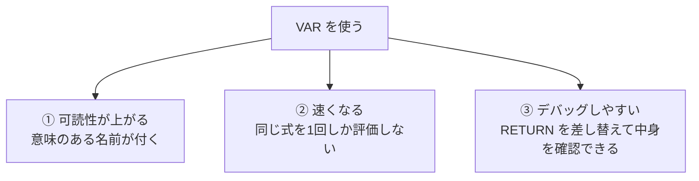
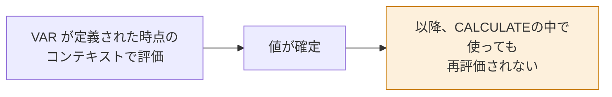

DAXは、書き方次第で読みやすさも速度も大きく変わります。その鍵が `VAR` です。

## VAR / RETURN の基本

```dax
粗利率 =
VAR 売上 = [売上合計]
VAR 原価 = [原価合計]
VAR 粗利 = 売上 - 原価
RETURN
    DIVIDE( 粗利, 売上 )
```

- `VAR 名前 = 式` で変数を定義
- `RETURN` の後に最終的な式を書く
- 変数は何個でも定義できる
- 変数はテーブルも保持できる

## VARの3つのメリット



### ② 速くなる理由

VARなしで書くと、同じ式が2回評価されます。

```dax
// 遅い：[売上合計] が3回評価される
前年比 = DIVIDE( [売上合計] - [前年売上], [前年売上] )
```

```dax
// 速い：それぞれ1回だけ
前年比 =
VAR 今年 = [売上合計]
VAR 前年 = [前年売上]
RETURN
    DIVIDE( 今年 - 前年, 前年 )
```

### ③ デバッグの技

複雑な式を書いていて結果がおかしいとき、`RETURN` の後を変数名だけにします。

```dax
検証中 =
VAR 対象商品 = FILTER( Dim_商品, Dim_商品[カテゴリ] = "家電" )
VAR 件数 = COUNTROWS( 対象商品 )
VAR 売上 = CALCULATE( [売上合計], 対象商品 )
RETURN
    件数    // ← ここを 売上 や 対象商品 に差し替えて中身を確認
```

> [!TIP]
> 変数がテーブルの場合、`RETURN 対象商品` にしてテーブルビジュアルに置くと、中身をそのまま目で確認できます。DAXデバッグの定番テクニックです。

## VARの最重要ルール：評価タイミング

**VARは定義された場所のコンテキストで、1回だけ評価されます。その後は値が固定されます。**



これは利点にも罠にもなります。

### 利点：外側の値を保持できる

```dax
// 各行で「その行の日付」を保持し、CALCULATE の中で使う
累計売上 =
VAR 現在日付 = MAX( Dim_日付[Date] )
RETURN
    CALCULATE(
        [売上合計],
        Dim_日付[Date] <= 現在日付,
        ALL( Dim_日付 )
    )
```

`現在日付` は `CALCULATE` の外で評価されているので、そのセルの日付が保持されます。`CALCULATE` の中に直接 `MAX(...)` と書くと、変更後のコンテキストで評価されてしまい、意図した結果になりません。

### 罠：再評価されない

```dax
// 意図：家電の売上を出したい
誤ったメジャー =
VAR 売上 = [売上合計]              // ← ここで全体の売上が確定してしまう
RETURN
    CALCULATE( 売上, Dim_商品[カテゴリ] = "家電" )   // ← 効かない
```

`売上` は既に値（数値）になっているので、`CALCULATE` のフィルターは何の影響も与えません。正しくはこうです。

```dax
正しいメジャー =
CALCULATE( [売上合計], Dim_商品[カテゴリ] = "家電" )
```

> [!EXAM]
> 「VARを使ったらCALCULATEのフィルターが効かなくなった」——この現象の理由（VARは定義時点で評価済み）は、DAXの理解度を測る良問としてよく出ます。

## テーブル変数

VARにはテーブルも入れられます。

```dax
上位10商品の売上 =
VAR トップ10 =
    TOPN( 10, VALUES( Dim_商品[商品名] ), [売上合計], DESC )
RETURN
    CALCULATE( [売上合計], トップ10 )
```

## 命名のコツ

| よくない名前 | よい名前 |
|---|---|
| `a`, `x`, `tmp` | `今年売上`, `前年売上` |
| `var1`, `var2` | `対象商品リスト`, `基準日` |
| `result` | `粗利率` |

日本語の変数名も使えます。チーム内で読みやすいほうを選んでください。

## 実践例：段階的に組み立てる

「前年比が改善している商品だけの売上」を出す例です。

```dax
改善商品の売上 =
VAR 対象商品 =
    FILTER(
        VALUES( Dim_商品[ProductID] ),
        VAR 今年 = [売上合計]
        VAR 前年 = [前年売上]
        RETURN
            NOT ISBLANK( 前年 ) && 今年 > 前年
    )
RETURN
    CALCULATE( [売上合計], 対象商品 )
```

`FILTER` の中でも `VAR` が使えます。ネストしても読みやすさを保てるのが `VAR` の強みです。

## 書き方のスタイルガイド

```dax
メジャー名 =
VAR 変数1 = 式
VAR 変数2 =
    複数行にわたる式(
        引数1,
        引数2
    )
RETURN
    最終的な式
```

1. `=` の直後で改行
2. `VAR` は行頭に揃える
3. 長い式は引数ごとに改行してインデント
4. `RETURN` は行頭、その内容は1段インデント
5. 3行を超える式は必ず `VAR` で分解する

> [!TIP]
> [DAX Formatter](https://www.daxformatter.com/) というWebツールに式を貼ると、この標準スタイルに自動整形してくれます。実務では必須の道具です。
