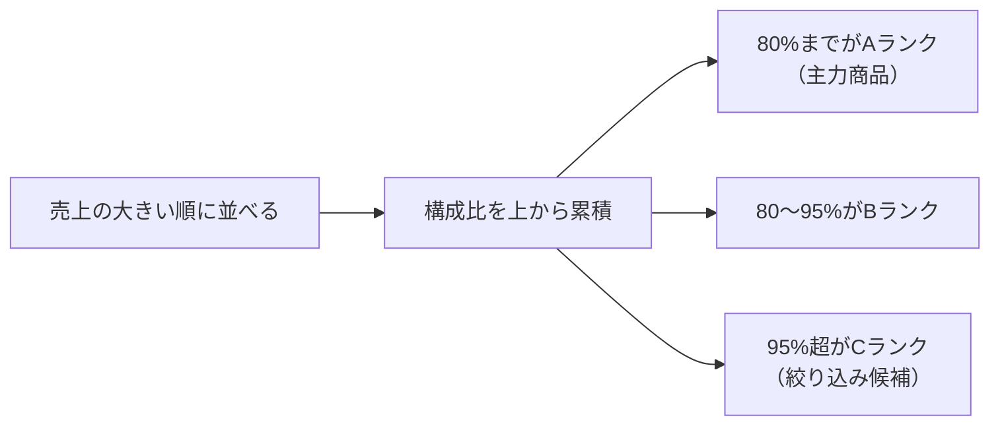

実務で繰り返し必要になる指標を、コピーして使える形でまとめます。それぞれ「なぜそう書くのか」も添えました。

## 1. 構成比（全体に対する割合）

```dax
売上構成比 =
DIVIDE(
    [売上合計],
    CALCULATE( [売上合計], ALLSELECTED( Dim_商品[カテゴリ] ) )
)
```

| 分母の書き方 | 意味 |
|---|---|
| `ALL( Dim_商品[カテゴリ] )` | 常に全カテゴリ合計が分母 |
| `ALLSELECTED( Dim_商品[カテゴリ] )` | スライサーで選ばれた範囲の合計が分母 |
| `ALL( Dim_商品 )` | 商品テーブルの全フィルター解除 |

> [!TIP]
> 実務では `ALLSELECTED` が「ユーザーの直感に合う」ことが多いです。スライサーで3カテゴリに絞ったら、その3つで100%になるからです。

## 2. 累計（Running Total）

```dax
売上累計 =
VAR 現在日付 = MAX( Dim_日付[Date] )
RETURN
    CALCULATE(
        [売上合計],
        Dim_日付[Date] <= 現在日付,
        ALL( Dim_日付 )
    )
```


`ALL( Dim_日付 )` を忘れると、そのセルの日付フィルターが残ったままになり、累計になりません。

## 3. ランキング

```dax
売上ランク =
RANKX(
    ALL( Dim_商品[商品名] ),
    [売上合計],
    ,
    DESC,
    DENSE
)
```

| 引数 | 意味 |
|---|---|
| 第1引数 | ランク付けの母集団（テーブル） |
| 第2引数 | 順位の基準となる式 |
| 第3引数 | 省略可（第2引数と同じ式を使う場合は空） |
| 第4引数 | `ASC` / `DESC` |
| 第5引数 | `SKIP`（1,2,2,4）/ `DENSE`（1,2,2,3） |

> [!TRAP]
> 第1引数に `ALL` を付け忘れると、各行が「自分自身だけの母集団」でランク付けされ、**全部1位**になります。RANKXでもっとも多いミスです。

## 4. 上位N件とその他

```dax
売上_上位10商品 =
VAR トップ10 = TOPN( 10, ALL( Dim_商品[商品名] ), [売上合計], DESC )
RETURN
    CALCULATE( [売上合計], KEEPFILTERS( トップ10 ) )
```

「その他」をまとめる場合：

```dax
売上_その他 = [売上合計] - [売上_上位10商品]
```

## 5. ABC分析（パレート分析）

売上構成比の累積が80%までをA、95%までをB、それ以降をCとする分類です。

```dax
売上累積構成比 =
VAR 当商品売上 = [売上合計]
VAR 全体売上 = CALCULATE( [売上合計], ALLSELECTED( Dim_商品[商品名] ) )
VAR 上位商品 =
    FILTER(
        ALLSELECTED( Dim_商品[商品名] ),
        [売上合計] >= 当商品売上
    )
VAR 累積売上 = CALCULATE( [売上合計], 上位商品 )
RETURN
    DIVIDE( 累積売上, 全体売上 )
```

```dax
ABCランク =
VAR 累積 = [売上累積構成比]
RETURN
    SWITCH( TRUE(),
        累積 <= 0.8,  "A",
        累積 <= 0.95, "B",
        "C"
    )
```



## 6. 前年比（BLANK対応版）

```dax
前年比増減率 =
VAR 今年 = [売上合計]
VAR 前年 = [前年売上]
RETURN
    IF(
        ISBLANK( 前年 ) || 前年 = 0,
        BLANK(),
        DIVIDE( 今年 - 前年, 前年 )
    )
```

## 7. 目標達成率と信号機表示

```dax
達成率 = DIVIDE( [売上合計], [予算合計] )

達成状況 =
VAR 率 = [達成率]
RETURN
    SWITCH( TRUE(),
        ISBLANK( 率 ),  "",
        率 >= 1.0,      "達成",
        率 >= 0.9,      "あと一歩",
        "未達"
    )
```

条件付き書式で色を出す場合は、色コードを返すメジャーを作ります。

```dax
達成率_色 =
VAR 率 = [達成率]
RETURN
    SWITCH( TRUE(),
        率 >= 1.0, "#14926B",
        率 >= 0.9, "#C77700",
        "#D33A4B"
    )
```

ビジュアルの書式設定 → 条件付き書式 → **フィールド基準** でこのメジャーを指定します。

## 8. 新規顧客・既存顧客の判定

```dax
新規顧客数 =
VAR 期間開始 = MIN( Dim_日付[Date] )
VAR 現在顧客 = VALUES( Fact_売上[CustomerID] )
VAR 過去顧客 =
    CALCULATETABLE(
        VALUES( Fact_売上[CustomerID] ),
        Dim_日付[Date] < 期間開始,
        ALL( Dim_日付 )
    )
RETURN
    COUNTROWS( EXCEPT( 現在顧客, 過去顧客 ) )
```

`EXCEPT( A, B )` は「Aにあって Bにない行」を返します。集合演算はこの手の分析で頻出です。

## 9. 同一期間の複数指標を並べる

```dax
売上_選択期間 = [売上合計]
売上_前期     = CALCULATE( [売上合計], DATEADD( Dim_日付[Date], -1, MONTH ) )
売上_前年同期 = CALCULATE( [売上合計], SAMEPERIODLASTYEAR( Dim_日付[Date] ) )
```

3本並べると、グラフ1枚で「前月比」「前年比」の両方が読めます。

## 10. 選択値の取得（動的タイトル）

```dax
レポートタイトル =
VAR 選択カテゴリ =
    IF(
        ISFILTERED( Dim_商品[カテゴリ] ),
        CONCATENATEX( VALUES( Dim_商品[カテゴリ] ), Dim_商品[カテゴリ], ", " ),
        "全カテゴリ"
    )
VAR 選択期間 = FORMAT( MIN( Dim_日付[Date] ), "yyyy/M" ) & " 〜 " & FORMAT( MAX( Dim_日付[Date] ), "yyyy/M" )
RETURN
    選択カテゴリ & " の売上分析（" & 選択期間 & "）"
```

これをカードビジュアルに置くと、スライサーの選択に応じてタイトルが変わります。レポートの完成度が一段上がります。

> [!TIP]
> `SELECTEDVALUE( 列, "既定値" )` は、単一選択のときだけ値を返す便利な関数です。上の `ISFILTERED` + `CONCATENATEX` は複数選択にも対応させたい場合の書き方です。

## パターン集の使い方

これらは丸暗記するものではありません。**「なぜ `ALL` が必要か」「なぜ `VAR` で日付を保持するか」を説明できる**ようになれば、パターンは自然に応用できます。説明できない式は、L302〜L304に戻って読み直してください。
