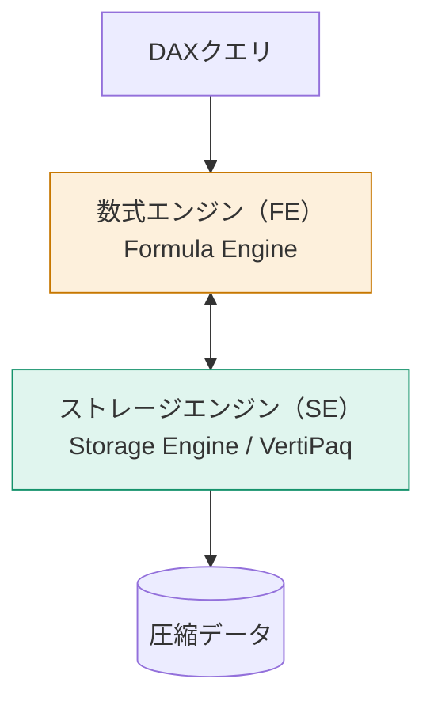
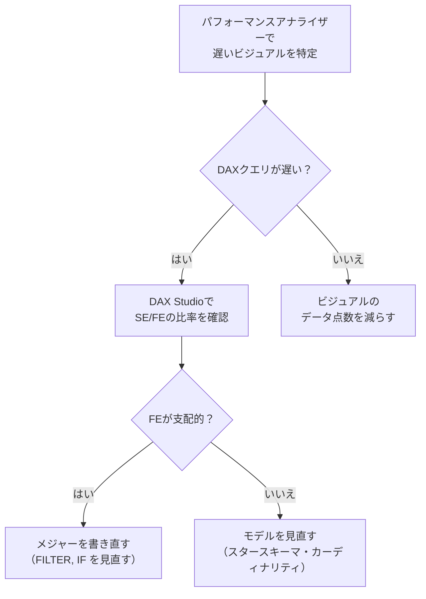

「レポートが重い」と言われたとき、どこを見て何を直すか。推測ではなく計測で解決する方法を学びます。

## 2つのエンジン

DAXクエリは、2つのエンジンが分担して処理します。



| | ストレージエンジン (SE) | 数式エンジン (FE) |
|---|---|---|
| 役割 | データの読み出しと単純集計 | 複雑なロジック・結合・反復 |
| 速度 | **非常に速い** | 遅い |
| 並列処理 | する（マルチコア） | しない（シングルスレッド） |
| キャッシュ | ある | ない |

**性能改善の原則は「できるだけ多くの仕事をSEにやらせる」**ことです。

## 計測ツール

### 1. パフォーマンスアナライザー（Power BI Desktop 内蔵）

**表示 → パフォーマンス アナライザー → 記録の開始 → ページの更新**

各ビジュアルの処理時間が、3つに分けて表示されます。

| 項目 | 意味 | 遅いときの対処 |
|---|---|---|
| DAXクエリ | 計算にかかった時間 | メジャーとモデルを見直す |
| ビジュアルの表示 | 描画にかかった時間 | データ点数を減らす・ビジュアルを変える |
| その他 | 待機・同期など | ビジュアル数を減らす |

> [!TIP]
> まずここを見てください。**「DAXクエリが遅いのか、描画が遅いのか」で対策がまったく変わります。** 描画が遅いなら、DAXをいくら直しても効果はありません。

### 2. DAX Studio

パフォーマンスアナライザーで「クエリのコピー」をして、DAX Studio に貼り付けます。

**Server Timings** をオンにして実行すると、次が分かります。

| 指標 | 見方 |
|---|---|
| Total | 全体の実行時間 |
| SE CPU | ストレージエンジンのCPU時間 |
| FE | 数式エンジンの時間 |
| SE Queries | SEへのクエリ回数 |

**目安**：FE の割合が高い、または SE Queries が数十回以上なら、改善の余地があります。

## 遅くなる典型パターンと対処

### パターン1：CallbackDataID

SEが処理できない式が含まれると、SEはFEに問い合わせを返します。これが `CallbackDataID` で、SEのキャッシュが効かなくなります。

```dax
// 遅い：SUMXの中に IF がある
SUMX( Fact_売上, IF( Fact_売上[Quantity] > 10, Fact_売上[売上金額], 0 ) )

// 速い：条件をフィルターに出す
CALCULATE( SUM( Fact_売上[売上金額] ), Fact_売上[Quantity] > 10 )
```

> [!TIP]
> **「イテレータの中に条件分岐や複雑な関数を書かない」**——これだけで大幅に改善することがあります。

### パターン2：FILTERでテーブル全体をイテレート

```dax
// 遅い
CALCULATE( [売上合計], FILTER( Fact_売上, Fact_売上[UnitPrice] > 10000 ) )

// 速い
CALCULATE( [売上合計], Fact_売上[UnitPrice] > 10000 )
```

後者は内部で列だけをスキャンするため、桁違いに速くなります。

### パターン3：双方向リレーションシップ

フィルターの伝播経路が増え、SEクエリが増加します。L204のとおり、`CROSSFILTER` でメジャー単位に限定してください。

### パターン4：高カーディナリティの列でのDISTINCTCOUNT

```dax
// 重い
DISTINCTCOUNT( Fact_売上[TransactionID] )
```

取引IDのような一意性の高い列でのカウントは高コストです。頻繁に使うなら、集計済みテーブルの用意を検討します。

### パターン5：計算列の使いすぎ

計算列は圧縮効率が悪く（多くの場合ディクショナリエンコードになる）、モデルサイズを膨らませます。Power Query で作れるものは Power Query へ移してください。

## ビジュアル側の対策

| 症状 | 対処 |
|---|---|
| 1ページのビジュアルが多い | 1ページ6〜8個以内を目安に分割する |
| テーブルの行数が多い | Top N フィルターで絞る、またはドリルスルーに移す |
| スライサーが多い | フィルターペインに移す |
| 地図に数万点をプロット | 集計してから表示する |

> [!EXAM]
> 「レポートの読み込みが遅い。最初に確認すべきものは？」→ **パフォーマンス アナライザー**。実行順序を問う問題として出ます。

## 改善の進め方



> [!TIP]
> 実務での優先順位は **「モデル > DAX > ビジュアル」** です。スタースキーマになっていないモデルをDAXでカバーしようとすると、必ず限界が来ます。遅さの根本原因がモデルにあることは非常に多いです。

## 参考になる無料ツール

| ツール | 用途 |
|---|---|
| [DAX Studio](https://daxstudio.org/) | クエリ計測・VertiPaq Analyzer |
| [Tabular Editor](https://tabulareditor.com/) | モデル一括編集・ベストプラクティスアナライザー |
| [DAX Formatter](https://www.daxformatter.com/) | DAXの整形 |
| [Bravo for Power BI](https://bravo.bi/) | モデル分析・日付テーブル生成 |

> [!TIP]
> Tabular Editor の **Best Practice Analyzer** は、モデルの問題点を自動で指摘してくれます。「自動の日付/時刻が有効」「非表示にすべき列が表示されている」といった指摘が一覧で出るので、モデルの健康診断として非常に有用です。
