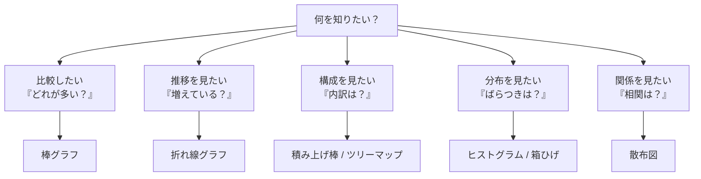
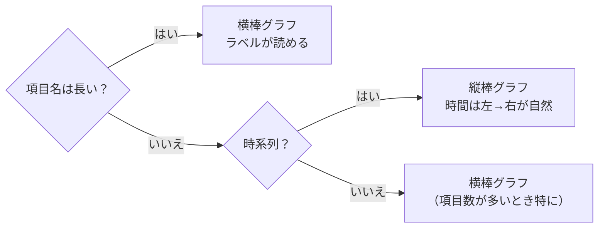
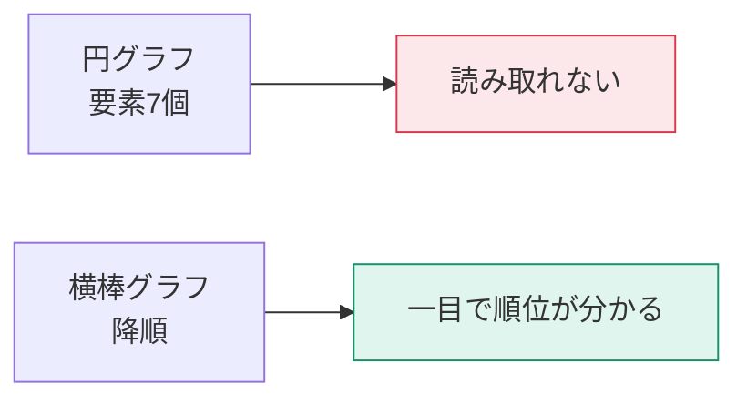
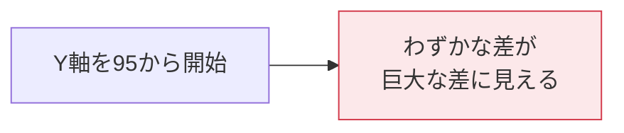

グラフ選びは好みの問題ではありません。**「答えたい問いの型」で決まります**。

## 問いの型 → ビジュアルの対応

| 問い | 第一候補 | 代替 |
|---|---|---|
| どのカテゴリが一番売れた？ | 横棒グラフ（降順） | 縦棒グラフ |
| 売上は伸びている？ | 折れ線グラフ | 面グラフ |
| 内訳の構成は？ | 積み上げ横棒 / ツリーマップ | 円グラフ（3要素以下のみ） |
| 単価の分布は？ | ヒストグラム | 箱ひげ図（カスタムビジュアル） |
| 広告費と売上に関係は？ | 散布図 | — |
| 今の売上はいくら？ | カード | KPI |
| 目標に対してどうか？ | ゲージ / KPI | 棒グラフ + 基準線 |
| 地域ごとの分布は？ | 塗り分け地図 | 棒グラフ（地域名） |
| 手順のどこで脱落する？ | じょうごグラフ | 棒グラフ |

## 縦棒か横棒か

日本語の商品名や部署名は長くなりがちです。**迷ったら横棒**が実用的です。

> [!TIP]
> 横棒グラフは**必ず降順に並べ替え**てください。ランキングとして読めるようになり、情報量が跳ね上がります。時系列以外で「元の並び順」のままにする理由はほぼありません。

## 円グラフを使ってよい条件

円グラフは嫌われがちですが、条件を満たせば有効です。

| 条件 | 理由 |
|---|---|
| 要素が3つ以下 | 人間は角度の比較が苦手 |
| 合計が100%になる | 部分と全体の関係を示すため |
| 大きな差がある | 微差は角度で読み取れない |

これらを満たさないなら、**積み上げ横棒グラフか、ツリーマップ**にしてください。

## 誤解を招く表現を避ける

### 1. 棒グラフの軸を0から始めない

**棒グラフの長さは値そのものを表します。** 軸を切り詰めると長さの比が値の比と一致しなくなり、誤読を招きます。

折れ線グラフは「変化の傾き」を見るものなので、軸を切り詰めても許容されます。この違いは重要です。

### 2. 3Dグラフを使わない

奥行きが値の読み取りを歪めます。Power BI に3Dグラフがないのは、意図的な設計です。

### 3. デュアル軸の乱用

左右で異なる単位の軸を使うと、交点の位置が任意に操作できてしまいます。使う場合は「売上と粗利率」のように、単位が本質的に違うものに限定してください。

## 色の使い方

| 用途 | 使い方 |
|---|---|
| カテゴリの区別 | 色相を変える（最大6〜7色まで） |
| 量の大小 | 同系色の濃淡（シーケンシャル） |
| 良し悪し | 発散配色（赤 ← 中立 → 緑） |
| 強調 | 1色だけ目立たせ、他はグレー |

> [!TIP]
> **もっとも効果的な色使いは「1つだけ色を付けて、残りをグレーにする」**ことです。「注目してほしいのはここ」というメッセージが明確になります。

> [!WARN]
> 赤と緑の組み合わせは、色覚多様性のある方（日本人男性の約5%）には区別が困難です。**色だけに意味を持たせず、形・位置・ラベルも併用**してください。詳しくはL406で扱います。

## 数値の見せ方

| ビジュアル | 使いどころ |
|---|---|
| カード | 最重要のKPI1つ（大きく） |
| 複数の行カード | 補助指標をまとめて |
| KPI | 実績・目標・トレンドを1つに |
| ゲージ | 目標に対する達成度（1つだけ） |
| テーブル | 明細の確認・エクスポート用 |
| マトリックス | 行列のクロス集計 |

> [!TRAP]
> ゲージを何個も並べるのは、スペース効率が悪い典型例です。3つ以上の目標達成率を見せるなら、**横棒グラフ + 基準線**のほうが圧倒的に読みやすくなります。

## 選択の練習

次の問いに、どのビジュアルを使いますか。

1. 「今月の売上トップ10店舗は？」
2. 「過去3年の月次売上推移と季節性は？」
3. 「値引き率と販売数量に関係はあるか？」
4. 「顧客の年齢分布は？」
5. 「予算に対する各部門の進捗は？」

答え：1=横棒（降順・Top10フィルター）、2=折れ線（年ごとの色分け、またはスモールマルチプル）、3=散布図、4=ヒストグラム（Power Queryでビン化するか、集合縦棒）、5=横棒 + 目標の基準線（またはKPI）

> [!EXAM]
> PL-300では「この分析目的に最適なビジュアルは？」という形で頻出します。**「分布」→散布図やヒストグラム、「相関」→散布図、「構成の推移」→積み上げ面グラフ**といった対応を押さえてください。
