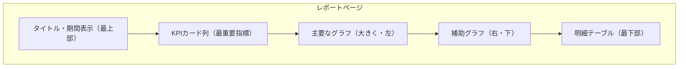
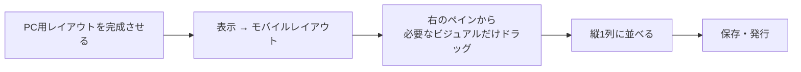

同じデータでも、レイアウト次第で「一目で分かるレポート」にも「読む気が失せるレポート」にもなります。

## 視線導線を設計する

人は左上から読み始め、Z字またはF字に視線を動かします。

| 位置 | 置くもの |
|---|---|
| 左上 | もっとも重要な指標・結論 |
| 上部横一列 | KPIカード（3〜5個） |
| 中央左 | 主役のグラフ |
| 右側 | スライサー・補助情報 |
| 下部 | 明細・詳細テーブル |

> [!TIP]
> **1ページ1メッセージ**が原則です。「売上概況」「商品分析」「顧客分析」のようにページを分け、それぞれで伝えたいことを1つに絞ってください。

## グリッドに揃える

**表示 → グリッド線を表示 / グリッドにスナップ** をオンにします。

さらに、複数ビジュアルを選択して **書式 → 配置** で端を揃えます。ピクセル単位の微妙なズレは、無意識のうちに「雑な資料」という印象を与えます。

**書式 → 配置 → 均等配置** で、間隔も揃えられます。

## サイズとキャンバス設定

| 設定 | 場所 | 推奨 |
|---|---|---|
| キャンバスサイズ | 書式 → キャンバスの設定 | 16:9（1280×720）が標準 |
| 表示倍率 | 表示 → ページビュー | 「ページに合わせる」 |
| 背景 | 書式 → キャンバスの背景 | 白または薄いグレー |

## テーマで色を統一する

**表示 → テーマ → テーマのカスタマイズ**

| 設定項目 | 内容 |
|---|---|
| 名前と色 | データ色8色・強調色・背景色 |
| テキスト | フォント・サイズ（タイトル・見出し・本文） |
| ビジュアル | 枠線・見出し・ツールチップの既定 |
| ページ | 壁紙・背景 |

JSONファイルとしてエクスポート／インポートできるので、**組織で1つのテーマファイルを共有**すれば、誰が作っても同じ見た目になります。

> [!TIP]
> テーマを最初に設定してからビジュアルを作ってください。後から変えると、個別に色を指定したビジュアルだけ取り残されます。

## モバイルレイアウト

**表示 → モバイル レイアウト**

ポイント：

- **すべてのビジュアルを載せる必要はありません。** スマホで見たい3〜5個に絞ります
- 縦スクロール前提。上から重要な順に
- スライサーは上部に1〜2個まで
- テーブルは列数を絞る（横スクロールは操作しづらい）
- タップ領域を考え、小さいビジュアルは避ける

> [!TRAP]
> モバイルレイアウトを設定していないと、スマホでは**PC用レイアウトが縮小表示**され、文字が読めません。スマホでの閲覧が想定されるなら必須の作業です。

> [!EXAM]
> モバイルレイアウトは**ページごとに設定**します。全ページ分の設定が必要である点も押さえてください。

## 余白とグルーピング

情報を「かたまり」として認識させるには、余白を使います。

| テクニック | 効果 |
|---|---|
| 関連するビジュアルを近づける | 同じグループだと認識される |
| 無関係なものは離す | 別の話題だと分かる |
| 図形（四角形）で背景を敷く | グループが明示される |
| 区切り線を引く | セクションを分ける |

> [!TIP]
> **枠線を増やすより、余白を増やすほうが整理されて見えます。** 線を引きたくなったら、まず間隔を広げることを試してください。

## タイトルと注釈

| 要素 | 書き方 |
|---|---|
| ページタイトル | 何のページか（例：「2025年度 売上概況」） |
| ビジュアルタイトル | **結論を書く**（例：「関東の売上が前年比+18%」） |
| 期間表示 | 動的タイトル（L307のパターン10）で自動更新 |
| 注釈 | データの前提・除外条件をテキストボックスで明記 |

> [!TIP]
> ビジュアルのタイトルを「売上推移」ではなく「売上は3か月連続で増加」にすると、読み手の理解が一段速くなります。データが変われば結論も変わるため、動的タイトルにするのが理想です。

## ナビゲーション

ページが増えたら、ページナビゲーターを置きます。

**挿入 → ボタン → ナビゲーター → ページ ナビゲーター**

ページを追加すると自動でボタンが増えるので、保守が不要です。

## 仕上げチェックリスト

- [ ] 1ページ1メッセージになっている
- [ ] 最重要指標が左上にある
- [ ] ビジュアルの端が揃っている
- [ ] テーマで色が統一されている
- [ ] タイトルが結論を語っている
- [ ] スライサーの位置が全ページで一貫している
- [ ] モバイルレイアウトを設定した
- [ ] 実際にスマホで開いて確認した
