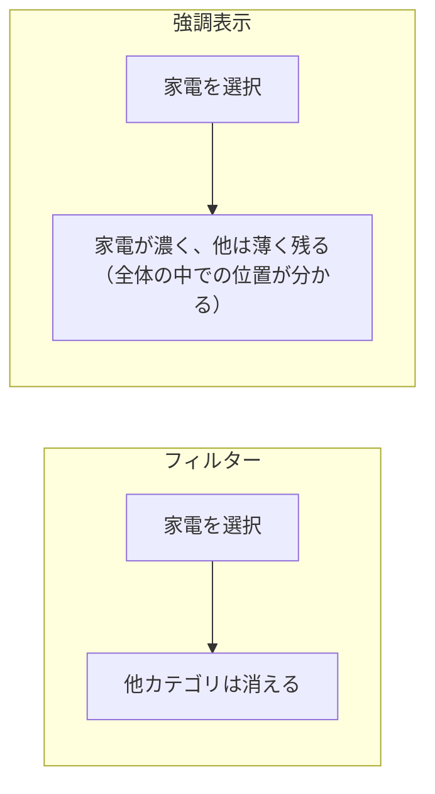
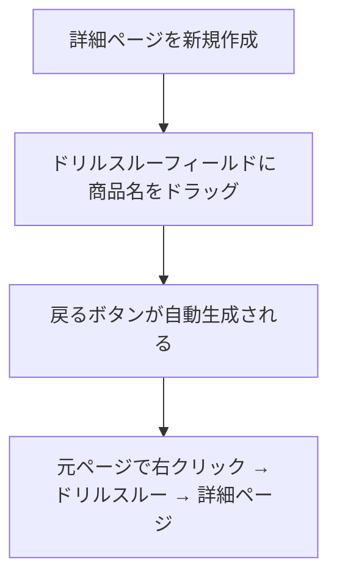
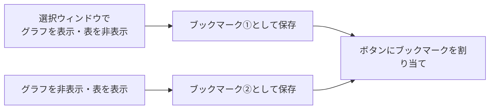

Power BI の価値は「静止画ではないこと」にあります。ユーザーが自分で掘り下げられる仕掛けを作ります。

## ビジュアル間の相互作用

既定では、あるビジュアルをクリックすると他のビジュアルが連動します。この挙動は制御できます。

**ビジュアルを選択 → 書式（リボン） → 相互作用の編集**

各ビジュアルの右上に3つのアイコンが出ます。

| アイコン | 動作 |
|---|---|
| フィルター（漏斗） | 選択した項目だけを表示 |
| 強調表示（ハイライト） | 選択部分を濃く、残りを薄く表示 |
| なし（○に斜線） | 影響を受けない |

> [!TIP]
> **KPIカードは「フィルター」、棒グラフは「強調表示」**が使いやすい組み合わせです。カードは数字が変わるべきで、棒グラフは全体の中での位置が見えたほうが分かりやすいからです。

> [!TRAP]
> スライサー同士も相互作用します。「地域スライサーで関東を選ぶと、店舗スライサーに関東の店舗だけが出る」のは便利ですが、意図しない絞り込みが起きることもあります。相互作用の編集で調整してください。

## ドリルダウン

階層（L205）を軸に置くと、ドリルダウンできます。

| 操作 | 動作 |
|---|---|
| 下向き矢印 → 項目クリック | その項目だけ1階層下へ |
| 二重下向き矢印 | 全項目を1階層下へ |
| 分岐アイコン | 下位階層を展開して並べる |

## ドリルスルー — 別ページへ掘り下げる

「商品を右クリック → その商品の詳細ページへ」という動線を作ります。

手順：

1. 新しいページを作る（例：「商品詳細」）
2. **視覚化ペイン → ページ情報の下の「ドリルスルー」** に `Dim_商品[商品名]` をドラッグ
3. そのページに、その商品の詳細ビジュアルを配置
4. 自動生成された「戻る」ボタンはそのまま活かす

> [!TIP]
> ドリルスルーページには**動的タイトル**（L307のパターン10）を置いてください。「どの商品を見ているのか」が明示されます。

> [!EXAM]
> ドリルスルー設定時に「すべてのフィルターを保持」をオンにすると、元ページのフィルター（期間など）も引き継がれます。この設定の効果は出題されます。

## ツールチップページ

ホバーしたときに、単なる数値ではなく**ミニレポート**を表示できます。

1. 新しいページを作成
2. **書式 → ページ情報 → ツールチップとして使用** をオン
3. **書式 → キャンバスの設定 → 種類 → ツールチップ**（320×240）
4. 元のビジュアル → **書式 → ツールチップ → 種類「レポートページ」** で作成したページを選択

> [!TIP]
> 棒グラフにホバーすると、その項目の月次推移が小さな折れ線で出る——この演出は、レポートの情報密度を上げずに深さを足せる優れた手法です。

## ブックマーク

画面の状態（フィルター・表示/非表示・並べ替え）を保存して、ボタンで呼び出せます。

**表示 → ブックマーク → 追加**

| 保存される要素 | チェックで制御 |
|---|---|
| フィルターの状態 | データ |
| ビジュアルの表示/非表示 | 表示 |
| 現在のページ | 現在のページ |
| 選択項目 | すべてのビジュアル / 選択したビジュアル |

### 典型的な使い方1：表示切り替え

「グラフ表示」と「テーブル表示」をボタンで切り替えます。

**表示 → 選択** で選択ウィンドウを開き、目のアイコンで表示/非表示を切り替えてからブックマークを保存します。

### 典型的な使い方2：フィルターのプリセット

「今月」「今四半期」「今年度」をワンタッチで切り替えるボタン群を作れます。

### 典型的な使い方3：スライサーパネル

普段は隠しておき、ボタンでスライドイン表示させるフィルターパネル。画面を広く使えます。

> [!TRAP]
> ブックマークを保存するとき、**「データ」のチェックを外し忘れる**と、意図しないフィルターまで固定されます。表示切り替えだけが目的なら、「データ」のチェックを外してください。

## 選択ウィンドウとレイヤー順序

**表示 → 選択**

- ビジュアルの表示/非表示を切り替え
- 重なり順（レイヤー）を変更
- タブ順序（アクセシビリティ用）を設定
- グループ化（複数ビジュアルをまとめて表示制御）

> [!TIP]
> ビジュアルには意味のある名前を付けてください（「売上推移_折れ線」など）。ブックマークや選択ウィンドウでの管理が段違いに楽になります。

## 実装チェックリスト

- [ ] KPIカードとグラフの相互作用を意図どおり設定した
- [ ] 主要な軸に階層を設定し、ドリルダウンできる
- [ ] 詳細を見たい対象にドリルスルーページを用意した
- [ ] ドリルスルーページに動的タイトルを置いた
- [ ] 重要なグラフにツールチップページを設定した
- [ ] ブックマークで表示切り替えを実装した（必要なら）
- [ ] ビジュアルに分かりやすい名前を付けた
