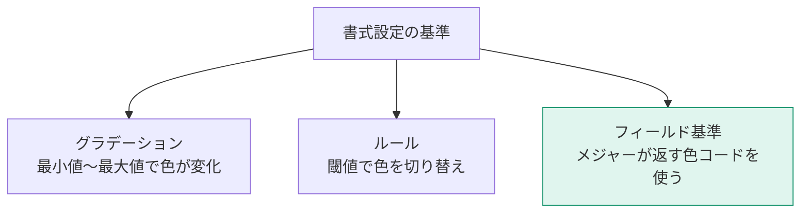

「数字を読ませる」から「異常が目に飛び込む」レポートへ。仕上げのテクニックを扱います。

## 条件付き書式

**ビジュアルを選択 → 書式ペイン → セル要素（テーブル/マトリックス）または データの色（グラフ）→ 条件付き書式**

### 4つの書式タイプ

| タイプ | 効果 | 使いどころ |
|---|---|---|
| 背景色 | セルの背景を塗る | ヒートマップ |
| フォントの色 | 文字色を変える | マイナス値を赤に |
| データバー | セル内に横棒を描く | 大小を視覚化 |
| アイコン | 記号を表示 | 信号機・矢印 |

### 3つの書式設定基準



**フィールド基準**がもっとも柔軟です。L307のパターン7で作った色メジャーを使います。

```dax
達成率_色 =
VAR 率 = [達成率]
RETURN
    SWITCH( TRUE(),
        率 >= 1.0,  "#14926B",
        率 >= 0.9,  "#C77700",
        "#D33A4B"
    )
```

> [!TIP]
> フィールド基準なら、複雑な条件（前年比と達成率の組み合わせなど）も自由に書けます。実務で条件付き書式を使うなら、この方法を第一候補にしてください。

> [!TRAP]
> 色分けは**3段階まで**にしてください。5段階、7段階と増やすと、どの色が何を意味するのか誰も覚えられません。

## カスタムツールチップ

L403で扱ったツールチップページに加えて、**フィールドを追加する簡易版**もあります。

ビジュアルのフィールドウェルに「ツールチップ」という欄があり、ここにメジャーを入れると、ホバー時に追加表示されます。

> [!TIP]
> グラフに表示していない補助指標（件数、前年比、粗利率など）をツールチップに入れておくと、画面を汚さずに情報を足せます。

## スモールマルチプル（小さな倍数）

1つのグラフを、カテゴリごとに小さく分割して並べる機能です。

**グラフを選択 → フィールドウェルの「小さな倍数」に分割したい列をドラッグ**


**Y軸を共有**に設定すると、地域間の規模の違いも比較できます。「各地域の形（トレンド）」を見たいなら共有しない、「規模も含めて比較」したいなら共有する、と使い分けます。

> [!TIP]
> 折れ線が3本を超えて絡み始めたら、スモールマルチプルを検討してください。多くの場合、そのほうが読みやすくなります。

## 基準線・目標線

**分析ペイン（虫めがねアイコン）** から追加できます。

| 線の種類 | 用途 |
|---|---|
| 定数線 | 固定の目標値 |
| 平均線 | 平均値の位置 |
| 中央値線 | 中央値 |
| パーセンタイル線 | 上位25%のラインなど |
| 予測 | 将来予測（折れ線のみ） |
| エラーバー | 誤差範囲 |

「動的な目標値」を線にしたい場合は、**定数線の値を「フィールド基準」でメジャー指定**します。

## Top N フィルター

フィルターペインで、フィールドのフィルターの種類を **「上位 N」** にします。

| 設定 | 内容 |
|---|---|
| 表示 | 上位 / 下位 |
| 件数 | 10 など |
| 値 | 順位付けに使うメジャー |

> [!TIP]
> Top N は「見やすさ」だけでなく「性能」にも効きます。数千行のテーブルを描画するより、上位20件に絞るほうが圧倒的に速く表示されます。

## テーブルとマトリックスの整形

| 設定 | 場所 | 効果 |
|---|---|---|
| 小計の非表示 | 書式 → 小計 | 階層が深いときに見やすくなる |
| 段階的レイアウト | 書式 → 行見出し | 階層をインデント表示 |
| 列幅の固定 | 書式 → 全般 → 自動サイズ調整をオフ | 更新で列幅が変わらない |
| 罫線 | 書式 → グリッド | 横罫線のみが読みやすい |
| 交互の背景色 | 書式 → 値 → 背景色 | 行が追いやすい |

> [!TIP]
> 罫線は「横線だけ」が読みやすさの定番です。縦線を全部引くと、視線が分断されて読みにくくなります。

## スパークライン

テーブル/マトリックスのセル内に、小さな折れ線を表示できます。

**テーブルを選択 → 右クリックでメジャーを選び「スパークラインの追加」**（またはリボンの「スパークラインの追加」）

数値と傾向を同じ行で見せられるため、情報密度が高くなります。

## 仕上げの一手：エラーと空データの扱い

| 状況 | 対処 |
|---|---|
| データがない期間 | メジャーで BLANK を返す |
| 0除算 | `DIVIDE` を使う |
| フィルターで結果が空 | 「該当データなし」のテキストをブックマークで表示 |
| 読み込み中 | 気にしない（Power BI が処理） |

> [!TIP]
> 「フィルターの結果、何も表示されない」画面は、ユーザーに「壊れた」と思わせます。空のときにメッセージを出す仕掛けを入れておくと、信頼感が上がります。
