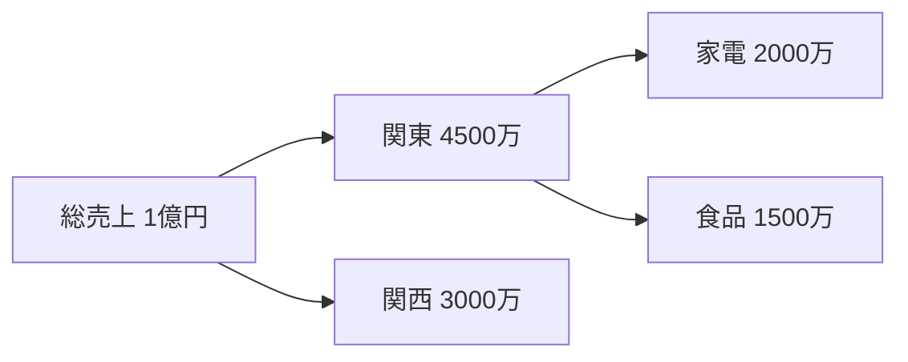
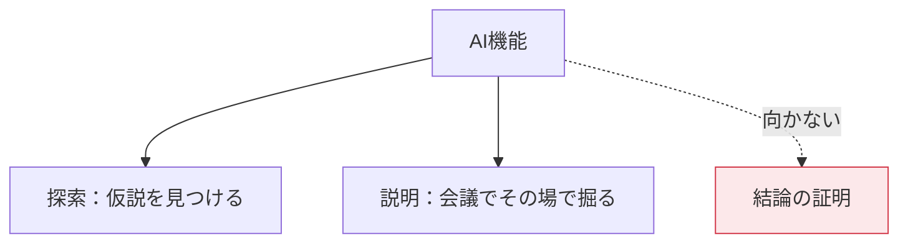

Power BI には、統計や機械学習の知識がなくても使える分析機能が組み込まれています。「なぜ？」に答えるための道具です。

## 主要な影響因子（Key Influencers）

「何が結果を左右しているのか」を自動で分析します。

設定：

| 欄 | 入れるもの |
|---|---|
| 分析 | 説明したい指標（解約フラグ、売上など） |
| 説明基準 | 要因の候補となる列（複数可） |
| 拡大先 | グループ化の単位（オプション） |

2つのタブがあります。

- **主要な影響因子**：個々の要因が結果に与える影響
- **上位セグメント**：複数条件の組み合わせで特徴的なグループを発見

> [!WARN]
> 出てくるのは**相関であって因果ではありません**。「契約期間が短い人は解約しやすい」は事実でも、「契約期間を延ばせば解約が減る」とは限りません。解釈には注意してください。

## 分解ツリー（Decomposition Tree）

指標をドリルダウンして、要因を掘り下げるビジュアルです。

| 欄 | 入れるもの |
|---|---|
| 分析 | 分解したい指標（売上など） |
| 説明基準 | 分解の軸となる列（複数可） |

ノードの「+」をクリックすると、次の軸を選べます。ここで2つの自動オプションが使えます。

| オプション | 動作 |
|---|---|
| 高い値 | 値が最大の軸を自動選択 |
| 低い値 | 値が最小の軸を自動選択 |

> [!TIP]
> 会議中に「なぜ落ちた？」と聞かれたその場で掘り下げられる——これが分解ツリーの真価です。事前に想定した切り口以外も探索できます。

## Q&A（自然言語の質問）

「今年の家電の売上は？」と日本語で入力すると、グラフが自動生成されます。

精度を上げるには準備が必要です。

**モデリング → Q&A のセットアップ**

| 設定 | 内容 |
|---|---|
| フィールドの同義語 | 「売上」「販売額」「セールス」を同じ列に紐づけ |
| 用語の確認 | Q&Aが認識できなかった語を確認 |
| 除外 | Q&Aで使わせない列を指定 |

> [!TRAP]
> 日本語のQ&Aは英語ほど精度が高くありません。同義語の登録を丁寧にやるほど使えるようになりますが、期待値は調整しておいてください。

## スマートナラティブ

グラフの内容を文章で自動要約します。**ビジュアルを右クリック → スマートナラティブ**、またはビジュアルギャラリーから追加。

生成された文章は編集でき、動的な値（メジャーの結果）を差し込めます。

> [!TIP]
> 生成された文をそのまま使うより、**「テンプレートとして手直しする」**のが実務的です。動的な値だけ活かして、文章は自分で書くほうが伝わります。

## 異常検知（Anomaly Detection）

折れ線グラフの **分析ペイン → 異常を検出** をオンにします。

| 設定 | 内容 |
|---|---|
| 感度 | 高いほど多くの異常を検出（既定70%） |
| 予期される範囲 | 正常範囲の帯を表示 |

異常点をクリックすると、右ペインに「考えられる説明」が表示されます。

## 予測（Forecast）

折れ線グラフの **分析ペイン → 予測**。

| 設定 | 内容 |
|---|---|
| 予測期間 | 何期先まで予測するか |
| 信頼区間 | 95%など |
| 季節性 | 自動または手動指定（月次データなら12） |

> [!WARN]
> 内部は指数平滑法（ETS）です。**過去の傾向が続く前提**の予測なので、構造変化（新製品投入、法改正など）は反映されません。参考値として扱ってください。

> [!TRAP]
> 予測を使うには、X軸が**日付型で、連続した値**である必要があります。カテゴリ軸や欠損のある日付では使えません。日付テーブル（L203）が効いてくる場面です。

## Rビジュアル / Pythonビジュアル

R や Python のコードで独自のグラフを描けます。

| 制約 | 内容 |
|---|---|
| 実行環境 | Desktop はローカルのR/Python、Service は Microsoft のランタイム |
| データ量 | 15万行まで |
| 対話性 | ない（静止画として描画） |
| ライセンス | Service で使うには Pro 以上 |

> [!EXAM]
> 「Rビジュアルで対話操作はできるか」→ **できません**（静止画）。この制約は出題されます。

## AI機能を使うときの心構え

AI機能は「仮説を発見する道具」です。見つかったパターンは、必ず人が検証してから意思決定に使ってください。
