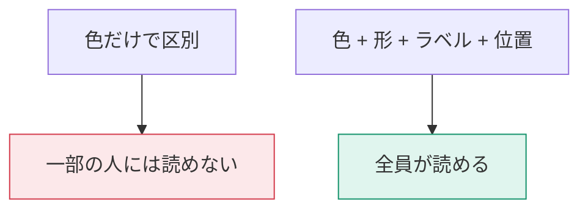
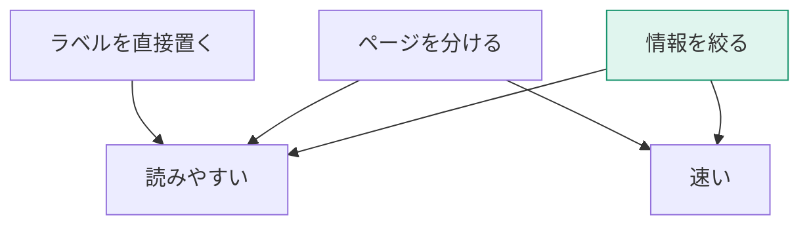

「全員が読めるレポート」と「速いレポート」。どちらも、作った後ではなく作りながら確保するものです。

## アクセシビリティ — 誰もが読めるレポート

### 色に頼らない

日本人男性の約5%、女性の約0.2%に色覚多様性があります。赤と緑の区別が難しい方が最も多数です。

対策：

- 良否は色だけでなく**アイコン（▲▼）や記号**も併用する
- 折れ線は色に加えて**マーカーの形**を変える
- 凡例だけでなく**データラベル**を直接置く
- 色覚シミュレータで確認する（Windowsの「カラーフィルター」でも簡易確認できます）

### コントラスト比

文字と背景のコントラスト比は **4.5:1 以上**が目安です（WCAG AA相当）。薄いグレーの文字は読めません。

### 代替テキスト

各ビジュアルの **書式 → 全般 → 代替テキスト** に説明を入れます。スクリーンリーダーが読み上げます。

> [!TIP]
> 代替テキストには**動的な値も入れられます**（フィールド基準）。「2025年4月の売上は1億2000万円、前年比+12%」のように、実データを読み上げさせることができます。

### タブ順序

**表示 → 選択 → タブ順序** で、キーボードのTabキーで移動する順序を設定します。既定は作成順なので、視覚的な並びと一致しないことがよくあります。

装飾用の図形などは、タブ順序から除外（非表示に設定）してください。

### キーボード操作

Power BI レポートは、キーボードだけで操作できます。

| キー | 動作 |
|---|---|
| Tab | 次のビジュアルへ |
| Enter / Space | ビジュアルを選択 |
| Alt + Shift + F11 | アクセシブルなテーブル表示 |
| Ctrl + 右クリック相当 | コンテキストメニュー |

### アクセシビリティのチェックリスト

- [ ] 色以外の手がかり（形・ラベル）がある
- [ ] 文字と背景のコントラストが十分
- [ ] すべてのビジュアルに代替テキストがある
- [ ] タブ順序が視覚的な並びと一致している
- [ ] 装飾要素をタブ順序から除外した
- [ ] フォントサイズが12pt以上（本文）

## パフォーマンス — 速いレポート

### パフォーマンス アナライザー

**表示 → パフォーマンス アナライザー → 記録の開始 → ページの更新**

| 表示項目 | 遅いときの意味 |
|---|---|
| DAXクエリ | 計算が重い → L308へ |
| ビジュアルの表示 | 描画するデータ点が多すぎる |
| その他 | ビジュアル数が多すぎる |

> [!EXAM]
> パフォーマンスアナライザーの3項目とその意味は出題対象です。特に「DAXクエリ」と「ビジュアルの表示」の切り分けが重要です。

### レポート側の高速化

| 対策 | 効果 |
|---|---|
| 1ページのビジュアルを8個以内に | ビジュアルごとにクエリが飛ぶため |
| Top N フィルターで行数を絞る | 描画データ量が減る |
| スライサーを減らす（フィルターペインへ） | スライサーもクエリを発行する |
| 既定でドリルダウンを閉じておく | 初期表示のデータ量が減る |
| 不要な相互作用を「なし」にする | 連動するクエリが減る |
| 画像を軽くする | 背景画像は数百KB以内に |

> [!TIP]
> **「1ページに全部載せる」誘惑に勝つ**ことが最大の性能対策です。ページを分けてナビゲーションでつなぐほうが、速くて読みやすくなります。

### 目標値の目安

| 指標 | 目安 |
|---|---|
| ページ全体の表示 | 5秒以内 |
| 1ビジュアルのDAXクエリ | 1秒以内 |
| スライサー操作後の反映 | 2秒以内 |

これを超えるなら、L308のモデル最適化に戻ってください。

## 両立させる設計

面白いことに、**アクセシビリティを高める設計は、性能も改善します**。どちらも「1画面に詰め込みすぎない」ことが核心だからです。
