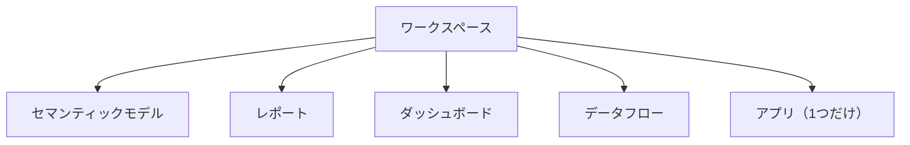
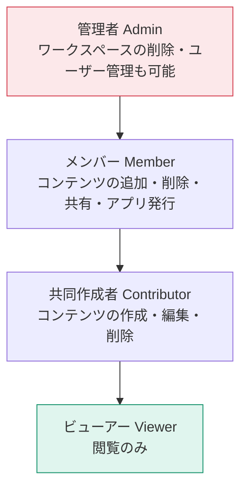
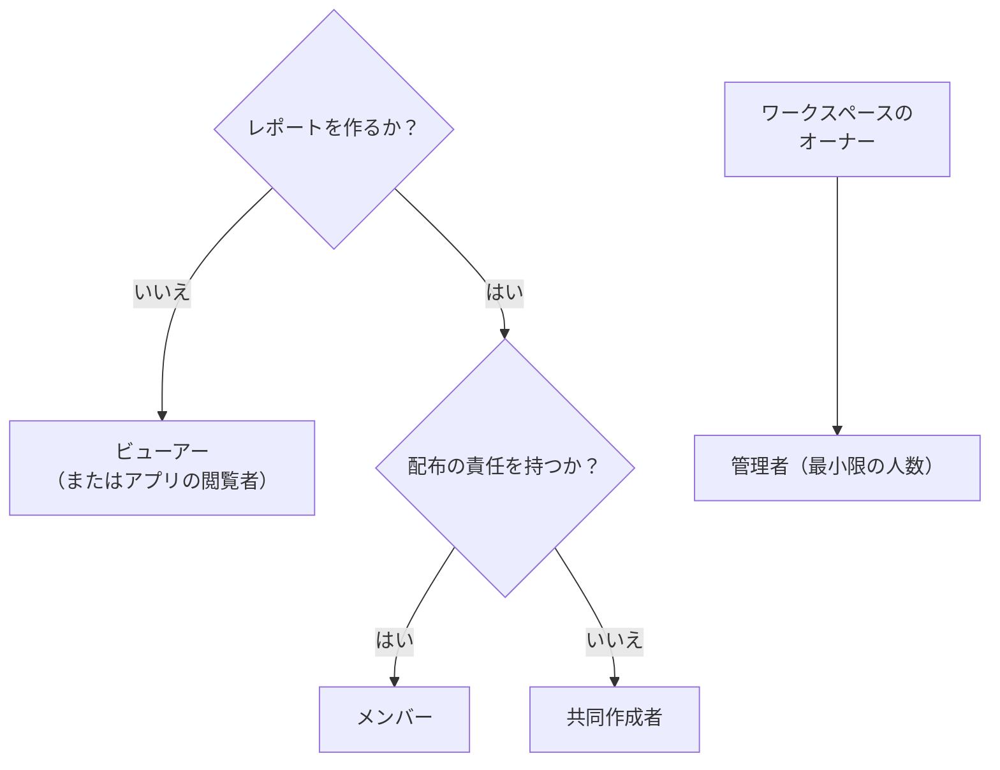

作ったレポートを組織で使ってもらうには、Power BI Service の構造を理解する必要があります。

## ワークスペースとは

ワークスペースは「作業と成果物を入れる箱」です。

| 種類 | 特徴 |
|---|---|
| **個人用ワークスペース (My workspace)** | 各ユーザー専用。**他人と共有できない** |
| **共有ワークスペース** | チームで共同作業。アプリを配布できる |

> [!TRAP]
> 「個人用ワークスペースに発行して共有しようとしたができない」——これは仕様です。共有が必要なら、必ず共有ワークスペースを作成してください。

## 4つのワークスペースロール

| 操作 | 管理者 | メンバー | 共同作成者 | ビューアー |
|---|:---:|:---:|:---:|:---:|
| ワークスペースの削除・設定変更 | ○ | × | × | × |
| ユーザーの追加（管理者を含む） | ○ | × | × | × |
| ユーザーの追加（メンバー以下） | ○ | ○ | × | × |
| アプリの発行・更新 | ○ | ○ | × | × |
| レポートの作成・編集・削除 | ○ | ○ | ○ | × |
| レポートの閲覧 | ○ | ○ | ○ | ○ |
| RLSが適用される | × | × | × | **○** |

> [!EXAM]
> この表は PL-300 の頻出範囲です。特に「アプリを発行できるのはメンバー以上」「RLSが効くのはビューアーのみ」の2点は確実に押さえてください。

## 権限設計の考え方

原則：**最小権限の原則**。必要以上の権限を与えないことが、事故を防ぐ最良の方法です。

> [!TIP]
> 個人ではなく **Microsoft Entra ID（旧Azure AD）のセキュリティグループ**に対して権限を付与してください。人事異動のたびにPower BIを触る必要がなくなります。

## ワークスペースの分け方

| 分け方 | 例 | 向き不向き |
|---|---|---|
| 部門別 | 営業部、経理部 | 一般的。分かりやすい |
| プロジェクト別 | 新製品分析PJ | 期間限定のもの |
| 環境別 | 開発 / テスト / 本番 | デプロイメントパイプライン用 |
| データ提供 / 利用 | 共通モデル置き場 + 各部門レポート | 大規模組織向け |

> [!TIP]
> 「共通のセマンティックモデルを1つのワークスペースに置き、各部門はライブ接続でレポートだけ作る」という構成は、**数字の一貫性を保つ**うえで非常に有効です。

## アイテムの権限（ワークスペースとは別）

ワークスペースロールとは別に、個々のアイテムにも権限があります。

| 権限 | 内容 |
|---|---|
| **再共有** | 他の人にさらに共有できる |
| **ビルド** | このモデルから新しいレポートを作れる／Excelで分析できる |

> [!EXAM]
> **ビルド権限**は、「他部署の人に自分のセマンティックモデルを使ってレポートを作らせたい」場合に必要です。閲覧権限だけでは新しいレポートは作れません。頻出です。

## 監視とメンテナンス

| 項目 | 場所 |
|---|---|
| 使用状況メトリック | レポートの「…」→ 使用状況メトリックを開く |
| 系列（リネージ）ビュー | ワークスペース右上の表示切り替え |
| 更新履歴 | セマンティックモデルの「…」→ 更新履歴 |

**系列ビュー**は、「このデータソースを変えると、どのレポートに影響するか」を一目で把握できます。変更前の影響調査に必須です。

## チェックリスト

- [ ] 共有ワークスペースを作成した（個人用ではない）
- [ ] セキュリティグループ単位で権限を付与した
- [ ] 閲覧者にはビューアーロール（RLSを効かせるため）
- [ ] 管理者は必要最小限の人数
- [ ] ワークスペースの命名規則を決めた
