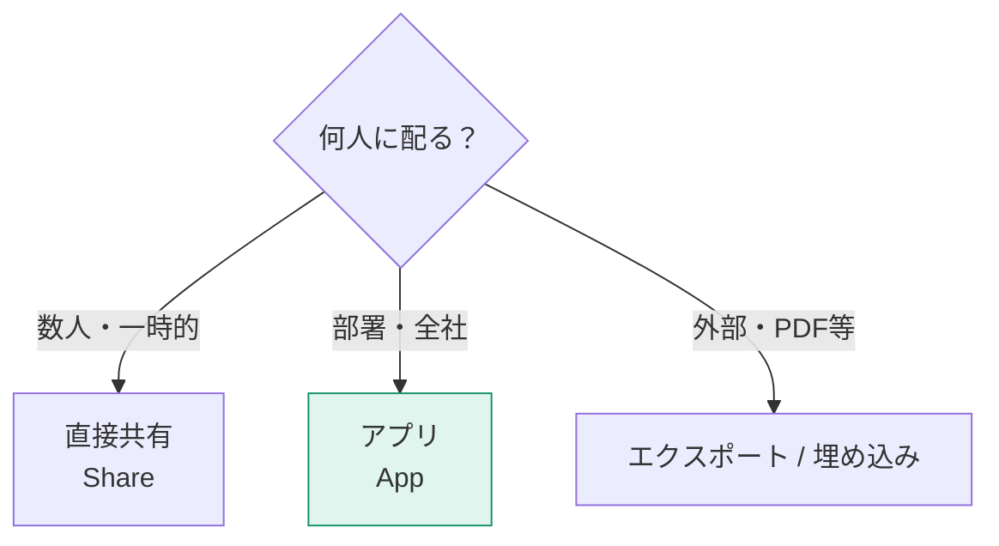

作ったレポートを、正しい方法で、正しい人に届けます。

## 配布方法の3択

| 方法 | 向いている場面 | 注意点 |
|---|---|---|
| **アプリ** | 多数への正式配布 | 準備が必要だが管理しやすい |
| 直接共有 | 少人数・一時的 | 誰に共有したか管理しにくい |
| ワークスペースへの追加 | 作成者チーム | 閲覧者を入れるのは不適切 |
| エクスポート（PDF/PPT） | 会議資料・記録 | 静止画になる |
| サブスクリプション | 定期メール配信 | 画像 + リンクが届く |

> [!EXAM]
> 「多数のユーザーに配布する最適な方法は？」→ **アプリ**。これは定型的な出題です。

## アプリの作成

1. ワークスペース右上の **アプリの作成**
2. **セットアップ**：アプリ名・説明・テーマ色・ロゴ
3. **コンテンツ**：含めるレポート/ダッシュボードを選択、並び順とセクションを設定
4. **対象ユーザー**：
   - 「対象ユーザー」を複数作れば、グループごとに見せるレポートを変えられる
   - 「組織全体」も選択可能
   - **アプリのアクセス許可**でビルド権限や再共有を制御
5. **アプリの発行**

更新するときは、ワークスペースで変更してから **アプリの更新** を押します。押すまで閲覧者には反映されません。

> [!TIP]
> 「アプリの更新を押すまで反映されない」性質は、**メリット**として使えます。作業中の状態を閲覧者に見せずに済むからです。

## セマンティックモデルの共有と再利用

同じデータを何度も取り込むのは無駄です。1つのモデルを複数のレポートで使い回します。

利用者側の手順：

1. Power BI Desktop → **データを取得 → Power BI セマンティックモデル**
2. 使いたいモデルを選択（ライブ接続になる）
3. レポートだけ作成して発行

必要な権限は **ビルド権限** です（L501参照）。

> [!TIP]
> この構成にすると「営業部と経理部で売上の数字が違う」問題が構造的に起きなくなります。数字の定義（メジャー）が1か所に集約されるからです。

### 複合モデル

ライブ接続したモデルに、自分だけのテーブルを追加することもできます（**モデルへのローカル変更を行う**）。共通モデル + 部門固有データの組み合わせが可能です。

## エクスポートとサブスクリプション

| 形式 | できること | 制限 |
|---|---|---|
| PDF | ページをそのまま出力 | 対話操作は失われる |
| PowerPoint | スライドとして出力 | ライブ埋め込みも可能 |
| Excel | データのエクスポート | 行数制限あり（設定で無効化も可能） |
| .pbix | レポートのダウンロード | 設定で禁止できる |

**サブスクリプション**は、レポートのスナップショットを定期的にメール送信する機能です。レポート画面上部の「サブスクライブ」から設定します。

> [!TRAP]
> サブスクリプションのメールには**画像とリンク**が届きます。RLSが設定されている場合、送信者の権限ではなく**受信者ごとの権限**が反映されます（データセットの設定による）。この挙動は必ずテストしてください。

## 埋め込み

| 方法 | 用途 | 認証 |
|---|---|---|
| SharePoint / Teams に埋め込む | 社内ポータル | Power BI ライセンス必要 |
| セキュアな埋め込み | 社内Webサイト | Power BI ライセンス必要 |
| **Webに公開（Publish to web）** | 一般公開 | **認証なし・完全公開** |
| 組み込み分析（Embedded） | 自社アプリに組み込む | Azure の容量が必要 |

> [!WARN]
> **「Webに公開」は、インターネット上の誰でも見られる状態になります。** 検索エンジンにインデックスされることもあります。社外秘データで絶対に使わないでください。テナント設定で無効化しておくことを強く推奨します。

> [!EXAM]
> 「Publish to web」の危険性は出題されます。社内共有には**SharePoint埋め込みかセキュアな埋め込み**を使います。

## 配布のチェックリスト

- [ ] 共有ワークスペースにコンテンツを配置した
- [ ] アプリとして発行した（多数配布の場合）
- [ ] 対象ユーザーをセキュリティグループで指定した
- [ ] RLSが必要なら、閲覧者はビューアーロールになっている
- [ ] スケジュール更新を設定した（L503）
- [ ] 「Webに公開」を使っていない
- [ ] 実際に閲覧者アカウントで見え方を確認した
