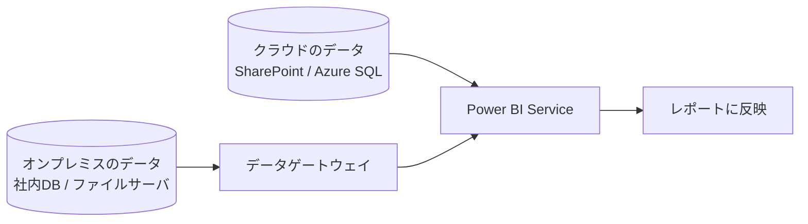
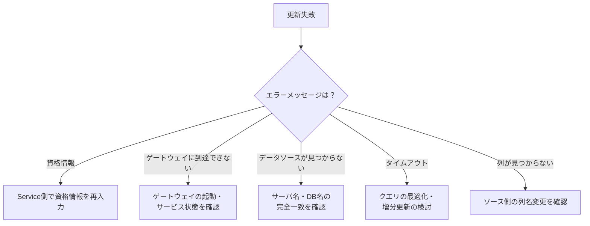

「レポートの数字が古い」——運用でもっとも多いトラブルです。更新の仕組みを理解すれば、原因の切り分けができます。

## データ更新の全体像

**クラウド上のデータは直接更新できますが、社内ネットワーク内のデータにはゲートウェイが必要**です。

## オンプレミスデータゲートウェイ

社内ネットワークとPower BI Serviceの間を安全につなぐ中継役です。

| 種類 | 用途 |
|---|---|
| **標準モード（エンタープライズ）** | 組織で共有。複数ユーザー・複数データソース。**本番はこちら** |
| **個人用モード** | インストールした本人のみ。テスト用途 |

### 設置のポイント

- 常時起動しているサーバにインストールする（個人PCは不可）
- データソースと同じネットワーク内、できるだけ近い場所に
- 高可用性が必要ならクラスター構成にする
- 定期的に更新する（毎月新バージョンが出る）

> [!TRAP]
> データソースの登録では、**Desktop で指定したサーバ名・データベース名と完全に一致**させる必要があります。`SERVER01` と `server01.contoso.com` は別物として扱われます。マッピングできない原因の大半がこれです。

## スケジュール更新

**ワークスペース → セマンティックモデルの「…」 → 設定 → 更新のスケジュール**

| 項目 | 内容 |
|---|---|
| タイムゾーン | 日本なら「(UTC+09:00) 大阪、札幌、東京」 |
| 更新の頻度 | 日次または週次 |
| 時刻 | 追加（Pro: 1日8回まで、Premium/PPU: 48回まで） |
| 失敗時の通知 | データセット所有者・追加の宛先 |

> [!EXAM]
> **Pro は 1日8回、Premium / PPU は 1日48回**。この数字は出題されます。

### 更新スケジュール設計のコツ

| 考慮点 | 内容 |
|---|---|
| ソースの更新タイミング | 基幹システムのバッチ完了後にする |
| 時間の分散 | 同時刻に集中させない（キューで待たされる） |
| 利用時間帯 | 業務開始前に完了させる |
| 失敗の連絡先 | 個人ではなく共有メールボックスにする |

## 更新が失敗する主な原因

| エラー | 原因と対処 |
|---|---|
| 資格情報が無効 | パスワード変更・期限切れ。Service で再入力 |
| ゲートウェイがオフライン | サーバの再起動・サービスの状態確認 |
| データソース未登録 | ゲートウェイにデータソースを追加 |
| タイムアウト（2時間） | クエリの最適化、増分更新の導入 |
| 列が見つからない | ソースの構造変更。Power Query を修正 |
| メモリ不足 | モデルサイズの削減（L207）、容量の見直し |

> [!TIP]
> 更新失敗の履歴は **セマンティックモデルの「…」→ 更新履歴** で確認できます。エラーメッセージの全文がここに残るので、まずここを見てください。

## 増分更新（おさらい）

L106 で扱った増分更新は、更新時間を劇的に短縮します。

条件：`RangeStart` / `RangeEnd` パラメータ + フォールディング可能なデータソース。

## その他の更新方法

| 方法 | 用途 |
|---|---|
| 今すぐ更新 | 手動（「…」→ 今すぐ更新） |
| REST API | 外部システムから更新をトリガー |
| Power Automate | ワークフローに組み込む |
| XMLA エンドポイント | 部分更新（Premium/PPU） |

> [!TIP]
> 「基幹システムのバッチが終わったらPower BIを更新する」を確実にやりたいなら、時刻指定ではなく **Power Automate や API で連鎖させる**のが正解です。

## 運用チェックリスト

- [ ] ゲートウェイを常時起動サーバに設置した（標準モード）
- [ ] ゲートウェイにデータソースを登録した（名前の完全一致を確認）
- [ ] Service で資格情報を設定した
- [ ] スケジュール更新を設定した（業務開始前に完了）
- [ ] 失敗通知の宛先を共有メールボックスにした
- [ ] 大きなテーブルに増分更新を検討した
- [ ] 更新履歴を定期的に確認する運用を決めた
