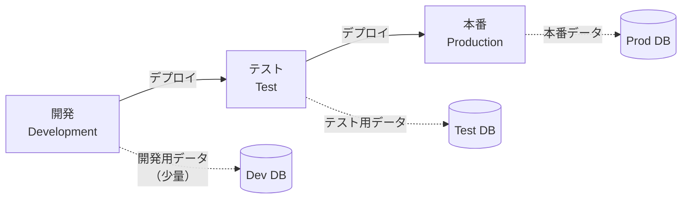
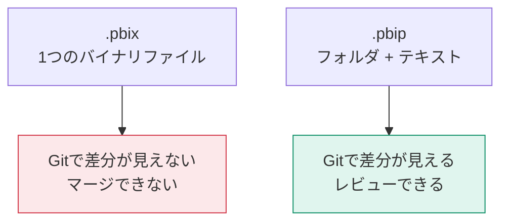

「本番のレポートを直接編集していたら壊した」——これを防ぐのがライフサイクル管理です。

## デプロイメントパイプライン

開発 → テスト → 本番 の3ステージを管理する Power BI の機能です（Premium / PPU / Fabric 容量が必要）。

各ステージは1つのワークスペースに対応します。

| ステージ | 誰が使う | データ |
|---|---|---|
| 開発 | 作成者 | 少量のサンプル |
| テスト | レビュアー・業務部門 | 本番相当（またはマスク済み） |
| 本番 | 全利用者 | 本番 |

## データソース規則

ステージごとに接続先を切り替える仕組みです。

**パイプライン → デプロイ設定 → データソース規則**

| ステージ | 接続先 |
|---|---|
| 開発 | `dev-sql.contoso.com` |
| テスト | `test-sql.contoso.com` |
| 本番 | `prod-sql.contoso.com` |

**パラメータ規則**も使えます。L106で作ったパラメータの値を、ステージごとに変えられます。

> [!EXAM]
> 「ステージごとにデータソースを変える方法は？」→ **データソース規則（またはパラメータ規則）**。デプロイのたびに手作業で書き換える必要はありません。

## デプロイの動作

| 操作 | 動作 |
|---|---|
| デプロイ | 上流ステージの内容を下流に上書きコピー |
| 選択的デプロイ | 特定のアイテムだけデプロイ |
| 比較 | 差分を確認してからデプロイ |
| 逆デプロイ | 下流から上流へ（緊急修正の取り込み） |

デプロイしても、下流ステージの**データソース規則とアプリの設定は保持**されます。

## Git 連携（Fabric）

Fabric ワークスペースは Azure DevOps / GitHub と接続でき、レポートやモデルの定義をリポジトリで管理できます。

## PBIP（Power BI Project）形式

`.pbix` はバイナリなので、Gitで差分が見えません。**PBIP形式**で保存すると、フォルダ + テキストファイル（TMDL / JSON）として展開されます。

**ファイル → 名前を付けて保存 → Power BI プロジェクト (.pbip)**

| 形式 | 用途 |
|---|---|
| `.pbix` | 通常の作業・配布 |
| `.pbit` | テンプレート（データを含まない） |
| `.pbip` | ソース管理・チーム開発 |

> [!EXAM]
> `.pbit` は**データを含まず、構造とクエリのみ**。開いたときにパラメータを入力させ、各自のデータで使わせる用途に適します。この違いは頻出です。

## パイプラインがない場合の運用

Premium がない環境でも、原則を守れば事故は防げます。

| 原則 | 具体的な運用 |
|---|---|
| 本番ワークスペースを直接編集しない | 開発用ワークスペースを別に作る |
| 変更前にバックアップ | `.pbix` をダウンロードして日付付きで保存 |
| ファイル命名規則 | `売上分析_v1.2_20250415.pbix` |
| 変更履歴を残す | レポート内に更新履歴ページを作る |
| 共有ドライブで一元管理 | 各自のPCに散在させない |

> [!TIP]
> 最低限でも「本番を直接触らない」ルールだけは守ってください。これだけで重大事故のほとんどが防げます。

## 変更管理のチェックリスト

- [ ] 開発用と本番用のワークスペースを分けた
- [ ] デプロイ前にテストステージで検証する運用にした
- [ ] データソース規則でステージごとの接続先を設定した
- [ ] `.pbix` のバックアップ運用を決めた
- [ ] 変更内容を記録する場所を決めた
- [ ] 誰がデプロイできるかを決めた（メンバー以上）
