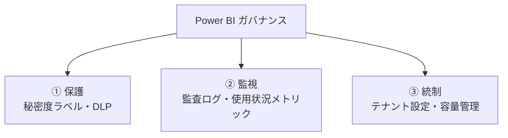
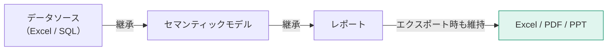

「誰でも自由に作れる」を維持しながら「情報が漏れない・数字が食い違わない」を両立させるのがガバナンスです。

## ガバナンスの3本柱

## 秘密度ラベル（Sensitivity Label）

Microsoft Purview で定義したラベルを、Power BI のアイテムに適用します。

| ラベル例 | 効果 |
|---|---|
| パブリック | 制限なし |
| 社内限定 | 社外への共有を警告 |
| 機密 | エクスポートを制限・暗号化 |
| 極秘 | ダウンロード禁止・透かし表示 |

> [!EXAM]
> **秘密度ラベルはエクスポートしたファイルにも引き継がれます。** Power BI から Excel にエクスポートしても、暗号化やアクセス制限が維持されます。これはRLSにはない特徴です。

### RLS と秘密度ラベルの違い

| | RLS | 秘密度ラベル |
|---|---|---|
| 制御対象 | **どの行が見えるか** | **ファイル自体の扱い** |
| 適用範囲 | Power BI 内 | エクスポート先まで追随 |
| 設定場所 | Desktop（定義）+ Service（割当） | Service / Purview |

**両方を併用する**のが正しい設計です。

## 監査ログ

誰がいつ何をしたかの記録です。

| 取得場所 | 内容 |
|---|---|
| Microsoft Purview コンプライアンス ポータル | 統合監査ログ |
| Power BI 管理ポータル → 監査ログ | Power BI 固有の操作 |
| PowerShell / REST API | 自動取得・独自分析 |

記録される操作の例：レポートの表示・作成・削除、共有、エクスポート、ゲートウェイの変更、テナント設定の変更。

> [!TIP]
> 「機密レポートを誰がエクスポートしたか」は監査ログで追跡できます。監査ログの取得自体をPower BIレポート化しておくと、定期的な点検が現実的になります。

## 使用状況メトリック

レポートごとの利用状況を確認できます。

**レポートの「…」→ 使用状況メトリックを開く**

| 分かること | 活用 |
|---|---|
| 閲覧者数・閲覧回数 | 使われていないレポートの廃止 |
| デバイス種別 | モバイル対応の必要性判断 |
| 配布方法別の利用 | アプリと直接共有のどちらが使われているか |

> [!TIP]
> **使われていないレポートを廃止する**のは、ガバナンスの重要な仕事です。放置されたレポートは、古い数字で誤った判断を招くリスク源になります。

## テナント設定（管理者向け）

**管理ポータル → テナント設定**

特に重要な設定：

| 設定 | 推奨 |
|---|---|
| Webに公開 | **無効化**（または特定グループのみ） |
| データのエクスポート | 必要な範囲に限定 |
| 外部ユーザーとの共有 | 原則無効、必要ならゲスト管理と併用 |
| 発行可能なユーザー | セキュリティグループで制限 |
| 開発者向け設定 | 必要な場合のみ |

> [!WARN]
> 「Webに公開」は既定で有効な場合があります。組織で Power BI を導入したら、真っ先に確認すべき設定です。

## 認定と昇格（Endorsement）

信頼できるコンテンツに印を付ける仕組みです。

| 状態 | 誰が設定できるか |
|---|---|
| 昇格済み (Promoted) | そのアイテムの編集権限がある人 |
| 認定済み (Certified) | テナント設定で許可された人のみ |

> [!EXAM]
> 「組織の公式データとして信頼できることを示す」→ **認定済み (Certified)**。昇格済みとの違いは「誰が設定できるか」です。頻出です。

## Fabric と容量

Power BI は現在 Microsoft Fabric の一部です。

| ライセンス | 容量 |
|---|---|
| Pro | 共有容量（モデル1GB上限） |
| PPU | 専用に近い（モデル100GB） |
| Fabric F SKU / Premium P SKU | 専用容量。Freeユーザーへの配布が可能 |

容量が逼迫すると、更新の失敗やレポートの遅延が起きます。**管理ポータル → 容量の設定 → メトリックアプリ**で使用状況を監視します。

## ガバナンスのチェックリスト

- [ ] テナント設定で「Webに公開」を無効化した
- [ ] 秘密度ラベルの運用ルールを決めた
- [ ] 公式データに認定済みマークを付けた
- [ ] 使用状況メトリックを定期確認する運用にした
- [ ] 監査ログの取得と点検の担当を決めた
- [ ] 命名規則とワークスペース構成のルールを文書化した
