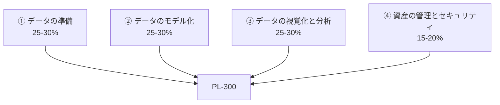

ここまでの学習を、資格という形にします。PL-300 の全体像と、合格までの現実的な進め方を整理します。

## PL-300 とは

| 項目 | 内容 |
|---|---|
| 正式名称 | Exam PL-300: Microsoft Power BI Data Analyst |
| 認定名 | Microsoft Certified: Power BI Data Analyst Associate |
| 出題数 | 40〜60問程度 |
| 試験時間 | 100分前後 |
| 合格ライン | 1000点満点中 **700点**（スケールドスコア） |
| 受験方法 | テストセンター / オンライン監督付き |
| 言語 | 日本語で受験可能 |

> [!WARN]
> 出題数・時間・料金は改定されることがあります。申込前に必ず [公式ページ](https://learn.microsoft.com/ja-jp/credentials/certifications/exams/pl-300/) で最新情報を確認してください。本ページの数値は執筆時点の目安です。

## 4つの出題領域

| 領域 | 配点 | 本サイトの対応 |
|---|---|---|
| ① データの準備 | 25-30% | Lv.1（L101〜L107） |
| ② データのモデル化 | 25-30% | Lv.2（L201〜L207）+ Lv.3（DAX） |
| ③ データの視覚化と分析 | 25-30% | Lv.4（L401〜L406） |
| ④ 資産の管理とセキュリティ | 15-20% | Lv.5（L501〜L505） |

**DAXは①〜③にまたがって出題されます。** 独立した領域ではありませんが、実質的にもっとも比重が高い技能です。

## 問題形式

| 形式 | 特徴 | 対策 |
|---|---|---|
| 単一選択 | 4択から1つ | 基本 |
| 複数選択 | 「2つ選べ」など | 部分点なし。確実に |
| ドラッグ&ドロップ | 手順の並べ替え | 操作順序を体で覚える |
| ホットエリア | 画面の該当箇所をクリック | 実際の画面を見慣れておく |
| ケーススタディ | 長文シナリオ + 複数問 | **戻れない場合がある**ので注意 |
| 「はい/いいえ」の連続 | 同じシナリオで3問 | 各問独立。1問ずつ判断 |

> [!WARN]
> **ケーススタディのセクションは、進むと前の問題に戻れないことがあります。** 画面の指示をよく読み、そのセクション内で見直しを済ませてから次へ進んでください。

## よく出るテーマ トップ15

本サイトの該当レッスンへのリンク付きです。

| # | テーマ | レッスン |
|---|---|---|
| 1 | インポート / DirectQuery / ライブ接続の選択 | L101 |
| 2 | ピボット解除（その他の列） | L104 |
| 3 | マージの結合種類（左外部 vs 内部） | L105 |
| 4 | クエリフォールディングと性能 | L106 |
| 5 | 増分更新（RangeStart / RangeEnd） | L106 |
| 6 | スタースキーマ vs フラットテーブル | L201 |
| 7 | リレーションシップの基数と方向 | L202 |
| 8 | 日付テーブルとしてマーク | L203 |
| 9 | 計算列 vs メジャー | L301 |
| 10 | CALCULATE と ALL / ALLSELECTED | L303 |
| 11 | タイムインテリジェンス（YTD・前年比） | L305 |
| 12 | 目的に応じたビジュアル選択 | L401 |
| 13 | RLS（USERPRINCIPALNAME・ロール割当） | L206 |
| 14 | ワークスペースロールの権限 | L501 |
| 15 | アプリによる配布 / Webに公開の危険性 | L502 |

## 学習計画

### 標準プラン（8週間）

| 週 | 内容 | 目安 |
|---|---|---|
| 1 | Lv.0 + Lv.1前半（L101〜L104） | 8時間 |
| 2 | Lv.1後半（L105〜L107）+ LAB02 | 8時間 |
| 3 | Lv.2前半（L201〜L204）+ LAB03 | 10時間 |
| 4 | Lv.2後半（L205〜L207） | 8時間 |
| 5 | Lv.3前半（L301〜L304）**最重要** | 12時間 |
| 6 | Lv.3後半（L305〜L308）+ LAB04 | 12時間 |
| 7 | Lv.4（L401〜L406）+ LAB05 | 10時間 |
| 8 | Lv.5（L501〜L505）+ LAB06 + 模擬試験 | 12時間 |

### 短期集中プラン（3週間・実務経験者向け）

| 週 | 内容 |
|---|---|
| 1 | Lv.1 + Lv.2 を通読、クイズで穴を特定 |
| 2 | Lv.3 を集中的に。DAXは手を動かす |
| 3 | Lv.4 + Lv.5、模擬試験を3回 |

## 直前2週間の過ごし方

1. **模擬試験を受ける**（本サイトの[模擬試験](exam.html)）
2. 領域別スコアで70%未満の領域を特定
3. その領域のレッスンを再読し、クイズを100%になるまで解く
4. 3日後にもう一度模擬試験
5. **2回連続で80%以上**なら受験申込の目安

> [!TIP]
> 模擬試験の点数より、**「なぜその選択肢が正しいか説明できるか」**が本質です。正解の丸暗記では、本番の言い回しが変わった瞬間に対応できません。

## 公式の学習リソース

| リソース | 内容 |
|---|---|
| [Microsoft Learn の学習パス](https://learn.microsoft.com/ja-jp/training/browse/?products=power-bi) | 無料・公式。演習付き |
| [PL-300 スキル測定ページ](https://learn.microsoft.com/ja-jp/credentials/certifications/exams/pl-300/) | 出題範囲の一次情報 |
| Microsoft Learn の練習評価 | 公式の無料練習問題 |
| [Power BI ブログ](https://powerbi.microsoft.com/blog/) | 新機能の把握 |

> [!TIP]
> **スキル測定ページの「スキルの概要」PDFを印刷してチェックリストにする**のが、もっとも確実な網羅方法です。出題範囲は改定されるため、必ず一次情報を確認してください。

## 受験当日

- 本人確認書類を2種類用意（オンライン受験は特に厳格）
- オンライン受験なら、机の上を完全に片付ける
- 時間配分：ケーススタディに時間を残す
- 分からない問題は「後で見直す」にチェックして先へ進む
- 見直しは「確実に間違えた」と気づいたものだけ変更する

## 合格後

| 次のステップ | 内容 |
|---|---|
| 実務での適用 | 自部門のレポートをスタースキーマで作り直す |
| DP-600 | Fabric Analytics Engineer（上位資格） |
| DP-203 / DP-700 | データエンジニアリング方面 |
| コミュニティ | 勉強会・ユーザーグループへの参加 |

資格はゴールではなく、共通言語を得るための通過点です。合格したら、次は**自分の職場のデータで価値を出す**段階に進んでください。
