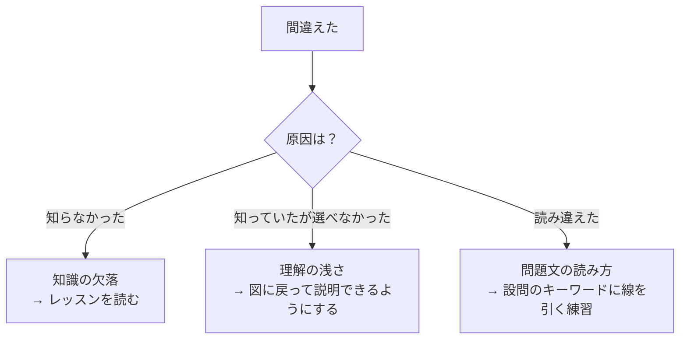
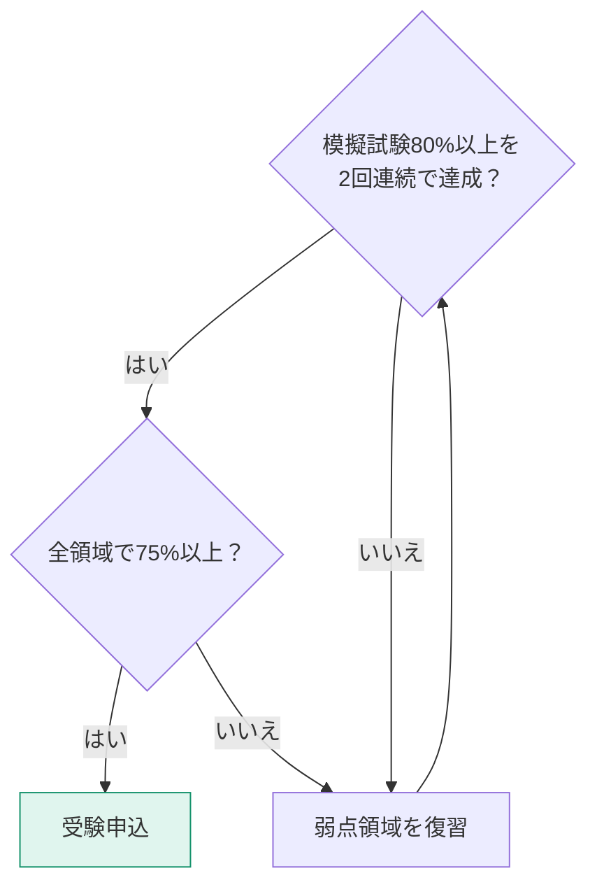

最後のレッスンは、実践です。模擬試験を受けて、弱点を数字で把握し、潰します。

## 模擬試験の受け方

本サイトの[模擬試験](exam.html)は、PL-300の出題形式に合わせています。

| モード | 特徴 | 使いどころ |
|---|---|---|
| **試験モード** | 制限時間つき・解説は最後にまとめて | 本番の練習 |
| **練習モード** | 1問ずつ即座に解説 | 知識の確認・弱点の補強 |

### 推奨の進め方

**3日空ける**のには理由があります。直後に解き直すと「答えを覚えている」だけで、理解したかどうかが分かりません。

## 弱点分析の読み方

模擬試験の結果画面には、4つの出題領域ごとの正答率が表示されます。

| スコア | 判定 | 次のアクション |
|---|---|---|
| 90%以上 | 得意 | 維持。復習は最小限で |
| 80〜89% | 合格圏 | 間違えた問題の解説だけ確認 |
| 70〜79% | 要注意 | 該当レッスンを再読 |
| 70%未満 | 弱点 | レッスン再読 + 該当クイズ全問正解まで |

> [!TIP]
> 総合スコアが80%でも、1領域だけ50%なら危険です。**本番では領域ごとの出題数が決まっている**ため、弱点領域から集中的に出題される可能性があります。総合点より領域別のバランスを見てください。

## 間違いのタイプを見分ける

間違えた問題は、原因によって対処が変わります。

### タイプ3（読み違え）への対策

PL-300 の問題文には、答えを決定づけるキーワードが必ず含まれます。

| キーワード | 示唆すること |
|---|---|
| 「最小限の労力で」 | 標準機能を使う。カスタム開発は不正解 |
| 「最も適切な」 | 複数正しそうでも、ベストプラクティスを選ぶ |
| 「将来のデータにも対応」 | 動的な方法（その他の列のピボット解除など） |
| 「パフォーマンスを最大化」 | インポート・フォールディング・スタースキーマ |
| 「常に最新のデータ」 | DirectQuery |
| 「複数のユーザーに配布」 | アプリ |
| 「行ごとに異なるデータを表示」 | RLS |

> [!TIP]
> 本番では、まず**設問の最後の一文**（「〜するには何をすべきか」）を読んでから、シナリオ本文に戻るのが効率的です。何を探せばよいか分かった状態で読めます。

## 分野別の総復習チェック

自分に説明できるか確認してください。できないものが、あなたの弱点です。

### ① データの準備

- [ ] インポート / DirectQuery / ライブ接続の使い分けを説明できる
- [ ] ピボット解除の「その他の列」を選ぶ理由を説明できる
- [ ] 左外部結合と内部結合の違いを図で説明できる
- [ ] クエリフォールディングが効く条件を挙げられる
- [ ] 増分更新に必要なパラメータ名を言える

### ② データのモデル化

- [ ] スタースキーマの構造を図で描ける
- [ ] 1対多のリレーションシップでフィルターが流れる向きを説明できる
- [ ] 日付テーブルとしてマークする理由を説明できる
- [ ] 計算列とメジャーの使い分けを判断できる
- [ ] CALCULATE の「上書き」と「追加」を説明できる
- [ ] ALL と ALLSELECTED の違いを説明できる
- [ ] RLS を USERPRINCIPALNAME で実装できる

### ③ データの視覚化と分析

- [ ] 分析目的に応じてビジュアルを選べる
- [ ] ドリルスルーとドリルダウンの違いを説明できる
- [ ] ブックマークの用途を3つ挙げられる
- [ ] 条件付き書式の3つの基準を説明できる
- [ ] モバイルレイアウトの作成手順を説明できる
- [ ] パフォーマンスアナライザーの3項目の意味を説明できる

### ④ 資産の管理とセキュリティ

- [ ] ワークスペースの4ロールと権限を説明できる
- [ ] アプリと直接共有の使い分けを説明できる
- [ ] ゲートウェイが必要な場面を説明できる
- [ ] Pro と Premium の更新回数の違いを言える
- [ ] 認定済みと昇格済みの違いを説明できる
- [ ] 「Webに公開」の危険性を説明できる

## 受験の目安

## 最後に

ここまで到達したなら、あなたはすでに「Power BIが使える人」です。資格はその証明にすぎません。

合格したら、ぜひ自分の職場のデータで何か作ってみてください。**教材のきれいなデータではなく、汚れた現実のデータを整えて価値を出したとき**、この学習は本当に完了します。

[模擬試験を受ける →](exam.html)
